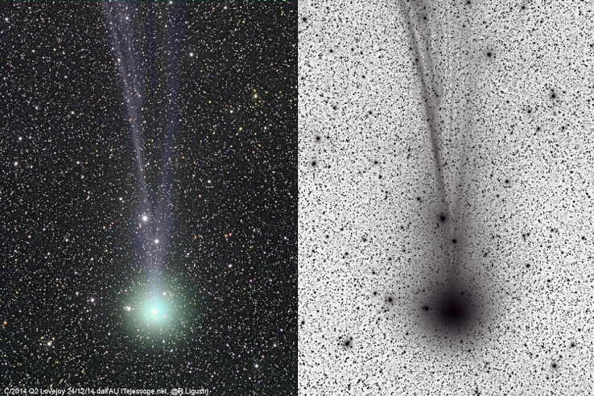
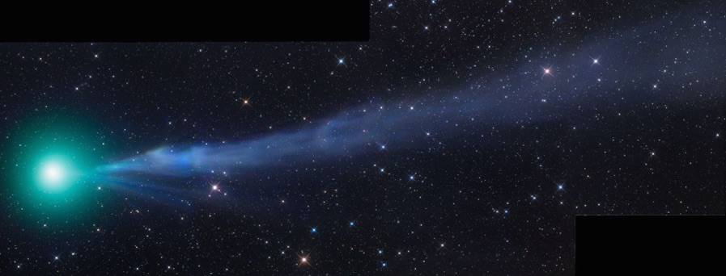
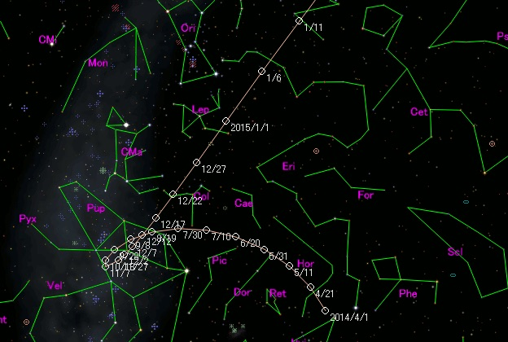
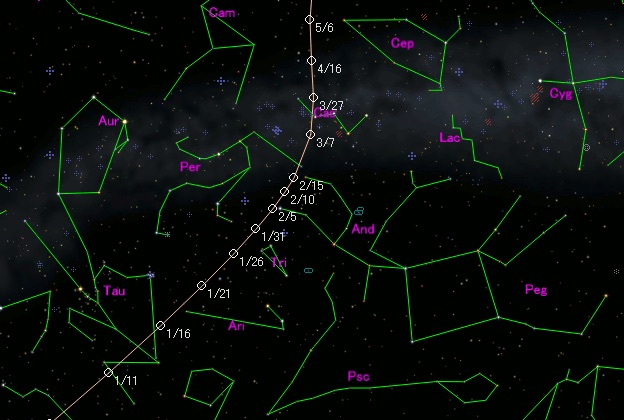
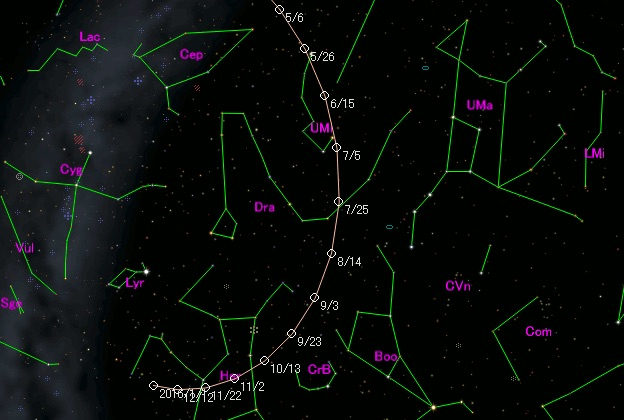
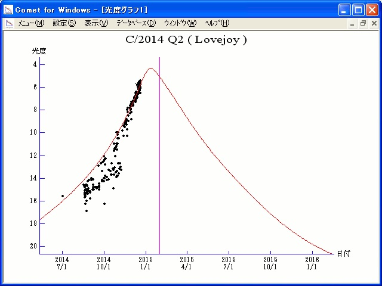
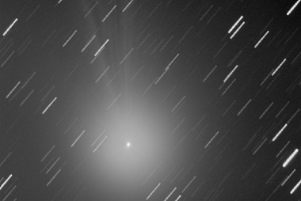
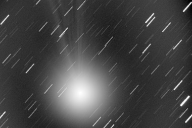

C/2014 Q2 (Lovejoy) es un cometa de periodo largo descubierto el 17 de agosto de 2014 por Terry Lovejoy mediante un telescopio Schmidt–Cassegrain de 200 mm (se trata del quinto cometa descubierto por Lovejoy). Fue descubierto con una magnitud aparente de 15 al sureste de las constelación de Popa (Puppis), en el hemisferio austral.

En diciembre de 2014 el cometa ha alcanzado un brillo de magnitud 7,4, haciéndolo accesible a través de pequeños telescopios y binoculares. A mediados de diciembre fue visible a ojo desnudo para observadores con posibilidad de acceso a cielos oscuros y con buena agudeza visual. Durante el 28−29 de diciembre el cometa pasará a un tercio de grado del cúmulo globular M79, en la constelación de la Liebre (Lepus). En enero de 2015 su brillo alcanzará la magnitud 4−5 y se convertirá en uno de los cometas más brillantes localizados en años. El 7 de enero de 2015 el cometa pasará a una distancia de 0,469 AU (70.200.000 km) de La Tierra. Atravesará el ecuador celeste el 9 de enero de 2015, pudiéndose así observar mejor desde el hemisferio norte. El cometa alcanzará su perihelio el 30 de enero de 2015, a una distancia de 1,29 AU del Sol.

Antes en entrar en la zona planetaria (época 1950), C/2014 Q2 tenía un periodo orbital de unos 11.500 años. Después de abandonar la región planetaria (época 2050), tendrá un periodo orbital de unos 8.000 años.

*Imágenes del cometa C/2014 Q2 (Lovejoy), tomadas por Rolando Lagustri (Italia)*

*Mosaico de imágenes del cometa C/2014 Q2 (Lovejoy)*

**Cartas celestes para su localización y seguimiento**

*Entre el 01/04/2014 y el 11/01/2015*

*Entre el 11/01/2015 y el 06/05/2015*

*Entre el 06/05/2015 y el 01/01/2016*

**Gráfico de magnitudes**

**Imágenes del cometa C/2014 Q2 (Lovejoy) de nuestro compañero José Carrillo**

