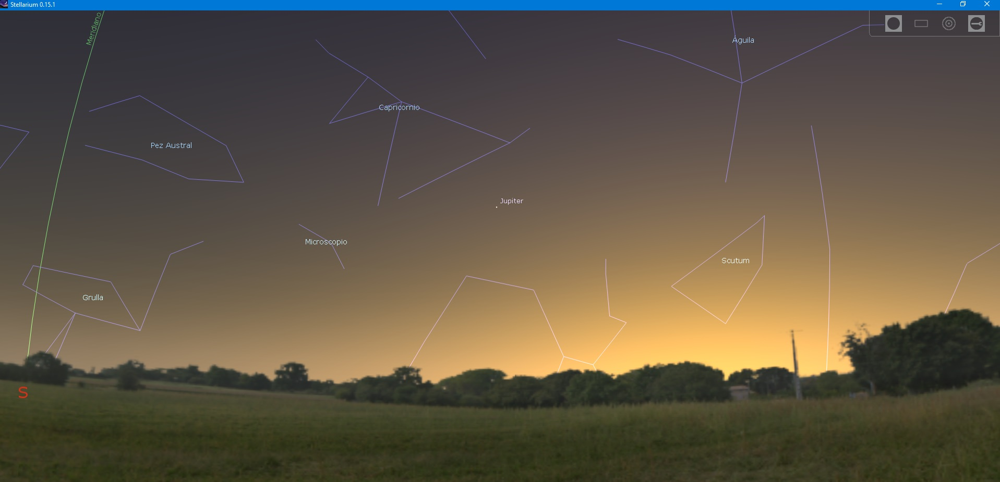
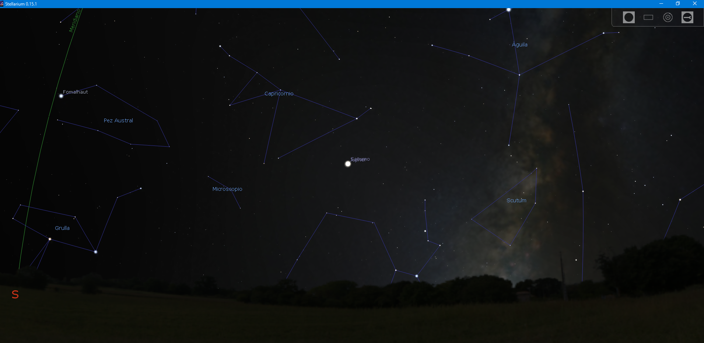
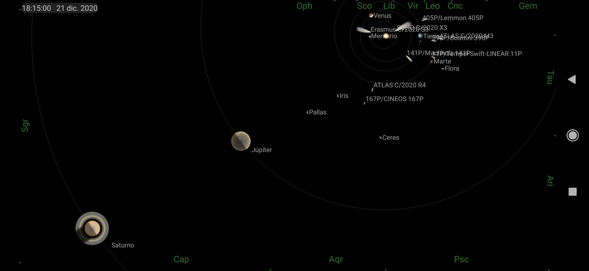
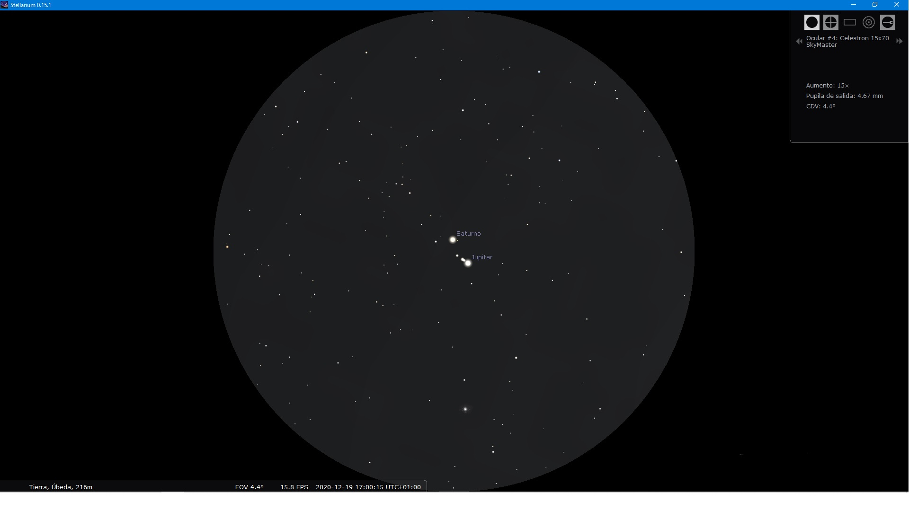
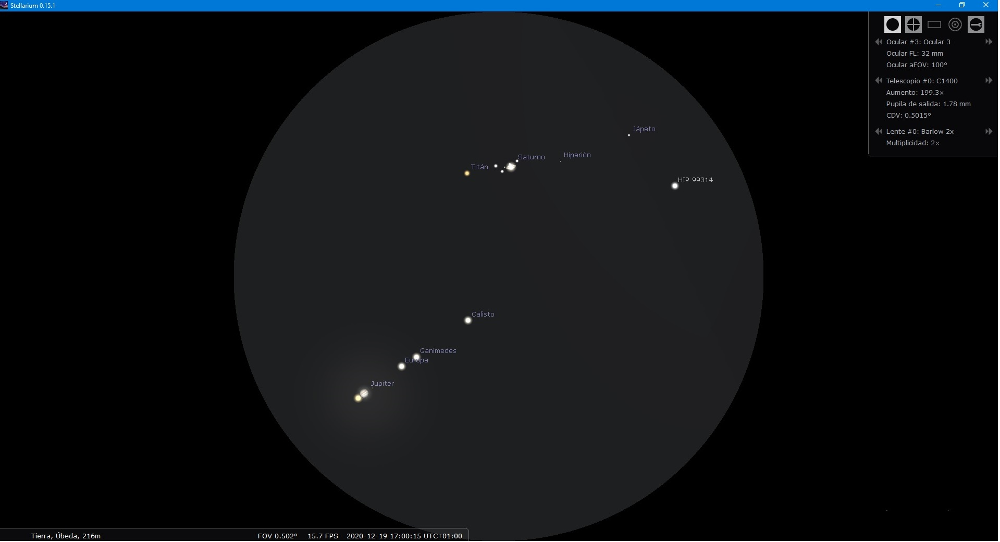

El 21 de diciembre de 2020, el quinto y sexto planeta del Sistema Solar estarán a tan sólo  6 minutos de arco en el cielo, una quinta parte del tamaño de la Luna llena, y se puede observar desde cualquier parte del mundo.

La imagen de dos planetas tan singulares como Júpiter  y Saturno, juntos en la misma región del cielo a la puesta de sol hacia el Oeste, será un espectáculo impresionante.

Dos astros están en conjunción cuando, observados desde La Tierra, se hallan en la misma región del cielo. Los astros se aproximan mucho en el cielo, aunque sus posiciones  no coinciden, pasando uno por encima del otro.

Si unimos el movimiento orbital de Júpiter alrededor del Sol, de 11,9 años, el de  Saturno de 29,5 años y el de La Tierra de 1 año, este fenómeno astronómico se repite cada 19,6 años y estos dos planetas  aparecerán en la misma región del cielo vistos desde La Tierra.

Debido a las orbitas elípticas una conjunción tan próxima, 6 minutos de arco, no se producía  desde  el 16 de julio de 1623, donde estuvieron a 6,8 minutos de arco. En esta ocasión fue muy difícil su observación debido a su cercanía al Sol. La conjunción del 25 de agosto de 1563 también estuvo entre los 6 y 7 minutos de arco de aproximación. Y la conjunción más próxima se produjo el 4 de marzo de 1226 donde Júpiter y Saturno se encontraron a tan solo 2 minutos de arco. En el año 6 antes de Cristo, Júpiter y Saturno también se encontraron muy cerca en el cielo, pero en esta ocasión, la conjunción se produjo con los planetas en oposición (los dos objetos se encontraban en el lado más alejado del sol y con su brillo máximo) y realizando su movimiento retrogrado lo que produjo 3 conjunciones seguidas.

Para poder disfrutar de nuevo de este espectáculo celeste, en el que Júpiter y Saturno se encuentren a 6 minutos de arco de distancia, tendremos que esperar hasta el 15 de marzo de 2080.

Posición de Júpiter el 21 de diciembre a las 18:15 horas.

Posición de Júpiter y Saturno. Azimut:+223º14’13.2” Altura:+20º13’7.4”

Posición de Júpiter y Saturno. Azimut:+223º14’13.2” Altura:+20º13’7.4”

Posición de Júpiter y Saturno

Simulación de campo de observación con prismáticos

Simulación de campo de ocular de 32mm 100º
