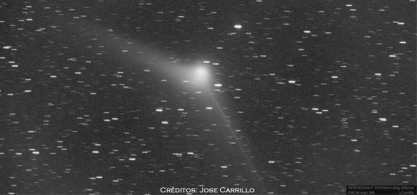

Un cometa es un objeto de nuestro sistema solar compuesto, principalmente, por hielo y polvo, por lo que se les conoce como “bolas de nieve sucia”. Los cometas se mueven alrededor del Sol siguiendo órbitas muy elípticas, con periodos que van de unos pocos a cientos de miles de años.

El cometa Catalina proviene de la Nube de Oort y contiene material primigenio de la nebulosa original que formó nuestro sistema solar
Cuando se acercan al Sol, el calor derrite los hielos cometarios, desprendiendo gases y partículas de polvo que forman la cola, o colas, del cometa, la cual puede medir más de un millón de kilómetros. Su parte sólida es el núcleo con tamaños entre 10 km a 40 km.

La mayor parte de los cometas provienen de la Nube de Oort –nube esférica situada a una distancia aproximada de 1 año-luz del Sol–, aunque algunos también tienen su origen en el Cinturón de Kuiper –un disco de materia situado entre 7.500-15.000 millones de kilómetros del Sol– y suelen ser de corto periodo (menor de 200 años).

El cometa Catalina, descubierto 31 de octubre de 2013, tiene origen en la Nube de Oort y es la primera vez que nos visita. Los últimos cálculos indican que tiene una órbita hiperbólica, por tanto, solo lo podremos ver en esta ocasión.
Desde el punto de vista astronómico, el estudio de los cometas es muy interesante pues son fósiles de la formación de nuestro sistema solar y, por tanto, contienen información de la génesis de los sistemas planetarios.

Si, además, el cometa proviene de la Nube de Oort (como es el caso de Catalina), el interés científico es mayor, pues suelen ser objetos nuevos que contienen material primigenio y sin procesar de la nebulosa original que formó nuestro sistema solar.

## Observación celeste

El momento óptimo para la observación será a partir de la primera semana de enero

Desde principios de diciembre, el cometa es visible en el hemisferio norte desde media noche hasta la salida de Sol. A simple vista será posible distinguir la zona central del cometa mientras que para observar detalles será necesario usar unos pequeños prismáticos.

El momento óptimo para su observación será a partir de la primera semana de enero, coincidiendo con la luna nueva y con el punto de mayor aproximación del cometa a la Tierra (17 de enero), cerca de la constelación de la Osa Mayor.

Aun así, desde el Instituto de Astrofísica de Canarias recomiendan disponer de una [carta celeste](http://www.skyandtelescope.com/wp-content/uploads/Web_Dec15_Catalina.pdf) para localizar mejor la posición del objeto, pues su posición en el cielo varía día a día debido a su propio movimiento orbital.

*C/2013 US10. Imagen tomada el 17/12/2015. Jose Carrillo (Fuensanta de Martos, Jaén)*

Fuente: [Sinc](http://www.agenciasinc.es/)
