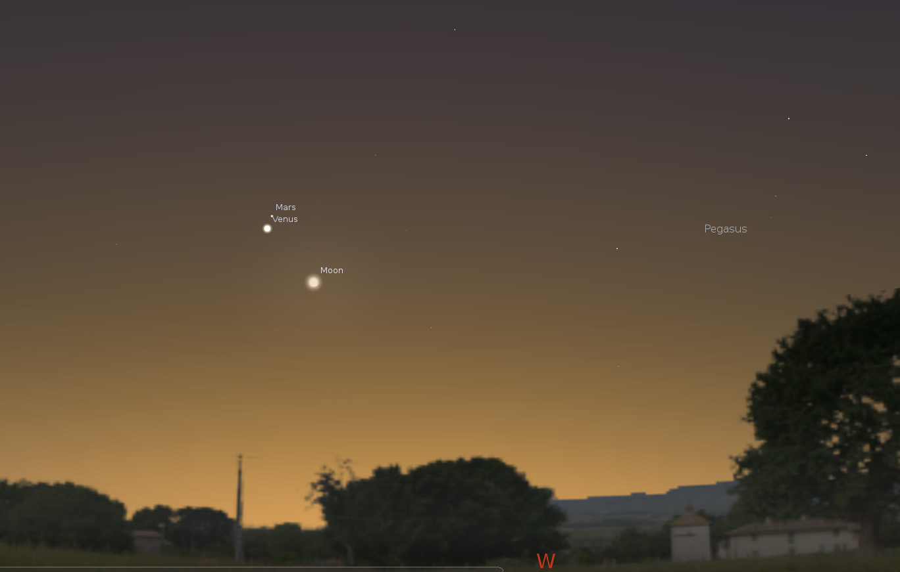
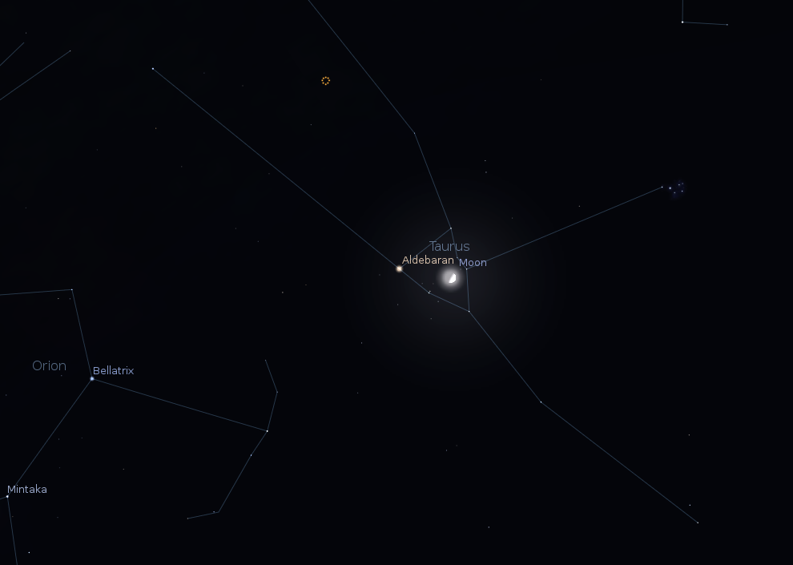

Por Tomás Ruiz Lara

# Planetas y asteroides

Como siempre empecemos con una **visión global** a la situación planetaria de este mes. Las noches de Febrero comenzarán con Venus dominando el cielo hacia el Oeste, brindándonos bonitas puestas de sol. Especialmente llamativa será la puesta de sol del día 21 de Febrero, cuando una bonita luna creciente con un 4.1% de su superficie iluminada mostrará todo su disco debido a la **luz cenicienta** acompañada de Venus y Marte. Recordemos que la luz cenicienta es el reflejo de la luz solar en la superficie de la Tierra que vuelve a ser reflejada en la superficie de la luna para acabar llegando a nuestra retina, permitiéndonos así ver la parte del disco lunar no iluminado directamente por el sol.

La distancia entre Marte y Venus será de algo menos de un grado, por comparar, con el brazo extendido y el dedo menique levantado, la proyección de dicho dedo sobre el cielo sería aproximadamente un grado. La máxima aproximación entre Marte y Venus se producirá el 22 de Febrero cuando su distancia sea inferior a medio grado (ver imagen).

*Atardecer del día 21 de Febrero con Marte, Venus y la Luna a menos de 10 grados de distancia. Diagrama generado con el programa Stellarium: http://www.stellarium.org/es*

**Venus** continúa cogiendo altura en el cielo de la tarde-noche y cada vez va mostrando un disco menos iluminado conforme se va acercando a nosotros. Destacar que, aunque su disco cada vez esté menos iluminado el hecho de que su distancia a la Tierra también sea menor hace que cada vez su magnitud vaya aumentando.

**Urano** será también visible a unos 23 grados de Venus rondando una magnitud de 6.23 hacia el cielo del Oeste tras anochecer. Será necesario observación telescópica para la observación de este planeta, aunque desde cielos muy oscuros puede encontrarse entorno al límite de detección.

Poco después de anochecer y hacia el Este, un punto muy luminoso se muestra ante nosotros. Se trata del planeta Júpiter, con una magnitud aproximada de -2.1, preparándose para su oposión que tendrá lugar el 6 de Febrero. Recordemos que los planetas los podemos dividir como superiores (Marte, Júpiter, Saturno, Urano y Neptuno) si se encuentran más allá de la órbita de la Tierra o inferiores (Mercurio y Venus) si se encuentran interior a la órbita de la Tierra. Otra clasificación planetaria puede hacerse en función al cinturón de asteroides entre Marte y Júpiter, distinguiendo así entre planetas interiores (Mercurio, Venus, Tierra y Marte, pequeños y rocosos) si su órbita se encuentra “dentro” del cinturón de asteroides y exteriores (Júpiter, Saturno, Urano y Neptuno, gigantes y gaseosos) si se encuentran más allá del cinturón de asteroides. La mejor fecha de observación de los planetas superiores como Júpiter es cuando se encuentran cerca de su oposición, es decir, cuando la Tierra se encuentra en la línea imaginaria que une dicho planeta (Júpiter en este caso) con el sol. El planeta se encuentra en la zona del cielo exactamente opuesta al sol, alcanza su máxima altura sobre el horizonte y debido a su mayor proximidad su disco presenta un tamaño mayor (permitiéndonos captar más detalles) así como presenta un mayor brillo. Júpiter se presenta en oposición cada 13 meses (aproximadamente), por lo tanto nos encontramos en el mejor período de observación de Júpiter hasta el 8 de Marzo de 2016 (fecha de la próxima oposición).

**Saturno** comenzará a ser observable entorno a las 4:30 de la mañana hacia el Este, con una magnitud de 0.7, encontrándose a unas 10 Unidades Astronómicas de la Tierra (AU, distancia media entre el sol y la Tierra, unos 150 millones de km).

**Mercurio** será visible a finales de mes al amanecer, concretamente, el 24 de Febrero Mercurio se encontrará en su máxima elongación oeste a unos 27 grados hacia el Oeste del sol. Recordemos, que los planetas inferiores experimentan lo que denominamos máximas elongaciones (máximas distancias angulares con respecto al sol visto desde la Tierra). Las elongaciones pueden ser Este u Oeste, si se encuentran al Este o al Oeste del sol respectivamente. Las máximas elongaciones Oeste siempre se producirán al amanecer (cuando el sol y el planeta se encuentran en el Este), mientras que las máximas elongaciones Este se producirán al atardecer (cuando el sol y el planeta se encuentran en el Oeste)…

Lo sabemos, estos conceptos son algo complejos pero poco a poco nos resultarán familiares.

Algunos **asteroides** visibles fácilmente durante este mes son Juno (magnitud 8.2, en la zona donde se encuentra Júpiter) y Pallas (magnitud 10.0, hacia las 4:30 de la mañana).

# La Luna

Comenzaremos el mes con una luna con un 95% de su superficie iluminada, y acercándose al 100% (luna llena) que se producirá en la noche del día 3 al 4 (00:04). Pasará desde ese momento a estar cada vez menos iluminada (fase menguante) siendo del día 11 al 12 (04:50) cuando se encontrará en cuarto menguante. La luna nueva de este mes se producirá la noche del 18 al 19 (00:47). A partir de este momento la luna comenzará a ser visible en el cielo del Oeste al atardecer (recordar la ya comentada conjunción entre Marte, Venus y la Luna del día 21) alcanzando su cuarto creciente el día 25 a las 18:14. Este mes podremos encontrar la Luna muy baja en el horizonte, encontrándose a una declinación mínima de -18.4º el 14 entorno a las 18:15 de la tarde. Se encontrará a una distancia máxima de la Tierra el día 6 (07:25, apogeo) y mínima el día 19 (08:29, perigeo).

El día 1 la Luna protagonizará la ocultación de la estrella lambda Geminorum (de 19:07 a 20:12). Este fenómeno nos puede servir para abrir boca al eclipse de sol que disfrutaremos el 20 del próximo mes de Marzo. El fenómeno astronómico es el mismo, tenemos el alineamiento (en este orden) de la Tierra, con la luna y una estrella. En este caso la estrella es lambda Geminorum, una débil estrella de magnitud 3.5 que en nada nos influye, por lo tanto, el hecho de que su luz deje de llegarnos durante una hora no afecta nuestra vida diaria, ni la de los animales, ni nos brinda un espectáculo digno de movilizar a la población. La diferencia fundamental entre este fenómeno y el que tendrá lugar el 20 de Marzo radica en la distancia a la estrella, mientras que nuestro sol se encuentra a 149.597.870 km (o lo que es lo mismo 1 Unidad Astronómica o 499 segundos-luz, 499 segundos tarda la luz en llegar a nosotros desde el sol viajando a unos 300.000 km/s) lambda Geminorum se encuentra a 94.3 años-luz. Lo más curioso es que este puntito diminuto de magnitud 3.5 realmente es una estrella variable 28 veces más luminosa que nuestro Sol con 2.8 veces su radio y 2.1 veces su masa. Como véis, todos estos puntitos de luz que vemos en una noche estrellada nos “engañan” debido a su lejanía, estamos hablando de fuentes de energía inmensas, muchas de ellas mucho más luminosas, grandes y masivas que nuestro propio sol que tan importante es para nosotros. La determinación de distancias en Astrofísica, y aún más teniendo en cuenta las distancias de las que hablamos en este campo, es uno de los grandes logros en la Astrofísica profesional, pero dejemos eso para otra entrada en otro lugar y tratemos de observar esta ocultación para calentar motores para el gran evento del próximo mes.

La Luna además nos brindará otras bonitas imágenes con aproximaciones al cúmulo abierto del pesebre (3 de Febrero, menos de 9 grados de distancia entorno a las 22:00), a Júpiter (4 de Febrero, entorno a las 22:00) o a Saturno (menos de tres grados hacia las 4:00 del día 13). Especialmente interesante será el tránsito de la luna por las hyades el día 25 al principio de la noche y su aproximación a la estrella Aldebarán (alpha Tau) estando a menos de 2 grados de la misma (ver imagen).

*Luna a principios de la noche del día 25 de Febrero. Ésta se encontraré en el área delimitada por el cúmulo abierto de las híades y muy próxima a Aldebarán. Diagrama generado con el programa Stellarium: http://www.stellarium.org/es*

# Cometas

El mes de Enero nos regaló la oportunidad de observar el cometa C/2014 Q2 (Lovejoy), del que ya hablamos el mes anterior y podéis leer un artículo dedicado a él aquí. Aunque aún visible, y en buenas condiciones durante este mes de Febrero en las constelaciones de Andrómeda y Perseo, este cometa poco a poco pierde brillo al ir aumentando su distancia a nosotros. Algunas informaciones de utilidad para los rezagados que aún no lo hayan observado o aquellos que quieran despedirlo en su viaje hacia el sistema solar externo:

|  |  |  |  |  |
| --- | --- | --- | --- | --- |
| **Fecha** | **Ascensión Recta** | **Declinación** | **Magnitud** | **Constelacion** |
| 2015-Feb-01 | 02h18m58s | +39°21’01” | 4.91 | Andromeda |
| 2015-Feb-08 | 02h01m03s | +44°44’08” | 5.31 | Andromeda |
| 2015-Feb-15 | 01h48m02s | +48°47’50” | 5.72 | Perseus |
| 2015-Feb-22 | 01h38m44s | +52°04’58” | 6.14 | Perseus |

Los cometas más brillantes y visibles en este período (algunos visibles desde nuestras latitudes, otros no) son:

|  |  |  |
| --- | --- | --- |
| **Cometa** | **Magnitud** | **Constelación** |
| C/2014 Q2 Lovejoy | 4.5 | Triangulum |
| 15P Finlay | 9.0 | Pisces |
| C/2013 A1 Siding Spring | 11.0 | Ophiuchus |

# Satélites naturales

Los satélites de Júpiter nos proporcionan algunos de los fenómenos más llamativos observables con instrumental básico. Con unos simples prismáticos fijados en un trípode, podemos ser capaces de observar eclipses y ocultaciones y tránsitos de los satétiles o sus sombras sobre Júpiter. Os proponemos para este mes algunos de los más destacados y os recordamos que nos encontramos en plena campaña de observación de Júpiter, os animamos a aquellos aficionados a la astrofotografía planetaria a tomar vuestras mejores imágenes de este gigante gaseoso. Todos los eventos están indicados en hora local.

- Eclipse de Calisto por Ío: Día 1 desde las 22:47 a las 22:52.
- Eclipse de Calisto por Ganímedes: Día 2 desde las 02:35 a las 02:44.
- Eclipse de Ganímedes por Ío: Día 5 desde las 19:57 a las 20:05.
- Tránsito de Calisto sobre Júpiter: Día 9 desde las 21:23 a las 02:17.
- Tránsito de la sombra de Calisto sobre Júpiter: Día 9 desde las 22:06 hasta las 03:04.
- Ocultación de Ío por Júpiter: Día 10 desde las 01:01 hasta las 03:23.
- Eclipse de Ío por Júpiter: Día 10 desde las 01:06 hasta las 03:28.
- Ocultación de Europa por Ío: Día 12 desde las 19:25 hasta las 19:28.
- Ocultación de Calisto por Júpiter: Día 18 desde las 03:05 hastalas 08:04.
- Tránsito de Europa sobre Júpiter: Día 18 desde las 03:59 hasta las 06:57.
- Tránsito de la sombra de Europa sobre Júpiter: Día 18 desde las 04:33 hasta las 07:32.
- Eclipse de Calisto por Júpiter: Día 18 desde las 05:46 hasta las 10:49.
- Tránsito de Ío sobre Júpiter: Día 26 desde las 20:05 hasta las 22:26.
- Tránsito de la sombra de Ío sobre Júpiter: Día 26 desde las 20:34 hasta las 22:55.

# Lluvias de meteoros

El mes de Febrero no es un mes especialmente conocido por la cantidad de meteoros que podemos observar. Evidentemente siempre podemos encontrar alguno esporádico no vinculado a ningún brote concreto, simplemente debido a material interplanetario que casi por casualidad se encuentra por ahí. Podemos destacar dos lluvias de meteoros poco llamativas pero observables en este periodo como son las alpha centauridas (28-Enero al 21-Febrero) y las Theta Centauridas, ambas con su radiante en la constelación de Centauro. Aunque Centauro se encuentra muy bajo en el horizonte para poder observarlo, alguno de los meteoros asociados a esta lluvia podrán ser observados en este mes. Son lluvias con muy poca actividad, rondando los 5 meteoros por hora.

# Para no perderse

Si deseas acceder a información más detallada sobre efemérides concretas, puedes consultar la página principal del servidor de efemérides del **Observatorio Astronómico Nacional**.

En esta página puedes consultar informaciones muy variadas como los tránsitos en tu localidad de Satélites artificiales, la Estación Espacial Internacional (ISS) y el telescopio espacial Hubble (HST). Otra página muy interesante y completa (aunque en inglés) es la de los compañeros de **Heavens Above**, selecciona tu localización y disfruta de todos los fenómenos relacionados con satélites y sistema solar visibles desde tu ciudad.

Con esto terminamos nuestro pequeño recorrido por los eventos no periódicos más interesantes que podemos observar a simple vista o con pequeños telescopios desde nuestras latitudes en este mes de Enero.
