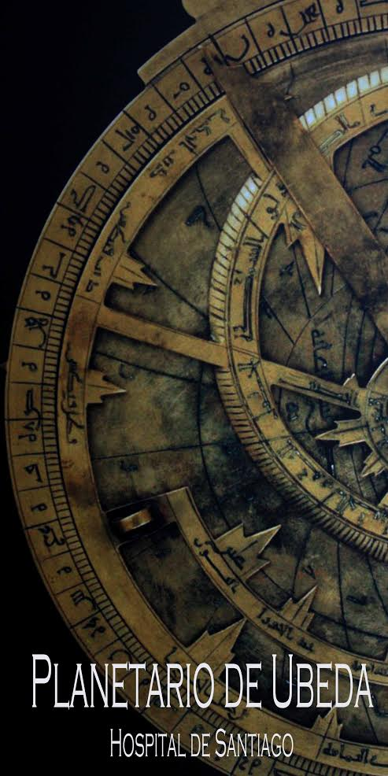
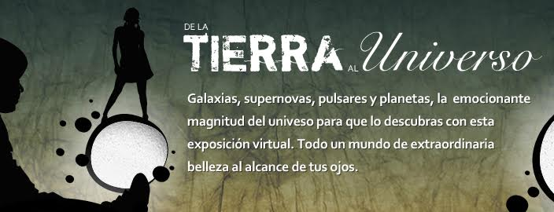
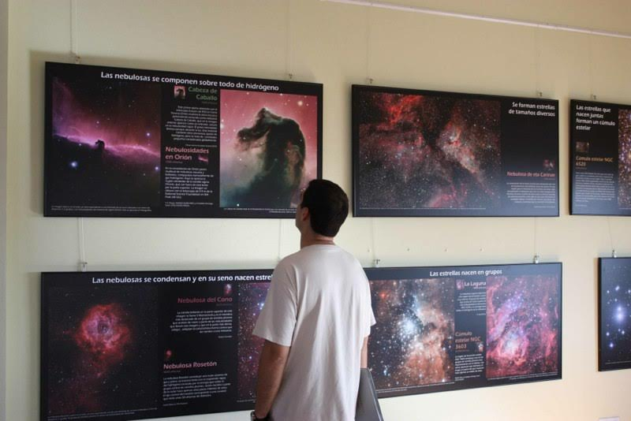

  Desde hace más de un cuarto de siglo, un grupo de docentes y profesionales de distintos sectores unieron esfuerzos para dar respuesta a una necesidad social básica en su entorno más cercano: comunicar y enseñar ciencia divulgando, proporcionando herramientas y experiencias al profesorado que repercutieran en la **comunidad educativa** y permitiera la innovación y renovación pedagógica.
Estos intensos años de trabajo han permitido ver la luz a materiales didácticos, actividades divulgativas, exposiciones, colaboraciones con entidades diversas, comunicaciones y difusión a través de recursos TIC, formación, investigación, colaboración en la creación de ferias de la ciencia y sobre todo el desarrollo de una infraestructura única: el **Planetario de Úbeda**, instalado en un entorno también único, el Hospital de Santiago. Su programación anual de actividades repercute no sólo en la **comunidad académica**, sino que incorpora acciones concretas que posibilitan ampliar la **oferta turística** y la colaboración en **programas de investigación**.
A lo largo de este nuevo curso 2015/16 el Planetario de Úbeda afronta una nueva etapa de **ampliación, actualización de equipos y programas**.
Desde este mes de Noviembre, incorpora las **tecnologías FullDome**. Estos sistemas permiten incorporar herramientas digitales proyectadas a pantalla completa en la cúpula, dotando de una versatilidad y posibilidades extremas al Planetario. Estos dispositivos complementan las prestaciones originales del proyector principal y han permitido renovar la oferta de programas disponibles, incorporando nuevas propuestas dirigidas a todos los públicos.
Por otro lado, el Planetario de Úbeda amplía sus instalaciones incorporando una **sala de usos múltiples** que permitirá el desarrollo de talleres, cursos de formación, desarrollo de experiencias y muestra de exposiciones temporales.

Abordamos esta nueva etapa incorporando a nuestra oferta habitual de actividades, nuevas acciones que permiten desarrollar un extensa y variada **Programación anual** y un horario de apertura más amplio. Algunas de estas nuevas propuestas serían:

- **Programa educativo**. Dirigido a grupos de escolares. Octubre- Junio.
- **Programa de Navidad**. Dirigido al público familiar. Diciembre- Enero.
- **El cielo del mes**. Actividad mensual dirigida al público familiar en la que se completa la visita al planetario con un taller, charla, observación o visita guiada a una exposición.
- **Club de lectura**. Dos anuales. Dirigida a monitores en formación y público general.
- **Exposición temporal**. Dos anuales.
- **Ciclo de cine científico**. Febrero-Abril.
- **Jornadas anuales de Astronomía**. Primera Semana de Julio (hasta ahora se han realizado 13 ediciones, aunque en los últimos 5 años se ha interrumpido la celebración de esta acción).
- **VII Jornadas de ciencia para tod@s**. Abril. Coordinadas y organizadas por la Asociación Renaciencia.
- **Curso de formación de monitores**. Dirigido a estudiantes entre 15 y 18 años. Noviembre- Junio.
- **Cuentacuentos en el Planetario**. Taller de cuentacuentos y participación en el evento “En Úbeda se cuenta 2016”. Junio.
- **Talleres de verano**. Dirigidos a público familiar.
- **Observaciones nocturnas y solares**. Realizadas en el Patio del Hospitalde Santiago, Torreón “Puerta de Úbeda” en Baeza y Observatorio astronómico de la Fresnedilla en el Parque Natural de Cazorla, Segura y Las Villas.

El próximo **1 de diciembre a las 12:00 horas** se celebrará la puesta de largo de las nuevas instalaciones y sistemas. Aprovecharemos el evento para presentar la concreción de la nueva programación de actividades y la inauguración de la exposición “**De la Tierra al Universo, la belleza de la evolución del Cosmos**”, cedida por la **Fundación Descubre**. La exposición constituyó uno de los proyectos globales más destacados del Año Internacional de la Astronomía en 2009 y muestra el Universo mediante imágenes astronómicas de gran belleza y relevancia científica y divulgativa tomadas desde diferentes observatorios del mundo, incluida Andalucía.

Además, el **5 de diciembre, de 17:00 a 21:00 horas**, tendrá lugar una jornada de puertas abiertas a todos los públicos.
Este nuevo impulso a la difusión de la cultura científica en nuestra comunidad ha sido posible gracias a la implicación de instituciones públicas y privadas en el proyecto. Cabe agradecer la apuesta decidida del Excmo. Ayuntamiento de Úbeda y su Área de cultura, la Fundación Caja Rural de Jaén o la Fundación Descubre, Fundación Andaluza para Divulgación de la Innovación y el Conocimiento.

**Planetario de Úbeda. Datos técnicos**

- Capacidad. 70 plazas
- Dirección. Planetario de Úbeda. Hospital de Santiago. Avda. Cristo Rey S/N 23400 Úbeda-Jaén
- E-mail: planetariodeubeda@aaquarks.com o aaquarks@aaquarks.com
- Web: www.planetariodeubeda.aaquarks.com o http://www.aaquarks.com/
