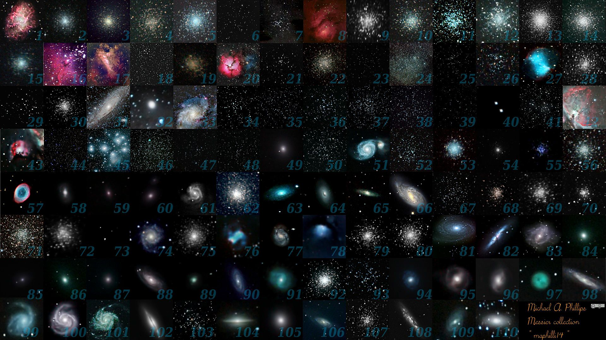
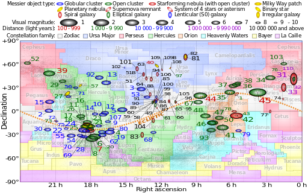
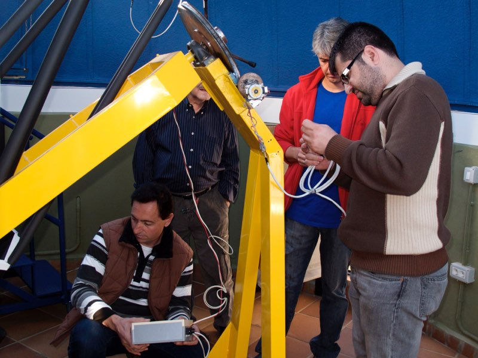
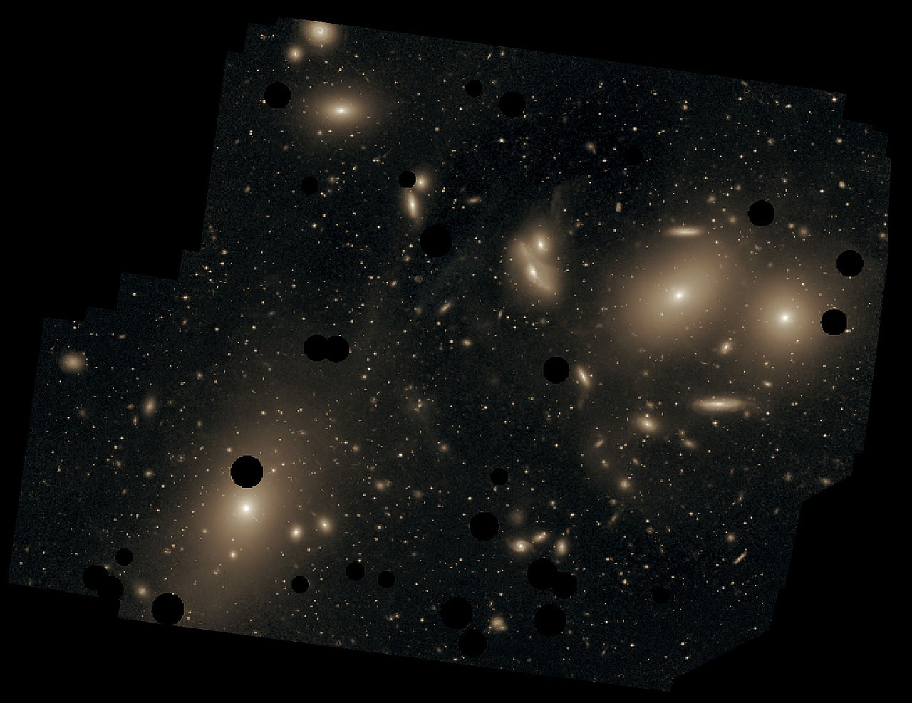

*Por Tomás Ruiz Lara*

Este mes de marzo vamos a romper con la rutina de escribir acerca de algunas de las constelaciones que se encuetran en mejores condiciones para ser observadas durante estos días (a horas razonables) y vamos a observar TODO el cielo nocturno, es hora de prepararnos para el maratón Messier. Las noches de Marzo (y principios de Abril) nos permiten disfrutar del cielo de invierno al principio de la noche, del cielo de primavera a altas horas de la noche y del cielo de verano cuando el crepúsculo matutino nos anuncia el comienzo de un nuevo día. Además estas noches aún son lo suficientemente largas como para disfrutar de las maravillas de cada una de estas épocas. Para aquellos rezagados o frioleros que no hayan disfrutado del espectáculo que nos brindan las noches de diciembre, enero y febrero, durante este mes aún podréis disfrutar de la belleza del cielo de invierno, pero debemos de tener en cuenta que las noches cada vez son más cortas y que el cielo de primavera empieza a llamar a la puerta esperando pacientemente a su turno.

Seáis rezagados o no, es hora de observar de nuevo aquellos objetos ya observados en los meses anteriores, así como anticiparnos a los objetos con los que el firmamento nos deleitará en los meses que vienen. ¿Por qué en marzo? ¿Qué es el maratón Messier? ¿Qué es el catálogo Messier? ¿Quién era este señor? ¿Consejos, itinerarios, fechas? Todo esto y más a continuación. Pero antes me gustaría agradecer (y animaros a visitar su página web) a Guy McArthur, Mark Elowitz, Hartmut Frommert y Christine Kronberg, principales administradores de la web <http://messier.seds.org/> de donde buena parte de la información que voy a mostrar a continuación ha sido obtenida, por su gran esfuerzo recopilando información, artículos y describiendo como nadie el placer de observar el firmamento que nos rodea.

*Mosaico con los 110 objetos que comprenden el catálogo Messier. Imagen montada por el astrónomo aficionado Michael A. Phillips (<http://astromaphilli14.blogspot.com.br/p/m.html>). Imagen tomada de Wikipedia.*

# Charles Messier y un poco de historia

Hoy día contamos con bases de datos con miles de millones de objetos, desde estrellas en nuestra vecindad solar, hasta otras galaxias pasando por objetos dispersos por nuestra propia Galaxia. Con un sólo click tenemos acceso a bases de datos que nos permiten reconstruir órbitas de cometas, obtener espectros cuyo análisis nos revela la naturaleza de los objetos observados o estudios multifrecuencia que nos permiten analizar en profundidad qué está pasando en dicho objetos. Pero esto ha sido gracias al desarrollo tecnológico de los últimos 170 años (fotografía) y al desarrollo de la informática y los métodos de captación de información procedente del espacio. Nada que ver con la ciencia que se hacía en el siglo XVIII. Por aquel entonces poco se sabía del Universo más allá del Sistema Solar, y por lo tanto, el descubrimiento de nuevos cometas era uno de los aspectos que te hacía tener un nombre en astronomía.

Con los instrumentos con los que contaban los astrónomos profesionales durante el siglo XVIII vagamente se podía diferenciar entre una nebulosa, una galaxia o un cometa. Y eso lo sabemos bien los aficionados a la astronomía, ya que algunos de nuestros telescopios podrían haber competido perfectamente con el instrumental utilizado en la época. Sin embargo, mientras que una nebulosa o una galaxia son objetos claramente desvinculados con nuestro Sistema Solar, y por lo tanto muy alejados, los cometas son cuerpos de nuestra vecindad, lo suficientemente cercanos como para verlos moverse con respecto al fondo de estrellas fijas. Catálogos de objetos fijos (nebulosas, cúmulos estelares o galaxias) eran claves para decidir si una nebulosidad observada en el cielo merecía la pena ser observada durante varias noches para ver si poseía movimiento propio o si se trataba de un objeto ya catalogado y conocido.

Durante los años 1758 al 1782, Charles Messier, astrónomo francés (1730 – 1817), compiló una lista de unos 100 objetos candidatos a cometas desde el observatorio que Joseph-Nicolas Delisle (astrónomo francés que desarrolló su labor entre los siglos XVII y XVIII) construyó en el pueblo francés de Cluny (o Clugny). Dicha lista de objetos comenzó a llamarse “Catálogo Messier”, sus objetos se designaron por una “M” en honor a Messier seguidos de un número y hoy día se considera con una colección de los objetos más bellos y brillantes que pueden observarse con telescopios de aficionados. La actual lista de objetos Messier se compone de un total de 110 objetos. La lista inicial de Charles Messier fue expandida por su colega Pierre Méchain (hasta completar una lista de 103 objetos). Los siete últimos (104 al 110) fueron añadidos posteriormente por otros astrónomos desvinculados de Charles Messier.

Efectivamente, lo que estáis pensando es completamente verdad. Lo que hoy día consideramos como una de las compilaciones de objetos más bellos del firmamento, en su día era una lista de objetos a evitar, una lista de objetos que dificultaban la tarea del astrónomo, interesado en el descubrimiento de nuevos cometas. Sin embargo, conforme la lista se iba confeccionando, Messier supo que podía ser interpretada como algo más que simplemente una lista de objetos a evitar, y es por ello que objetos como M42 (la gran nebulosa de Orión) o M45 (las Pleiades), objetos NO confundibles por cometas, también fueron introducidos en la lista.

# El maratón Messier

El maratón Messier es el nombre, artístico si os gusta el término, que se le ha dado al intento de observar tantos objetos Messier como sean posibles en una sola noche de observación. Los objetos Messier no se encuentran uniformemente distribuidos a lo largo del firmamento, de hecho, el único objeto que se encuentra entre las ascensiones rectas 21:40 a 0:40 es M52. Este hecho hace que haya una serie de noches especiales durante los meses de marzo y abril a lo largo de las cuales podemos observar la totalidad de los objetos catalogados por Charles Messier. Dichas fechas oscilan de un año a otro dependiendo de las condiciones lunares, ya que necesitamos luna nueva y cielos limpios para poder observar todos los objetos de cielo profundo del catálogo Messier. Charles Messier realizó sus observaciones desde el Observatorio de Joseph-Nicolas Delisle (astrónomo francés que desarrolló su labor entre los siglos XVII y XVIII) en el pueblo francés de Cluny (o Clugny). Por lo tanto sus observaciones estaban limitadas al hemisferio Norte. De hecho, debido a la distribución de Ascensiones Rectas y Declinaciones de los objetos Messier, las latitudes terrestres óptimas para lograr observar los 110 objetos del catálogo Messier ronda los 25 grados Norte, haciendo de Andalucía (37 grados latitud Norte) uno de los lugares donde esta aventura es posible.

*Representación en el plano Declinación vs Ascensión Recta de los objetos del catálogo Messier. Constelaciones modernas, eclíptica y la Vía Láctea están también marcadas en la figura. Imagen tomada de Wikipedia.*

Los comienzos del maratón Messier se datan por la década de los setenta, cuando algunos aficionados norteamericanos (y quizás algún español no confirmado) comenzaron a intentar cazar todos los objetos Messier en una sola noche. De hecho, se cree que fué la noche del 23 al 24 de marzo de 1985 la primera vez que un astrónomo aficionado (Gerry Rattley desde Arizona) completó tal hazaña. Desde entonces son varias las asociaciones que se han fundado con el único objetivo de prepararse y preparar materiales para esta carrera observacional. De hecho recomendamos enormemente que con la ayuda de este humilde artículo (y otros muchos en la red así como libros especializados como “the Observing Guide to the Messier Marathon” de Machholz, 2002) os animéis a juntaros con vuestros compañeros de asociación e intentar este reto.

Eso sí, la tecnología desde aquellos primeros años setenta ha cambiado muchísimo, y hoy día en pequeños telescopios de aficionado tenemos precisas y completas bases de datos que nos permiten, con un simple click de un mando conectado a la montura (o por medio de un ordenador), movernos de un objeto a otro casi sin pestañear. No soy quién para decir que eso es trampa, pero se pierde el romanticismo de aquellas noches tirados en el suelo con las manos en la montura (o en el mando del motor), con un ojo en el buscador, el otro en el cielo mientras recordamos el recorrido que hemos acordado de acuerdo al mapa de turno para llegar a nuestro siguiente objetivo. De todas formas, sea como sea, os animo desde aquí a intentarlo, si este año observamos 20, el año que viene, con la preparación necesaria, seguro que somos capaces de ampliar nuestra marca.

Evidentemente, hay quién critica este tipo de actividades esgrimiendo que la observación en una noche de 110 objetos no nos permite deleitarnos con cada uno de ellos como se merecen. Es cierto, pero no me convencen, mi respuesta al respecto es muy sencilla. El Universo es un complejo “organismo” que funciona como un sólo, que ha seguido una evolución que tratamos de desgranar los astrónomos día a día. Desde la formación, evolución y muerte de estrellas; hasta las grandes asociaciones estelares como cúmulos abiertos, globulares y hasta galaxias; pasando por observación del medio interestelar que da lugar a nuevas estrellas o que nos impiden observar más allá. Todo esto es el Universo, y todo esto podremos observarlo a lo largo de una sola noche. Habrá actividades más gratificantes, habrá fenómenos más espectaculares, pero seguro que nada como la observación de toda esta variedad de astros en una sola noche, siendo conscientes de lo que estamos observando, para valorar el espectáculo que noche a noche la naturaleza nos brinda y que día a día el ser humano se encarga de destrozar y alejar.

Ya sea para la realización del maratón Messier o para deleite personal durante una noche cualquiera del año, hay multitud de recursos en internet con información acerca de cómo observar cada objeto, cómo localizarlo, que sabemos los astrónomos de él, curiosidades y un largo etcétera. Sólo puedo animaros desde aquí a continuar leyendo esta recopilación de información y ampliar informaciones en completas páginas como las que listo a continuación:

- <http://www.catalogomessier.com/>: Información sobre los objetos, imágenes, dibujos, información sobre el maratón Messier…
- <http://www.astronomia-iniciacion.com/el-catalogo-messier.html>: Información variada sobre el catálogo Messier.
- <https://play.google.com/store/apps/details?id=com.domobile.catalogomessier>: Aplicación para Android sobre el catálogo Messier.
- <http://messier.seds.org/>: Un compendio (en inglés) con todo lo que quieres saber sobre el catálogo Messier, los objetos, el maratón, curiosidades, etc.

Creo que esto es más que suficiente para animaros a preparar todo lo necesario, calibrar nuestro instrumental y salir al campo a pasar un buen rato de observación con nuestros compañeros de afición. Es hora de dejarnos embriagar por las maravillas de un Universo que nos ha creado y visto crecer, ya que nosotros somos parte de él, nosotros somos polvo de estrellas.

# Algunos consejos y principales etapas del maratón

## Equipamiento

Evidentemente, lo primero que necesitamos es algún instrumento óptico. A simple vista podremos ser capaces (desde cielos oscuros) de observar unos 10 objetos. Unos prismáticos de 7×50 o 10×50 (los más recomendados para la observación astronómica) nos permitirán observar unos 60 objetos. En teoría, unos prismáticos de 20×80 nos permitirían observar la totalidad de los objetos Messier. Sin embargo, nuestra intención es observar todos los objetos Messier y optimizar el tiempo, lo que nos lleva a que debemos de empezar cuando las últimas luces aún nos impiden disfrutar de un cielo oscuro y las primeras luces nos dicen que nuestro maratón está llegando a su fin. Además, algunos objetos se encontrarán bajos en el horizonte y otros próximos al sol. Por lo tanto, aunque unos pequeños prismáticos nos ahorrarán mucho tiempo (y de hecho serán utilizados), necesitaremos de un telescopio para captar los objetos más débiles en las condiciones de observación más difíciles. Un newtoniano de 200 mm puede ser un buen compromiso entre comodidad, transportabilidad y ser capaces de observar los 110 objetos, así como un completo set de oculares. También algunos filtros como UHC para resaltar nebulosas pueden venir bastante bien, pero hay que tener en cuenta el diámetro de telescopio que estamos utilizando, la calidad del cielo y el objeto en particular, la experiencia es lo que nos dirá qué usar en cada momento.Tengas el instrumental que tengas, ¡anímate a intentar este reto!

Recordad llevad con vosotros vuestra guía de estrellas de campo favorita, mapas precisos de objetos y alguna planificación referente al orden de los objetos a observar (ya sea la aquí propuesta, otra que encontréis en los anteriores enlaces o alguna que confeccionéis vosotros de acuerdo a vuestra situación). El resto de equipamiento es el típico: ropa de abrigo, aunque la primavera va llegando tenemos por delante muchas horas y las noches de principios de primavera pueden ser bastante frías; comida y un termo con bebida calentita, a medidados de nuestro recorrido haremos un parón para reponer fuerzas que nos permitirá seguir hasta el amanecer; mesa y sillas para sentarnos, observar cómodamente y dejar nuestros cuadernos y mapas; una linterna roja es también imprescindible ya que vamos a observar fundamentalmente objetos de cielo profundo que requieren que nuestra vista esté acostumbrada a la oscuridad.

*Miembros de la Asociación Astronómica Quarks ultimando los preparativos para afrontar un Maratón Messier. Imagen cortesía de la [Asociación Astronómica Quarks](http://aaquarks.com/blog/) de Úbeda.*

Encontrad un lugar con el horizonte lo más despejado posible, trataremos de observar objetos bastante bajos en el horizonte y sería una lástima si no completamos nuestro maratón porque algún árbol se encuentra delante del objeto impidiéndonos su visión (especialmente los horizontes Sur, Este y Oeste deben de estar despejados). Dicho lugar debe de estar lo más alejado posible de las luces artificiales de las ciudades, un cielo oscuro nos garantizará que nuestro éxito puede estar cerca. También la fecha es muy importante. Elegid la fecha convenientemente, muy pronto o muy tarde nos hará perder objetos al principio o al final de la noche. La fase de la luna es otro de los aspectos a tener muy en cuenta, incluso una luna poco iluminada nos puede hacer perder algunos objetos. Al final de esta entrada podréis encontrar una tabla con las fechas más apropiadas teniendo en cuenta todos estos factores hasta 2100.

Llegar pronto al lugar para prepararlo todo con las luces del día es clave. Colimar, alinear buscadores, preparar mapas, comer algo antes de empezar, son algunas de las cosas que debemos de hacer antes de empezar nuestro maratón. A continuación vamos a esbozar algunas de las etapas fundamentales que vamos a encontrar. Los detalles para la localización de cada objeto las podéis encontrar en guías, diversas páginas web (las arriba recomendadas) o incluso vuestras propias notas si ya habéis observado anteriormente estos objetos, de hecho esta última es mi opción recomendada, aunque requiere de bastante experiencia

## Principales etapas

**1) Atardecer ajetreado:** Tan pronto como las primeras estrellas aparezcan en el cielo, siendo éste aún azulado-grisaceo debemos de empezar nuestra búsqueda. Nuestros primeros objetivos son 6 galaxias, 4 de ellas pertenecientes a nuestro Grupo Local (M74, M77, M33, M31, M32, M110) todas ellas hacia el horizonte oeste. Sin tiempo que perder debemos de movernos hacia los 4 siguientes (M52, M103, M76, M34) que son críticos para conseguir nuestro objetivo. Debido a su baja altura y la extinción atmosférica serán difíciles de observar, pero si lo conseguimos, habremos salvado la primera etapa, una de las más duras.

**2) Un poco de relax:** Ahora nos centramos en una zona bastante más alta sobre el horizonte, objetos bastante brillantes, algunos de los cuales podrán ser observables con prismáticos o incluso a simple vista, lo que nos ahorrará bastante tiempo. Durante esta etapa disfrutaremos de cúmulos abiertos, cúmulos globulares, nebulosas y galaxias agrupadas a pares y hasta en tripletes. Cubriremos en esta etapa los objetos enumerados del 11 al 48 en la lista que os proponemos más abajo.

**3) El Universo a gran escala:** A continuación nos sumergiremos en los objetos más lejanos, entorno a 60 millones de años luz nos encontramos con el cúmulo de galaxias denominado como Coma-Virgo (objetos del 46 al 65). Todos estos objetos son galaxias, algunas gigantes elípticas, otras espirales similares a la nuestra, una bella imagen que nos ayuda a imaginar cómo es la estructura filamentada a gran escala del Universo y cómo las galaxias se agrupan, al igual que las estrellas, en cúmulos o supercúmulos ligadas por la acción gravitatoria. En esta etapa aprovecharemos e incluiremos otros dos objetos (M68 y M83) antes de tomarnos un bien merecido descanso. Si miramos el reloj a este punto deben de rondar desde las 0:00 a las 2:00, hasta las 2:30 podemos descansar un poquitín para retomar fuerzas, recordar lo que nos queda por delante y afrontar la última parte… ¡Ánimo ya queda menos!

*Imagen profunda de una región del cúmulo de galaxias de Virgo tomada por  Chris Mihos y colaboradores con el  Burrell Schmidt telescope mostrando además luz difusa proveniente de material intergaláctico. Imagen tomada de Wikipedia.*

**4) Tour de objetos veraniegos:** No sé si a vosotros os pasa lo mismo, pero el ánimo se me sube cada vez que empiezo a observar, aunque sea muy avanzada la noche, las constelaciones de Escorpio y Sagitario, ¡el verano se aproxima!. Sea como sea, es tiempo de observar los objetos típicos del verano y barrer constelaciones como Ofiuco, la Serpiente, Lira, Cisne, Sagitario, etc. Probablemente una de las regiones más bonitas ya que estaremos enfocando nuestros telescopios en dirección al núcleo de nuestra Galaxia, la Vía Láctea, y tendremos ante nosotros uno de los espectáculos más impresionantes. En esta etapa también hay un buen número de objetos observables con prismáticos que nos ahorrarán mucho tiempo. ¡El cielo que viene para los próximos meses promete! En este etapa barreremos objetos desde el 68 al 105, además se trata de la zona del cielo que los observadores del hemisferio Norte mejor conocemos, el buen tiempo y las vacaciones nos permiten en los meses de verano disfrutar de nuestro telescopio mucho más que en los meses de pleno curso escolar.

**5) El acelerón final:** Los primeros claros empiezan a amenazar en el horizonte este tras una noche movidita en la que hemos disfrutado de la naturaleza en estado puro. La naturaleza despierta, el sonido de autillos, buhos y ladridos esporádicos de perros empieza a dar paso a cantos gallos, cencerros de cabras y el piar y trinar de bandadas de pájaros. Cinco objetos más y habremos terminado, pero debemos de darnos prisa, el amanecer está cerca y algunos objetos como M30 pueden llegar a ser bastante difíciles de observar. Pero al final todo merecerá la pena, M15, M2, M72, M73 y nuestro ansiado último objeto M30. ¡Lo hicimos! Hemos terminado nuestro maratón.

Pero no os preocupéis si no habéis observado los 110 objetos, eso sería una proheza, aunque mi más sinceras felicitaciones si lo habéis conseguido. Sea como sea, cada año son varios los días en los que intentar el maratón, así como hay muchos años por delante para tener éxito en este intento. Seguro que al final, con perseverancia, como siempre en esta vida, acabaremos terminar nuestro maratón observacional.

# Secuencia de observación de objetos

A continuación les enseñamos, a modo orientativo, la secuencia de observación de objetos a lo largo del maratón Messier según Don Machholz en su libro “Messier Marathon Observer’s Guide”. Hay otras alternativas de secuencia de objetos, el objetivo fundamental de estas secuencias es el de evitar desplazamientos grandes entre objetos que nos puedan hacer perder el tiempo. Esta secuencian está optimizada para observadores en latitudes norte entre 20 y 40 grados. Compilada por Hartmut Frommert (http://messier.seds.org/xtra/marathon/marath.html). También animamos a todo aquel aficionado a construir su propia lista o incluso a probar varias alternativas a lo largo de los años para ver cuál es vuestra preferida. El apartado anterior trataba de describir de una manera muy resumida, el avanzar en el maratón Messier siguiendo esta lista.

[Tabla con la secuencia de objetos a seguir durante la realización del maratón Messier](http://elseptimocielo.fundaciondescubre.es/files/2015/02/table_sequence.pdf)

# Fechas de los siguientes maratones Messier:

A continuación podréis encontrar una compilación con las mejores fechas para completar el maratón Messier hasta el año 2100 teniendo en cuenta la situación de la luna y buscando fines de semana óptimos para la observación.

[Tabla con las fechas de los siguientes maratones Messier](http://elseptimocielo.fundaciondescubre.es/files/2015/02/table_dates.pdf)
