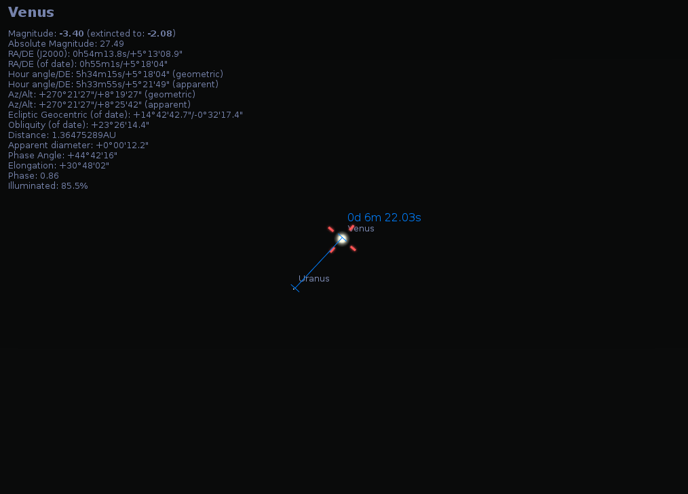
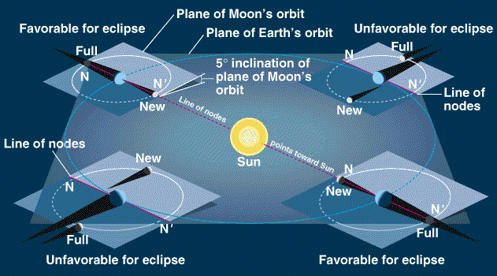
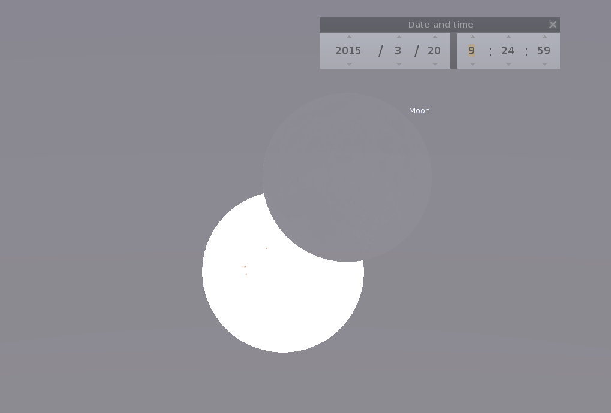

*Por Tomás Ruiz Lara*

# Planetas y Asteroides

Si durante este mes de marzo hay que destacar algún fenómeno relacionado con el Sistema Solar, sin ninguna duda dicho evento es el eclipse solar del día 20 que tanto llevamos esperando. Como podréis imaginar, la entrada de este mes vendrá dominada por esta efeméride. Sin embargo este mes viene cargado de interesantes curiosidades y fenómenos como el equinoccio de primavera o el comienzo de la Semana Santa a finales de mes. Pero para no perder nuestro objetivo, empecemos poco a poco describiendo la situación planetaria a medida que transcurre la noche y el mes.

Al principio de las noches de marzo el oeste estará dominado por el planeta Venus y muy cerca de éste, Marte. Venus irá ganando en brillo desde la magnitud -3.4 el día 1 hasta la -3.5 el día 31 y ganando en altura, aunque recordemos que viene de una conjunción superior (la Tierra, el Sol y Venus estaban alineados en este orden) y por lo tanto cada vez un porcentaje más pequeño de su disco estará iluminado. Sin embargo Marte cada vez lo encontraremos más próximo al horizonte, siendo prácticamente inobservable, especialmente al final del mes. Urano también será observable con telescopio al principio de las noches de marzo muy cerca de Venus y con una magnitud de 7 (teniendo en cuenta extinción atmosférica). Especialmente interesante será el acercamiento Venus-Urano, con una distancia inferior a unos 6 minutos de arco el día 4 de este mes (ver imagen).

La noche “planetaria” estará dominada un mes más por Júpiter. Tras su oposición del pasado 6 de febrero, Júpiter sigue siendo el astro que llamará la atención del público en general junto con Sirio (alpha del Can Mayor), así es que me atrevería a decir que si alguien os pregunta durante este mes ¿Cuál es esa estrella tan brillante? Casi sin mirar al cielo me atrevería a decir Júpiter, aunque la competencia de Sirio y Venus puede llevarnos a error  Júpiter aparecerá con una magnitud de -1.77 al principio del mes, brillando cada vez menos a la vez que se aleja de su opsición (y por lo tanto de nosotros) hasta la magnitud -1.67 a finales de mes. A unos 10 grados de Júpiter tendremos a Juno con una magnitud cercana a 9 observable con telescopios.

Al final de la noche seremos capaces de observar al planeta que por espectacularidad es el favorito de casi cualquier aficionado a la astronomía, Saturno. Con una magnitud cercana a cero nos ofrecerá su mejor cara dominada por sus anillos prácticamente observable con la máxima inclinación posible. Algún cuerpo menor como Ceres o Plutón pueden ser observable entorno a 50 grados hacia el Este de Saturno, y Pallas hacia el noreste. Como siempre, recomendamos la observación de estos cuerpos menores durante algunas noches realizando pequeños bocetos de la vecindad del objeto para ver su movimiento sobre el fondo estrellado.

Algunos fenómenos o encuentros esporádicos dignos de resaltar durante este mes son:

- 3 de marzo: Júpiter a 5.2 grados al Norte de la Luna.
- 4 de marzo: Régulo a 3.8 grados al Norte de la Luna.
- 8 de marzo: NGC4697 detrás de Luna.
- 9 de marzo: Spica a 3.3 grados al Sur de la Luna.

*Máximo acercamiento entre Urano y Venus el día 4 de marzo de 2015. Diagrama generado con el programa Stellarium: <http://www.stellarium.org/es>*

# La Luna

La luna este mes será personaje principal en la obra que el día 20 escenificará junto a la Tierra (observadora de lujo) y el sol (objeto eclipsado), colocándose exactamente en la línea que une ambos astros. El día 5 se producirá el apogeo de esta órbita lunar, es decir, la Luna se encontrará lo más lejos posible de la Tierra hasta la siguiente órbita (aproximadamente un mes), coincidiendo con la fase de Luna llena. Cuarto menguante se producirá el día 13 y poco a poco se irá acercando hacia el sol para el día 20, cuando ésta se encuentre en su fase nueva (y próxima al perigeo, máximo acercamiento Luna-Tierra, que se producirá el día 19) y eclipse al Astro Rey. Cuarto creciente se producirá el 27 de este mes.

*Sencilla explicación gráfica del concepto de línea de los nodos debido a que las órbitas de la luna (alrededor de la Tierra) y la Tierra (alrededor del Sol) no se encuentran en el mismo plano. Ver texto para más detalles. Imagen tomada de http://people.highline.edu/iglozman/classes/astronotes/eclipse.htm*

# El Sol

En la Tierra, debido a la combinación entre traslación, rotación y precesión (ver artículo sobre la[Región Circumpolar Norte I](https://elseptimocielo.fundaciondescubre.es/2015/02/03/region-circumpolar-osa-mayor-osa-menor-y-camelopardalis/)), hay días más largos y días más cortos !incluso lugares geográficos en los que no sale o no se pone el sol! Pues bien, el día 20 de este mes (un día muy importante desde el punto de vista astronómico este año) a las 23:45 el sol se encontrará exactamente a una declinación de 0 grados, es decir, cruzará el ecuador celeste. Este día el sol se encontrará a una Unidad Astronómica de distancia (distancia media entre el Sol y la Tierra), que corresponde a unos 150 millones de kilómetros, o lo que es lo mismo 8.31 minutos luz (la distancia que la luz recorre en 8 minutos y unos 20 segundos). O lo que es lo mismo, la noche y el día durarán exactamento lo mismo y nos encontraremos en lo que denominamos equinoccio de primavera.

!Pero no sólo eso! Este año el equinoccio de primavera coincide con la luna nueva, y además la Luna, el Sol y la Tierra se encuentran en lo que conocemos como la línea de los nodos (ver imagen adjunta). La línea de los nodos es la línea imaginaria de intersección de los planos de la órbita de la Luna (alrededor de la Tierra) y la órbita de la Tierra (alrededor del Sol). Sabemos que ambas órbitas no se encuentran en el mismo plano, si así fuera cada Luna llena sería eclipse lunar y cada luna nueva sería eclipse solar, algo bastante apetitoso pero que haría perder el encanto y romanticismo de estos esporádicos fenómenos. En otras palabras, este año el 20 de marzo tendremos casi a la vez equinoccio, luna nueva y eclipse de sol. Pero por si todo esto os parece poca casualidad, además la luna se encontrará en perigeo 14 horas antes del eclipse, lo cual supone que mostrará un tamaño aparente superior al de días anteriores y posteriores… !Todo un espectáculo que no debemos de perdernos!

El eclipse será observable desde Andalucía desde las 9 de la mañana hasta las 11:15 aproximadamente. Para tener una información más detallada del evento así como horarios para vuestra localización particular, recomendamos que visitéis la siguiente página [web](http://www.vercalendario.info/es/luna/espana-20-marzo-2015.html) y a nivel mundial recomendamos esta [otra](http://www.timeanddate.com/eclipse/solar/2015-march-20).

Como curiosidad, y anticipándonos a lo que relataremos en el próximo mes de abril, la luna llena del mes de abril se producirá el día 4. La celebración de la Pascua de Resurrección siempre debe de coincidir con el primer domingo tras la primera Luna llena tras el equinoccio de primavera (20 de marzo). Por ello, las fechas para dicha festividad vienen impuestas por la Astronomía y oscilan entre el 22 de marzo y el 25 de abril. Ahora entendemos por qué la Semana Santa cambia de fechas dependiendo del año y por qué este año se celebra a finales de Marzo, principios de Abril, aunque el mes que viene hablaremos algo más acerca de esto

*Imagen de lo que podremos observar durante el eclipse de Sol que tendrá lugar el día 20 de este mes de marzo. Diagrama generado con el programa Stellarium: <http://www.stellarium.org/es>*

# Cometas

Este mes la actividad cometaria se encuentra bastante a la baja, destacando cometas de magnitud 10.5 y más débiles. Aún podremos seguir observando en la constelación de Cassiopea a nuestro viejo compañero C/2014 Q2 Lovejoy. Durante este mes de marzo lo encontraremos en la Región Circumpolar:

|  |  |  |  |  |
| --- | --- | --- | --- | --- |
| **Fecha** | **Ascensión Recta** | **Declinación** | **Magnitud** | **Constelación** |
| 2015-Mar-01 | 01h32m14s | +54°55’01” | 6.56 | Cassiopeia |
| 2015-Mar-08 | 01h27m54s | +57°29’34” | 7.00 | Cassiopeia |
| 2015-Mar-15 | 01h25m15s | +59°56’00” | 7.44 | Cassiopeia |
| 2015-Mar-22 | 01h23m58s | +62°19’24” | 7.88 | Cassiopeia |

# Satélites naturales

Los satélites de Júpiter nos proporcionan algunos de los fenómenos más llamativos observables con instrumental básico. Con unos simples prismáticos fijados en un trípode, podemos ser capaces de observar eclipses y ocultaciones y tránsitos de los satétiles o sus sombras sobre Júpiter. Os proponemos para este mes algunos de los más destacados y os recordamos que nos encontramos en plena campaña de observación de Júpiter, os animamos a aquellos aficionados a la astrofotografía planetaria a tomar vuestras mejores imágenes de este gigante gaseoso. Todos los eventos están indicados en hora local.

|  |  |  |
| --- | --- | --- |
| **Inicio (dia hora)** | **Fin (dia hora)** | **Fenomeno** |
| 06 17:31 | 06 22:30 | Ocultación de Calisto por Júpiter |
| 06 19:08 | 06 21:30 | Ocultación de Ío por Júpiter |
| 06 19:47 | 06 22:10 | Eclipse de Ío por Júpiter |
| 10 03:05 | 10 06:52 | Transito de Ganimedes sobre Júpiter |
| 10 06:01 | 10 09:48 | Tr. de la sombra de Ganimedes sobre Júpiter |
| 20 20:18 | 21 00:06 | Ocultación de Ganimedes por Júpiter |
| 20 22:42 | 21 01:04 | Ocultación de Ío por Júpiter |
| 20 23:37 | 21 02:00 | Eclipse de Ío por Júpiter |
| 21 00:03 | 21 03:52 | Eclipse de Ganimedes por Júpiter |
| 23 17:52 | 23 22:53 | Eclipse de Calisto por Júpiter |
| 23 20:35 | 23 23:32 | Ocultación de Europa por Júpiter |
| 23 22:31 | 24 01:28 | Eclipse de Europa por Júpiter |

# Para no perderse

Si deseas acceder a información más detallada sobre efemérides concretas, puedes consultar la página principal del [servidor de efemérides del Observatorio Astronómico Nacional](http://www.oan.es/servidorEfem/)

En esta página puedes consultar informaciones muy variadas como los tránsitos en tu localidad de Satélites artificiales, la Estación Espacial Internacional (ISS) y el telescopio espacial Hubble (HST). Otra página muy interesante y completa (aunque en inglés) es la de los compañeros de [Heavens Above](http://www.heavens-above.com/), selecciona tu localización y disfruta de todos los fenómenos relacionados con satélites y sistema solar visibles desde tu ciudad.

Como podéis ver marzo de 2015 vendrá cargado de eventos astronómicos protagonizados por cuerpos de nuestros Sistema Solar así como lleno de curiosidades y sobre todo “casualidades”.
