18 al 23 de septiembre 2023

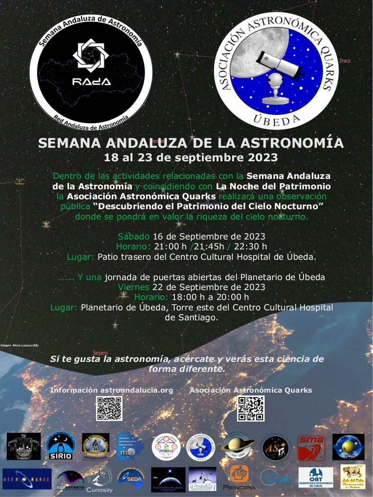

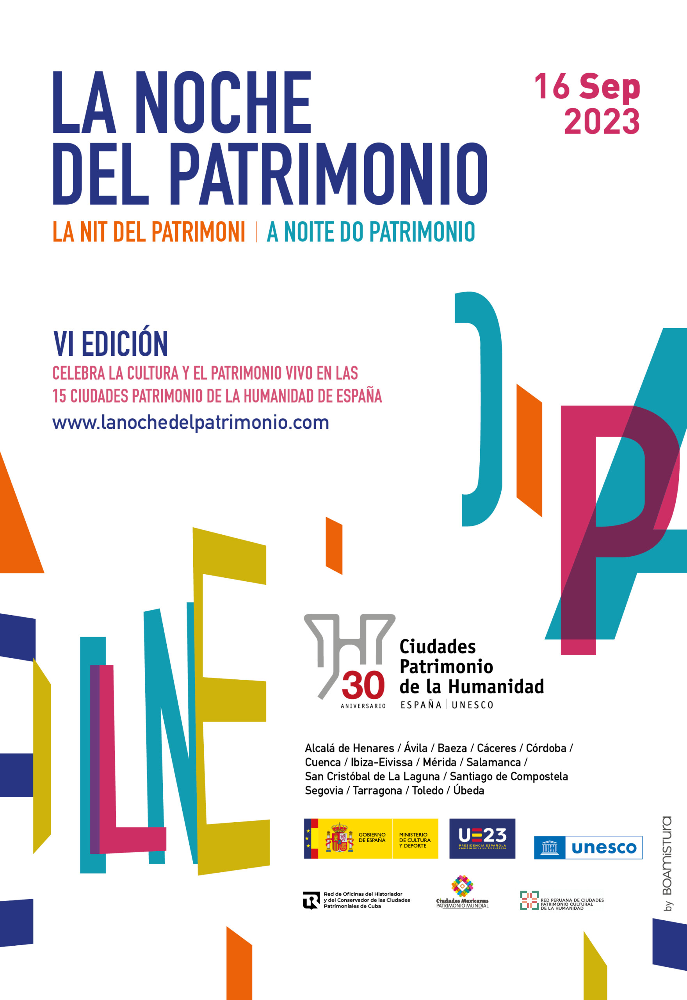

Dentro de las actividades relacionadas con la [Semana Andaluza de la Astronomía](https://astroandalucia.org/semana-andaluza-de-la-astronomia/) y coincidiendo con [La Noche del Patrimonio](https://lanochedelpatrimonio.com/programa-ubeda/), la **Asociación Astronómica Quarks** realizará una observación pública **“Descubriendo el Patrimonio del Cielo Nocturno”** en el **Patio trasero del Centro Cultural Hospital de Úbeda** el sábado **16 de Septiembre de 2023**. Se realizarán 3 sesiones, **21:00 h /21:45 h / 22:30 h** donde se pondrá en valor la riqueza del cielo nocturno. Inscripciones en la oficina de Turismo TLF: 34 953 750 138

Y el Viernes **22 de Septiembre de 2023** se realizará una**jornada de puertas abiertas del Planetario de Úbeda** de **18:00 h a 20:00**

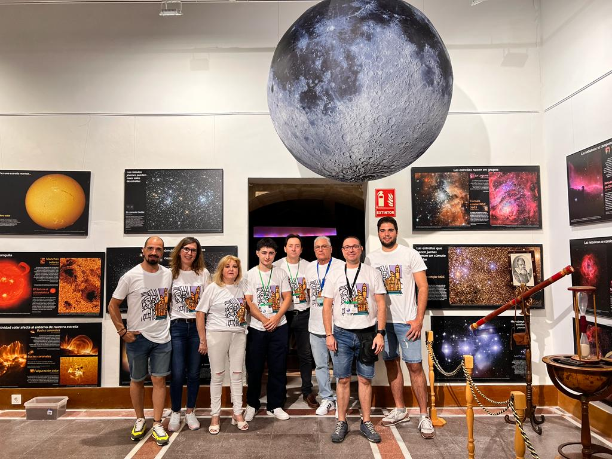
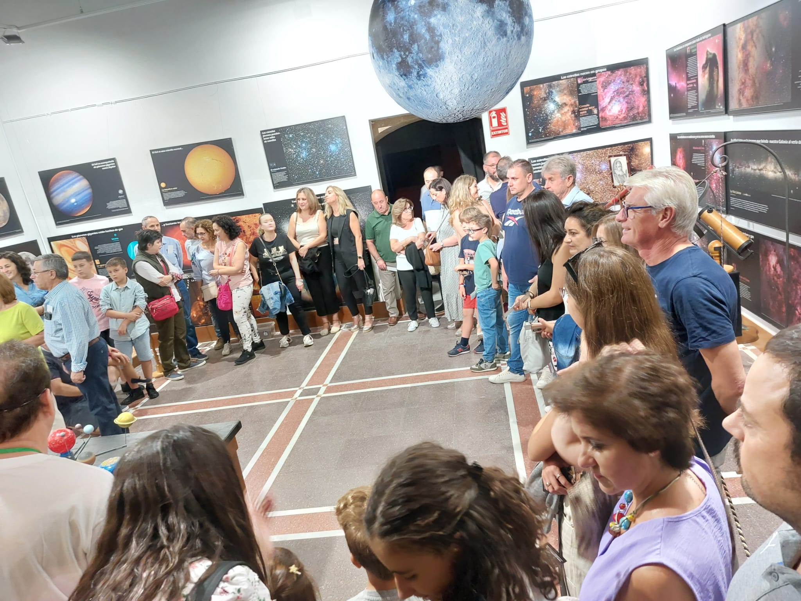
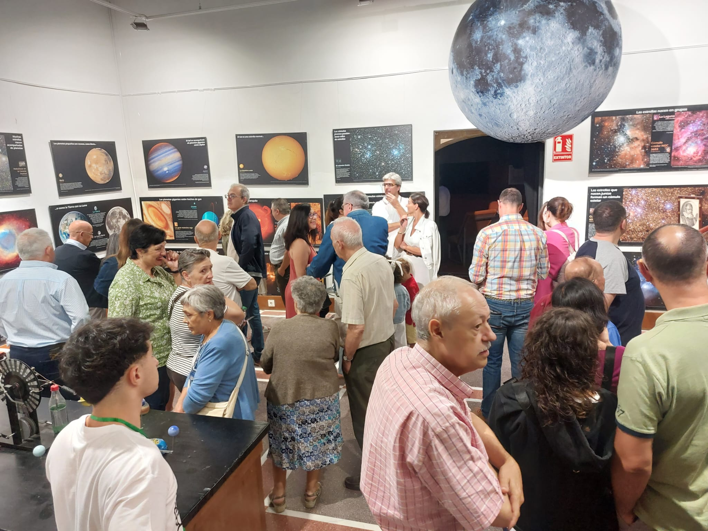
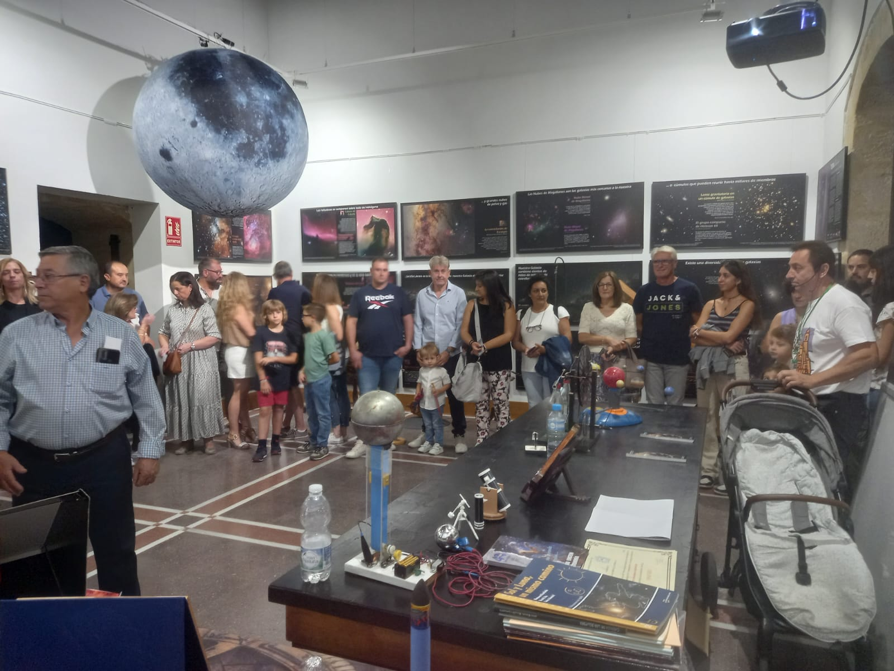
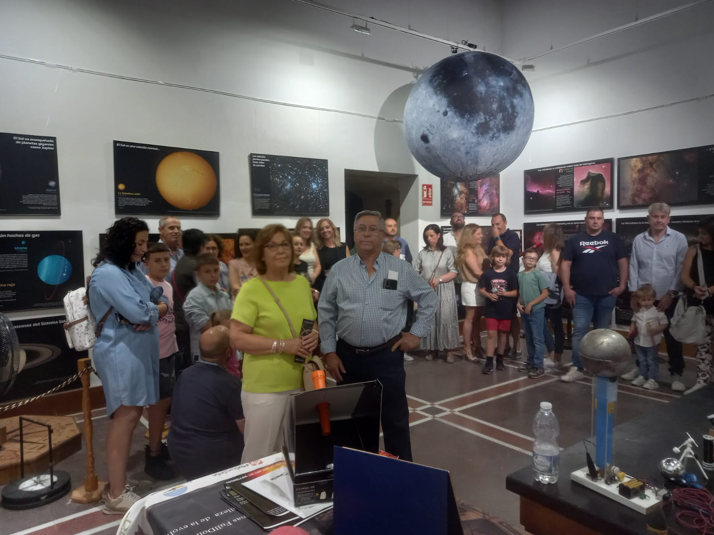
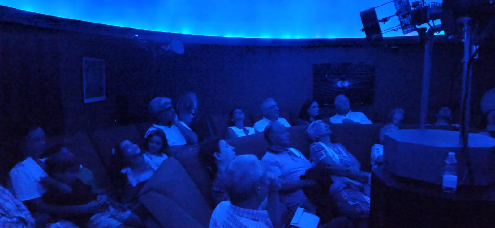
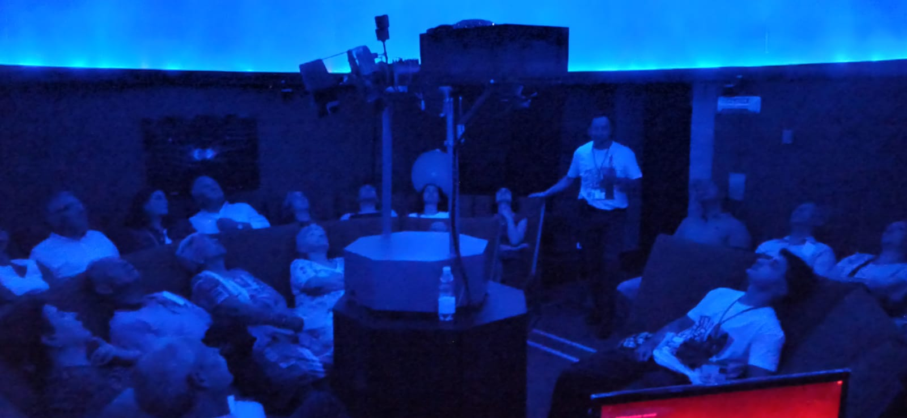
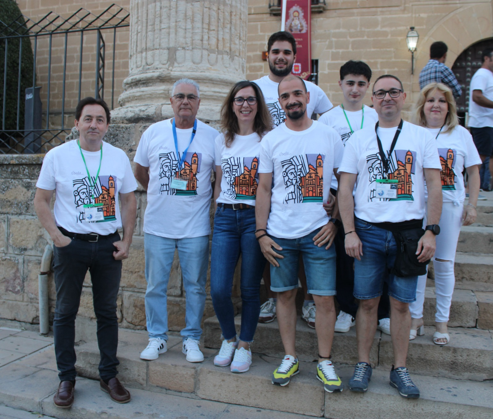
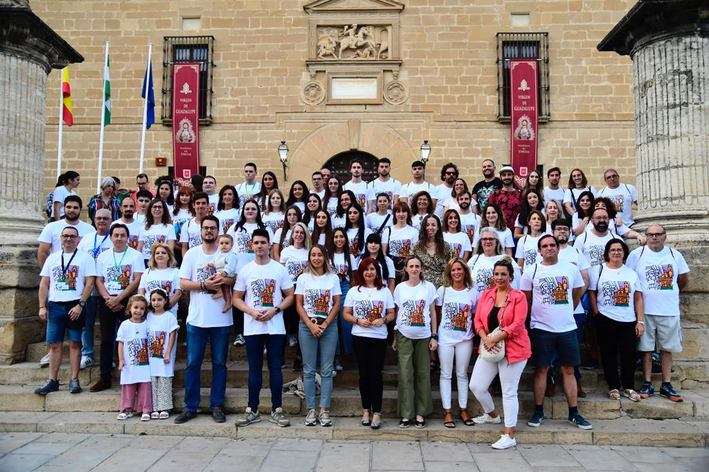
