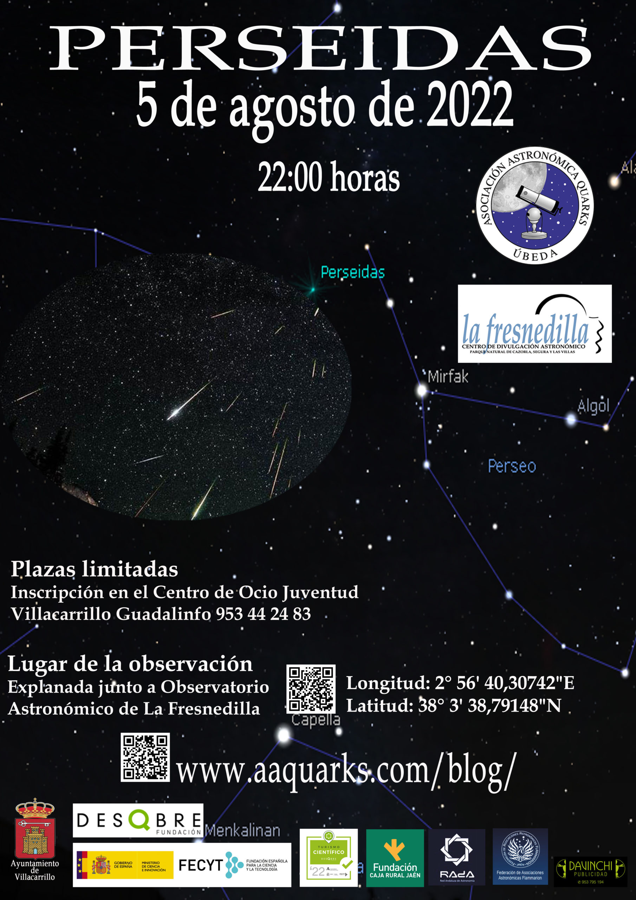
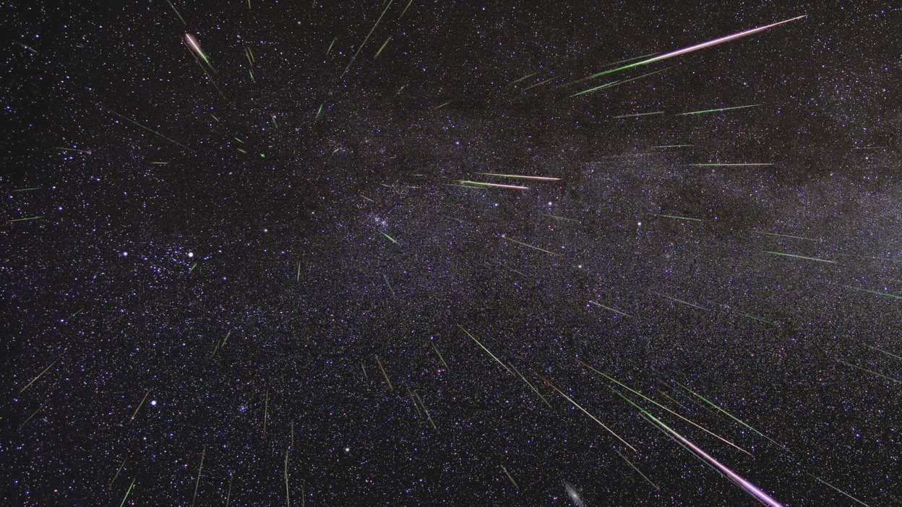
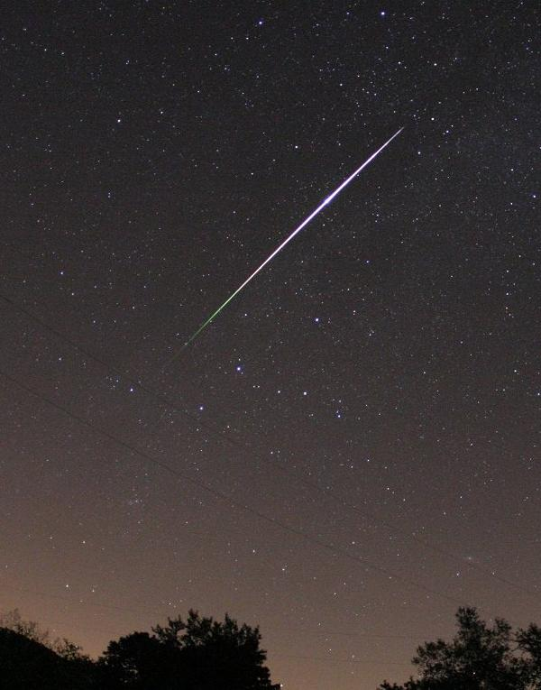
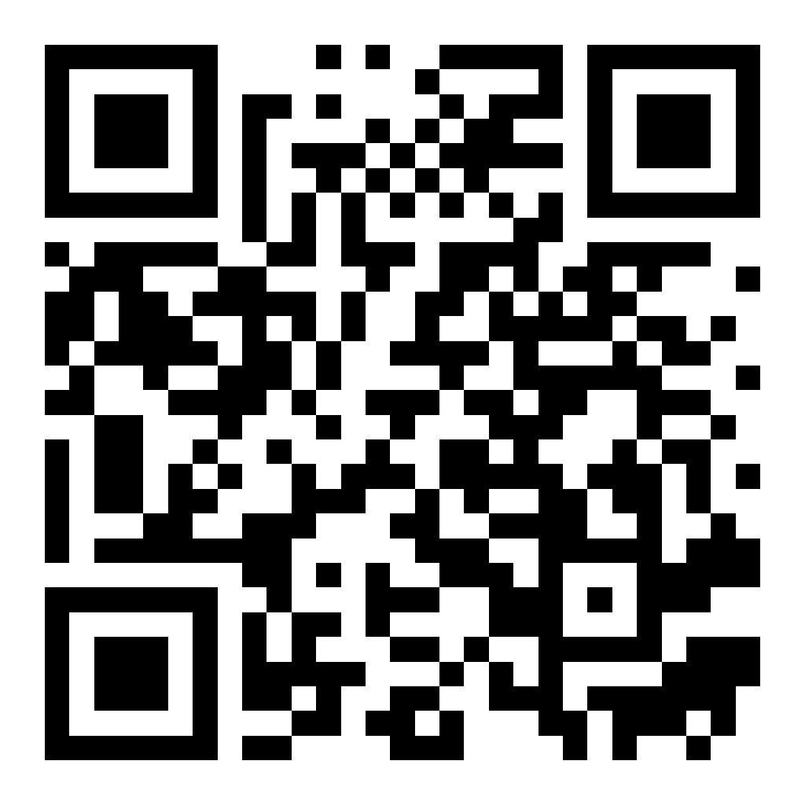

**OBSERVATORIO DE LA FRESNEDILLA**

**5 DE AGOSTO DE 2022 22:00 HORAS**

La lluvia de estrellas de las Perseidas es una de las más esperadas del año, al coincidir
con el verano en el hemisferio Norte.

**¿Qué son las perseidas?**

Las Perseidas, **también llamadas ‘lágrimas de San Lorenzo**’, son una de las lluvias de meteoros más importantes del año. De hecho, son las más abundantes al poder llegar a **observar entre 50 y 110 cada hora.** Además, como tiene lugar durante las noches de verano en el hemisferio Norte (entre los meses de julio y agosto), es también uno de los fenómenos que más éxito tiene entre los aficionados.

La lluvia de meteoros de las Perseidas procede del cometa Swift-Tuttle. Cada año, entre finales de julio y mediados de agosto, la Tierra pasa a través de una nube de polvo desprendida por el cometa cuando se acerca al Sol. Los meteoroides de las Perseidas **golpean nuestra atmósfera a 210.000 kilómetros por hora**, produciendo ese característico espectáculo de luz que atrae la mirada de miles de curiosos de todo el mundo.

En realidad, la mayoría de los meteoroides desprendidos del Swift-Tuttle son pequeños fragmentos parecidos a un grano de arena. Cuando impactan contra la atmósfera terrestre aumentan su temperatura hasta unos**5.000 grados centígrados en una fracción de segundo, lo que provoca que se desintegren a una altura de unos 100 y 80 kilómetros de altitud**. Ese efecto es el que provoca que emitan un destello de luz. Las partículas más grandes, del tamaño de un guisante o incluso mayores, pueden producir unas estelas mucho más brillantes, conocidas con el nombre de bólidos.

Bólido producido por una perseida.

### **¿Cuándo se podrán ver las Perseidas?**

La lluvia de las Perseidas puede verse desde el 17 de julio hasta el 24 de agosto, **aunque el pico tendrá lugar la noche del 11 al 13 de agosto.** La mejor hora para ver las Perseidas en el hemisferio Norte es **durante las horas previas al amanecer,** aunque también pueden apreciarse al anochecer, **a partir de las 10 de la noche**. Este año no se podrán observar en todo su esplendor debido a la Luna llena del 13 de agosto por lo que deberán observarse en los días previos o posteriores a la luna llena.

**Lugar de observación**

La observación se realizará a partir de las 22:00 horas del 5 de agosto de 2022 en la explanada junto al observatorio de La Fresnedilla.

Longitud: 2° 56′ 40,30742″E Latitud: 38° 3′ 38,79148″N

