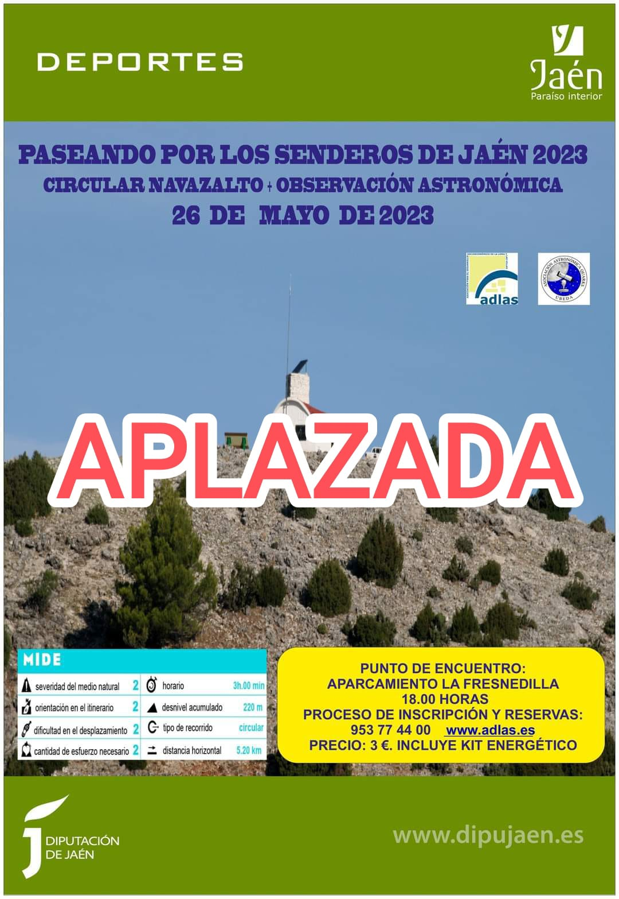

**OBSERVATORIO DE LA FRESNEDILLA.** **Subida al Pico Navazalto y Observación Astronómica.** El viernes 26 de mayo a las 18:00 horas tendremos una actividad doble dentro del programa Paseando por los Senderos. Se recomienda llevar ropa de abrigo.
Más información en el teléfono 953774400 ext. 1800 o en correo jesusdelgado@adlas.es.
