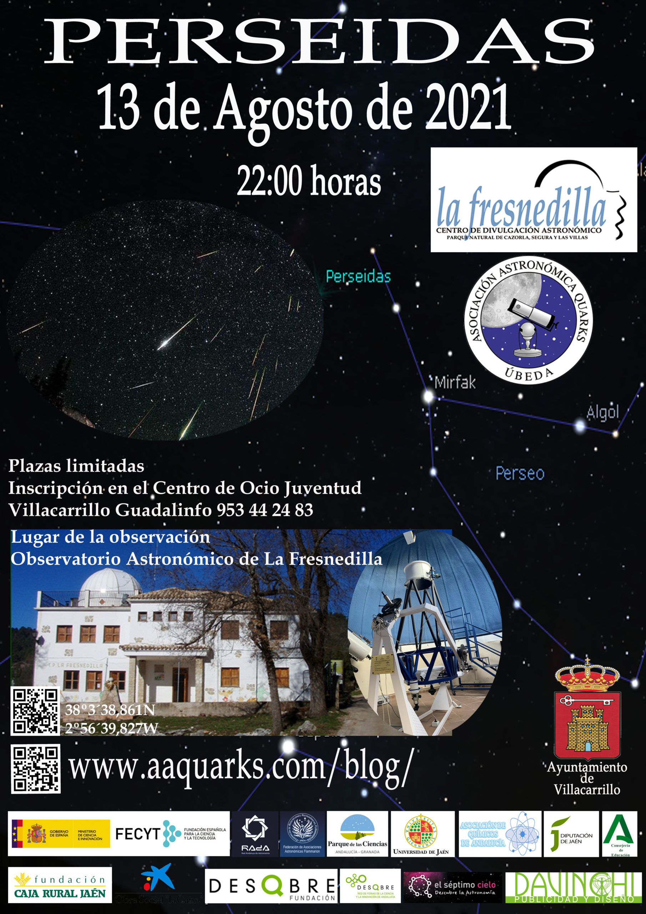
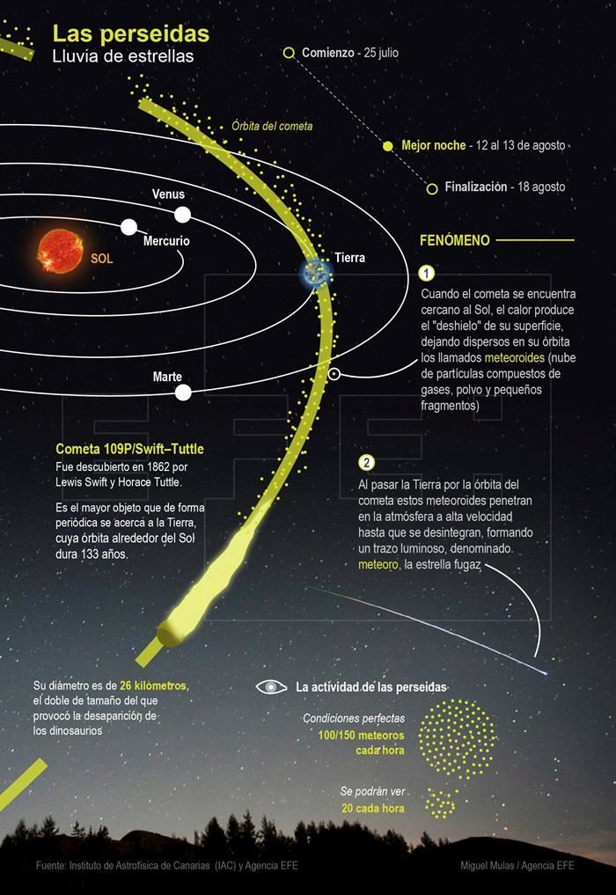

## **La observación se realizará desde el Observatorio Astronómico de La Fresnedilla, el viernes 13 de agosto a las 22:00.**

**Plazas limitadas, Inscripción en el Centro de Ocio Juventud Guadalinfo de Villacarrillo (953 44 24 83)**

La lluvia de las perseidas es una lluvia de meteoros (comúnmente llamados «estrellas fugaces») que sucede todos los años hacia el 12 de agosto.

Las perseidas son visibles desde todo el hemisferio norte en pleno verano. Las velocidades de estos meteoros pueden superar los 50 kilómetros por segundo y su tasa de actividad puede llegar a los 200 meteoros por hora. Aunque su momento de máxima actividad tiene lugar en las noches del 11 al 13 de agosto, las perseidas comienzan habitualmente a verse hacia el 17 de julio y terminan hacia el 24 de agosto. Su alta actividad, junto con las condiciones atmosféricas favorables para la observación durante el verano boreal, hace de las perseidas la lluvia de meteoros más popular, y la más fácilmente observable, de las que tienen lugar a lo largo del año.

El 2021 será año excelente para observar las Perseidas, pues sucederán pocos días después de la luna nueva (8 de agosto).

La máxima actividad de la lluvia está prevista para el 12 de agosto entre las 21 y las 24. Por tanto, el mejor momento para observar las Perseidas será la noche del 12 al 13 de agosto, una vez que el cielo esté oscuro, después de que el creciente de Luna se oculte por el horizonte.

Los cometas, según describen sus órbitas alrededor del Sol, van arrojando al espacio un reguero de gases, polvo y escombros (materiales rocosos) que permanece en una órbita muy similar a la del cometa progenitor.

Cada cometa va formando así un anillo en el que se encuentran distribuidos numerosos fragmentos cometarios. Cuando la Tierra, en su movimiento en torno al Sol, encuentra uno de estos anillos, algunos de los fragmentos rocosos (meteoroides) son atrapados por su campo gravitatorio y caen a gran velocidad a través de la atmósfera formando una lluvia de meteoros. La fricción con los gases atmosféricos calcinan y vaporizan los meteoros que aparecen brillantes durante una fracción de segundo formando lo que popularmente denominamos estrellas fugaces. No se trata por tanto de una estrella sino de una partícula de polvo incandescente.

La altura a la que un meteoro se hace brillante depende de la velocidad de penetración en la atmósfera, pero suele estar en torno a los 100 kilómetros. Sin embargo, el alto brillo y la gran velocidad transversal de algunos meteoros ocasionan un efecto espectacular, causando la ilusión en el observador de que están muy próximos. Los meteoroides de masa menor al kilogramo se calcinan completamente en la atmósfera, pero los mayores y más densos (de consistencia rocosa o metálica), forman meteoritos: restos calcinados que caen sobre el suelo.

Cada año a principios de agosto nuestro planeta cruza la órbita del cometa 109P/Swift-Tuttle, que tiene un período de 133 años y que pasó cerca del Sol por última vez en 1992. Esta órbita está llena de partículas pequeñas, como granos de arena o menores, que han sido liberadas por el cometa en sus pasos anteriores. Cuando una de estas partículas, que formaron en su día la cola del cometa, entra en la atmósfera terrestre a gran velocidad, la fricción la calienta hasta vaporizarla a gran altura.

La correspondiente lluvia de meteoros parece tener un único centro de origen, un punto del que parecen surgir todas las estrellas fugaces. Ese punto se denomina «radiante» y su localización se utiliza para nombrar a la lluvia de estrellas. Así pues, las perseidas tienen su radiante en la constelación de Perseo.

El lugar de observación puede ser cualquiera con tal de que proporcione un cielo oscuro. Es preferible observar desde un lugar que tenga pocos obstáculos para la vista (como edificios, árboles o montañas), y no utilizar instrumentos ópticos que nos limiten el campo de visión. Aunque las perseidas parecen venir de la constelación de Perseo (de ahí su nombre), se pueden ver en cualquier parte del cielo. Conviene dirigir la mirada hacia las zonas más oscuras, en la dirección opuesta a la posición de la Luna si la observación se realiza antes de su ocaso. Lo más cómodo es tumbarse y esperar a que la vista se acostumbre a la oscuridad.

El número de meteoros observables por hora es muy variable. En un sitio bien oscuro y con el radiante alto sobre el horizonte puede superar el centenar. Sin embargo, el número de meteoros observados por hora puede variar muy rápidamente según varía la densidad de fragmentos en la estela del cometa, por ello las predicciones concretas sobre número específico de meteoros dependiendo del día y la hora son difíciles de realizar y suelen estar afectadas de una incertidumbre alta.
