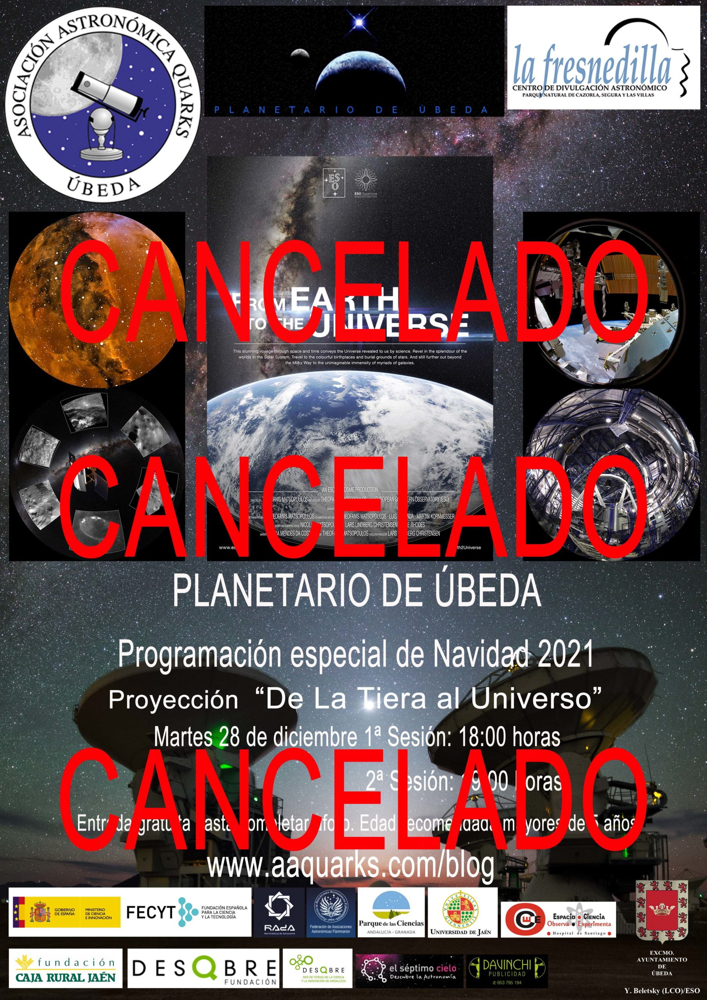

## Planetario de Úbeda: Programación especial de Navidad «De la Tierra al Universo».

Un año más, la Asociación Astronómica Quarks y El Planetario de Úbeda
participarán en las actividades de la campaña de Navidad con la
proyección del espectáculo para planetario «De La Tierra al Universo».

El martes 28 de diciembre se realizarán dos sesiones, la 1ª comenzará a
las 18:00 horas y la 2ª comenzará a las 19:00 horas.

La entrada será gratuita hasta completar aforo.

En esta proyección se muestra como el cielo nocturno, hermoso y
misterioso, ha inspirado asombro y ha sido objeto de historias de
fogatas y mitos antiguos desde que ha existido la Humanidad. El deseo de
comprender el Universo, bien puede ser la experiencia intelectual
compartida más antigua de la humanidad. Sin embargo, solo recientemente
hemos comenzado a comprender verdaderamente nuestro lugar en el vasto
cosmos. Con este viaje de descubrimiento, conoceremos desde las teorías
de los antiguos astrónomos griegos hasta los telescopios más grandiosos
de la actualidad.

Este impresionante viaje de 30 minutos por el espacio y el tiempo, a
través de imágenes y sonidos brillantes, muestra el Universo tal como
nos lo revela la ciencia. Por este impresionante camino, la audiencia
aprenderá sobre la historia de la astronomía, la invención del
telescopio y como los actuales telescopios gigantes nos permiten sondear
cada vez más profundamente el Universo.

Esta proyección está dirigida por el griego Theofanis N. Matsopoulos y
la arrolladora banda sonora compuesta por el compositor noruego Johan B.
Monell.
