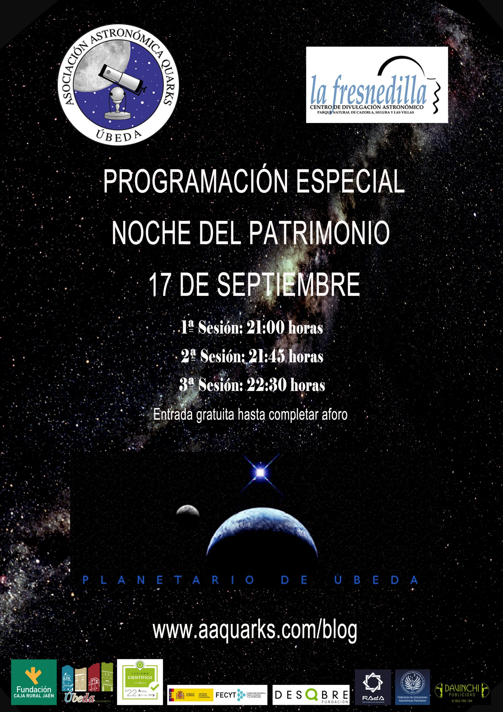

17 DE SEPTIEMBRE DE 2022, PROGRAMACIÓN ESPECIAL NOCHE DEL PATRIMONIO

Este año, la **Asociación Astronómica Quarks**, participa en «La Noche del Patrimonio» con una proyección en el **Planetario de Úbeda**.

Más información de las actividades en la página web de «La Noche del Patrimonio» <https://lanochedelpatrimonio.com/abierto-patrimonio-ubeda>
