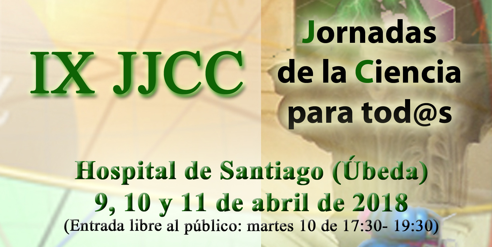

##

El **próximo viernes 16 de marzo**, tendrá lugar el acto de **presentación de las IX Jornadas de Ciencia para tod@s**, en el que se ofrecerá una visita al Planetario y una actividad divulgativa en el Centro de Divulgación Científica “Espacio Ciencia” en la que asistiremos a una variante del famosísimo experimento con el que Fizeau consiguió determinar la velocidad de la luz a mediados del siglo IXX: **“*Medida la velocidad de la luz con una trompeta***” por **Juan Antonio Jiménez Salas.**

### Viernes, 16 de marzo. Programa

### Presentación IX Jornadas de ciencias para tod@s 2018

- 18:00 h. Atención a medios de comunicación.
- 18:15 h. Sala Julio Corzo. Presentación Jornadas de ciencia para tod@s.
- 18:30 h. Demo en el Planetario de Úbeda y Aula de Astronomía. “**Actividad divulgativa: “*Medida la velocidad de la luz con una trompeta***” a cargo  de **Juan Antonio Jiménez Salas**.

### Visita guiada a Espacio Ciencia:

- Sala de módulos “Lise Meitner”.
- Realización de talleres. Sala de usos múltiples.

## **Asociación cultural Renaciencia**

**IX Jornadas de Ciencia para tod@s**

**Úbeda 2018**

**9 al 11 de Abril**

**Centro Cultural Hospital de Santiago**

**[http://www.jornadasdelaciencia.aaquarks.com](http://www.jornadasdelaciencia.aaquarks.com/)**

[Acceso a la galería de imágenes de ediciones anteriores](http://www.aaquarks.com/web/Asociacion_Astronomica_Quarks/Actividades____Actividades_del_2011/Paginas/II_Jornadas_Ciencia_para_Tod%40s.html)

**[jjccparatodos@gmail.com](mailto:jjccparatodos@gmail.com)**   [FACEBOOK](https://www.facebook.com/RenacienciaUbeda/?fref=ts)         [@jjccparatodos](https://twitter.com/jjccparatodos)

###
