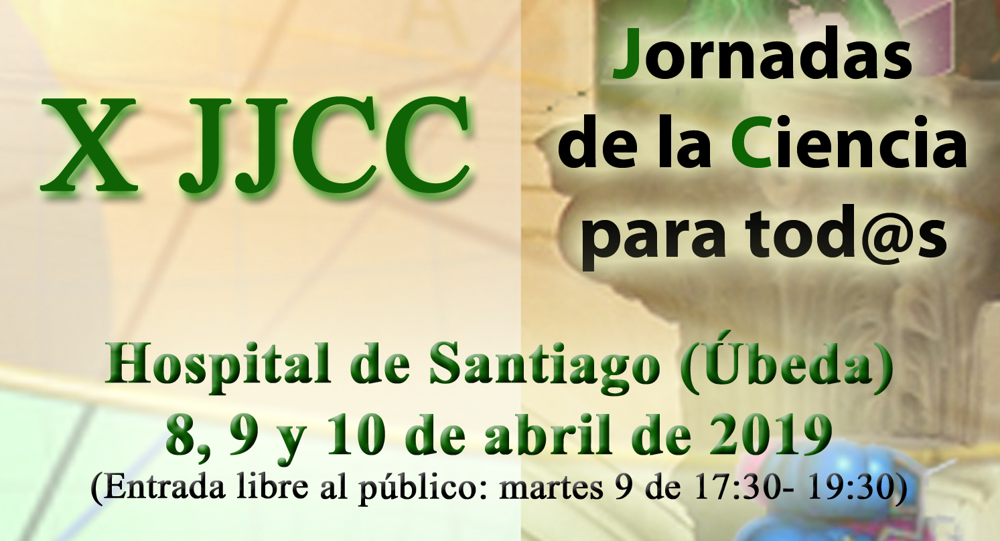
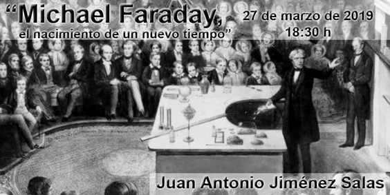
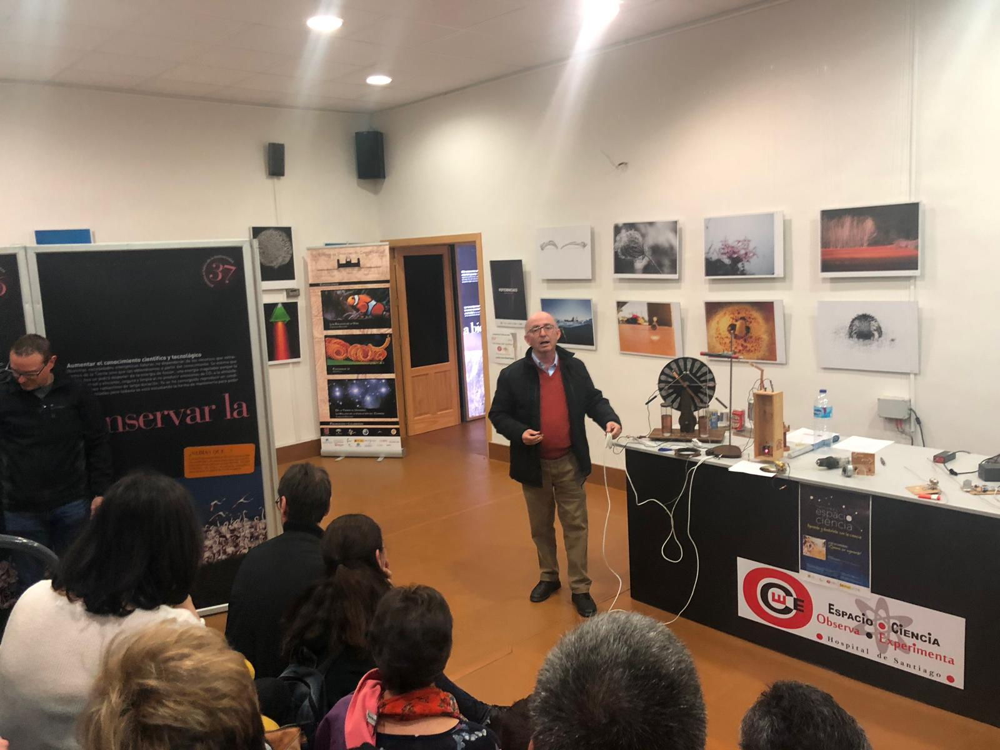
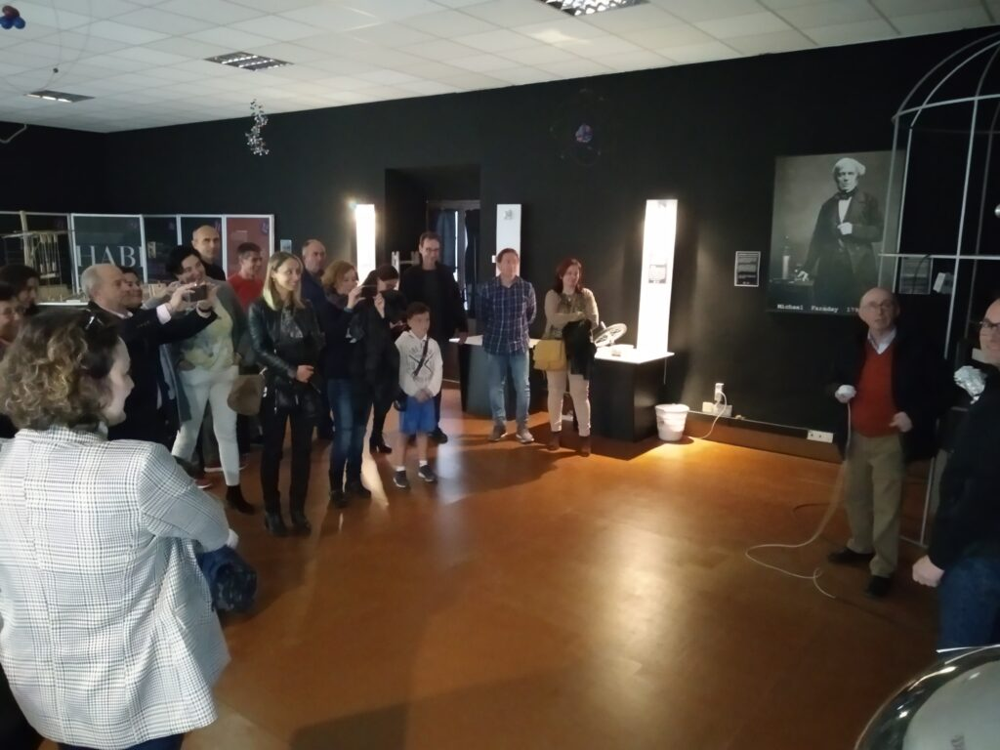
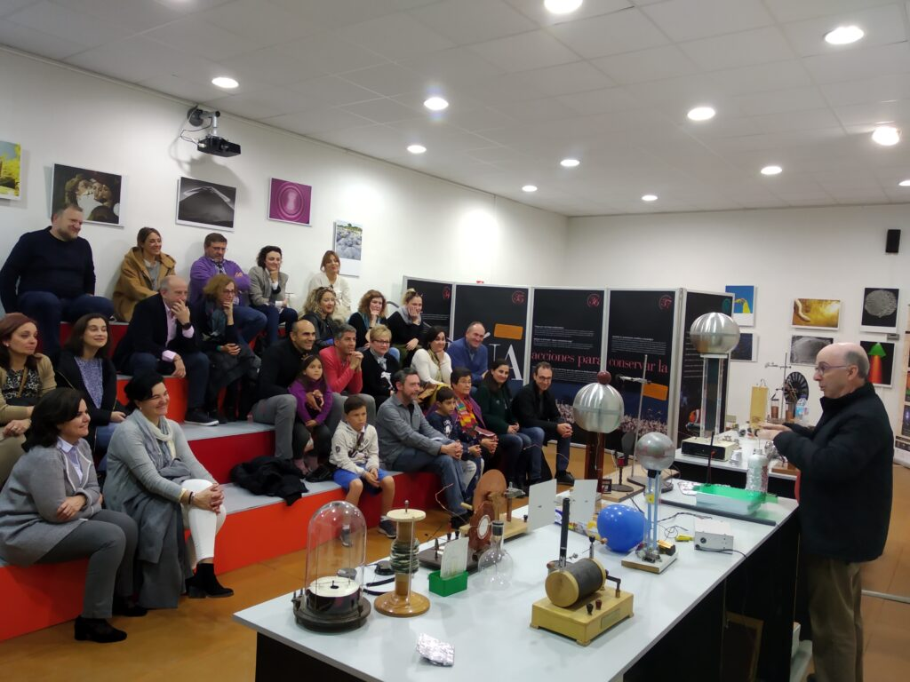

El **próximo viernes 27 de marzo**, tendrá lugar el acto de **presentación de las X Jornadas de Ciencia para tod@s**, en el que se ofrecerá una visita al Planetario y una actividad divulgativa en el Centro de Divulgación Científica “Espacio Ciencia” en la que asistiremos a una reproducción de un taller similar a los que Michael Faraday impartía en el siglo XIX: **“*****Michael Faraday, el nacimiento de un nuevo tiempo***” por **Juan Antonio Jiménez Salas.**

### **Viernes, 27 de marzo.**

### **Programa**

### **Presentación X Jornadas de ciencias para tod@s 2019**

18.00 h: Reunión informativa para los docentes responsables de los grupos que participan como monitores/as de las experiencias.

18:30 h: Taller “Michael Faraday, el nacimiento de un nuevo tiempo” por D. Juan Antonio Jiménez Salas, Licenciado en Química e Ingeniero Industrial que desarrolla su actividad en el ámbito educativo, participando de forma activa en acciones formativas.

### **Visita guiada a Espacio Ciencia y Planetario:**

- Sala de módulos “Lise Meitner”.
- Planetario: Sesión “El
  Renacimiento de la Astronomía”

- 
- 
- 

## **Asociación Renaciencia**

**X
Jornadas de Ciencia para tod@s**

**Úbeda
2019**

**8
al 10 de Abril**

**Centro
Cultural Hospital de Santiago**

[Acceso
a la galería de imágenes de ediciones anteriores](http://www.aaquarks.com/web/Asociacion_Astronomica_Quarks/Actividades____Actividades_del_2011/Paginas/II_Jornadas_Ciencia_para_Tod%40s.html)

[**jjccparatodos@gmail.com**](mailto:jjccparatodos@gmail.com)   [FACEBOOK](https://www.facebook.com/RenacienciaUbeda/?fref=ts)
      [@jjccparatodos](https://twitter.com/jjccparatodos)
