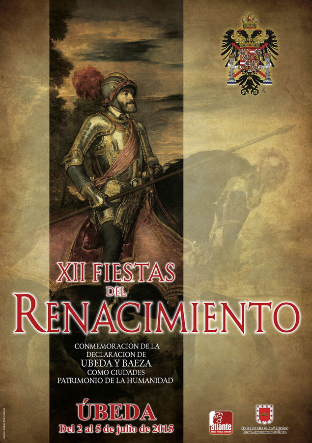
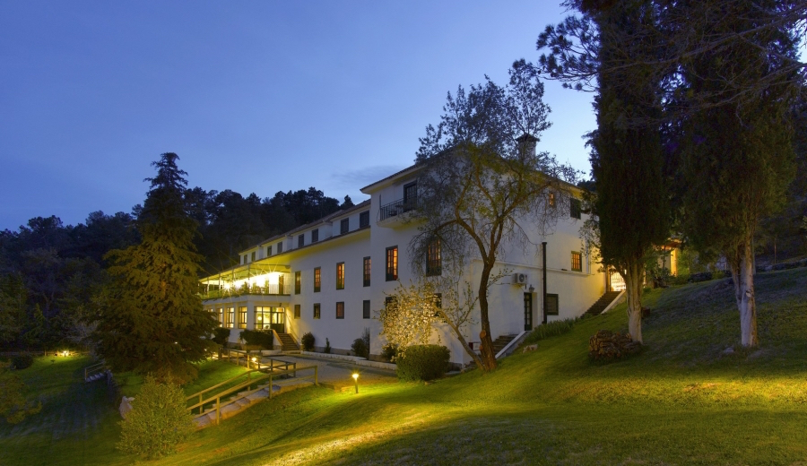

### [Fiestas del Renacimiento de Úbeda](http://turismodeubeda.com/index.php/es/agenda-cultural/fiestas/fiestas-del-renacimiento)

En julio se celebran las **Fiestas del Renacimiento**, fiestas que conmemoran la declaración de Úbeda y Baeza como Ciudades Patrimonio de la Humanidad el 3 de julio de 2003, en concreto, este año celebramos el **12º aniversario**.

**1 de Julio**

20:00 HORAS. Planetario de la Asociación Quarks. Hospital de Santiago. Visita guiada al Planetario: “**VISIÓN RENACENTISTA DE LOS ORBES CELESTES**” y Visita guiada al **MUSEO DE LA CIENCIA** del Hospital de Santiago: “**EXPERIENCIAS CLÁSICAS: DEL RENACIMIENTO A LA ACTUALIDAD**”.

22:00 HORAS. Hospital de Santiago: **OBSERVACIÓN ASTRONÓMICA CON INSTRUMENTOS CLÁSICOS** (reproducciones de los telescopios de Galileo, Newton y Herschel) y **PROYECCIÓN AUDIOVISUAL “LA ASTRONOMÍA DEL RENACIMIENTO”** en la fachada del Hospital de Santiago.

### Noche de estrellas en el Parador de Cazorla

 Como cada verano y fiel a su cita, el firmamento nos deleita con un baile de estrellas titilantes encima de nuestras cabezas. Con el programa «Noches de Estrellas», el Parador de Cazorla ofrece a sus clientes la posibilidad de acercarse a un cielo de una calidad envidiable ofreciendo claves para su observación y los objetos que pueden observarse con diferente instrumental.

La Asociación Astronómica Quarks colabora en el desarrollo de estas actividades aportando los monitores y el instrumental de observación. Actividad reservada a clientes del Parador.

Fechas: 2 y 30 de Julio y 6 de Agosto

Reservas: [www.parador.es/es/paradores/parador-de-cazorla](http://www.parador.es/es/paradores/parador-de-cazorla) y 953727075

### Verano de estrellas. [Observatorio de la Fresnedilla](http://aaquarks.com/blog/?page_id=56) IMG_0916-1024x569

Bajo el título «Verano de estrellas» proponemos acercarnos a las noches estrelladas del verano con un programa amplio y adaptado a todos los públicos, siendo una actividad ideal para realizar en familia. Podremos disfrutar estos días desde las famosas lluvias de estrellas a la observación de cielo profundo con el instrumental más avanzado.

**LLuvia de estrellas: Viernes 12 de Agosto.**

- Visita guiada al centro
- Sesión de Planetario Natural
- Observación dirigida con instrumental avanzado

La actividad pretende presentar este centro a los visitantes que en estas fechas estivales se acercan a nuestro Parque Natural a disfrutar sus vacaciones. Al mismo tiempo, queremos ofertar una alternativa cultural y de ocio a los habitantes del entorno.

Cabe destacar la calidad del cielo del paraje en el que se encuentra ubicado el centro, lo que nos permite incidir de forma expresa y como objetivo central de esta actividad, en la necesidad de mantener nuestros cielos libres de contaminación lumínica.

Este propuesta se enmarca en la programación anual 2016 del Planetario de Úbeda, Museo de ciencia de Úbeda y del Centro de Divulgación Astronómico de La Fresnedilla, consolidada en los últimos años con una amplia variedad de propuestas, ya que en su conjunto recoge más de cincuenta actividades repartidas a lo largo del año y dirigidas a diversos públicos: escolares, docentes, universitarios, familiar, turístico, asociaciones…

**Nota:** Además de las actividades cerradas, puden solicitarse visitas concertadas para grupos. Todas las actividades requieren reserva previa. Pueden solicitarse actividades a la carta a través del sistema de reservas en [aaquarks@aaquarks.com](mailto:aaquarks@aaquarks.com). Donativo 10 €

### **Visitas guiadas al cielo de Sabiote desde el Castillo**

Con esta nueva iniciativa, Sabiote ofrece al visitante la posibilidad de abrir una ventana para observar el Universo. El entorno monumental del Castillo completa su oferta turística añadiendo a su patrimonio renacentista el patrimonio natural de su cielo y las maravillas que encierra: nebulosas, cúmulos, galaxias…y por supuesto Saturno y la Luna. Un viaje en el tiempo y una experiencia única.

Fechas: 10 y 26 de Agosto

Reservas: info@bonoturistico.com o 953 10 83 10 (Artíficis y Pópulo)

### Lluvia de estrellas en Torreperogil. Programa «Apaga tu pueblo»

Fiel a su cita anual, asistiremos al espectáculo que nos ofrecen Perseidas o Lágrimas de San Lorenzo, un clásico ya de las noches veraniegas. Para ello, el entorno del auditorio Torres oscuras ofrece la posibilidad de realizar una observación astronómica relajada y de disfrute del entrono monumental y natural en la que aprender a reconocer el cielo a simple vista, observar a través de telescopios objetos como Saturno con su sistema de anillos y lunas, y, aprovechando la luna en fase de cuarto creciente hablaremos largo y tendido sobre ella. También observaremos cuerpos de cielo profundo (galaxias, nebulosas, cúmulos de estrellas,…) que por su brillo sean posible de contemplar a pesar del brillo de la Luna. Todo estará aderezado por las trazas de las estrellas fugaces.

Fecha: 11 de Agosto

Lugar: Torres oscuras

Hora: 22.00-24.00
