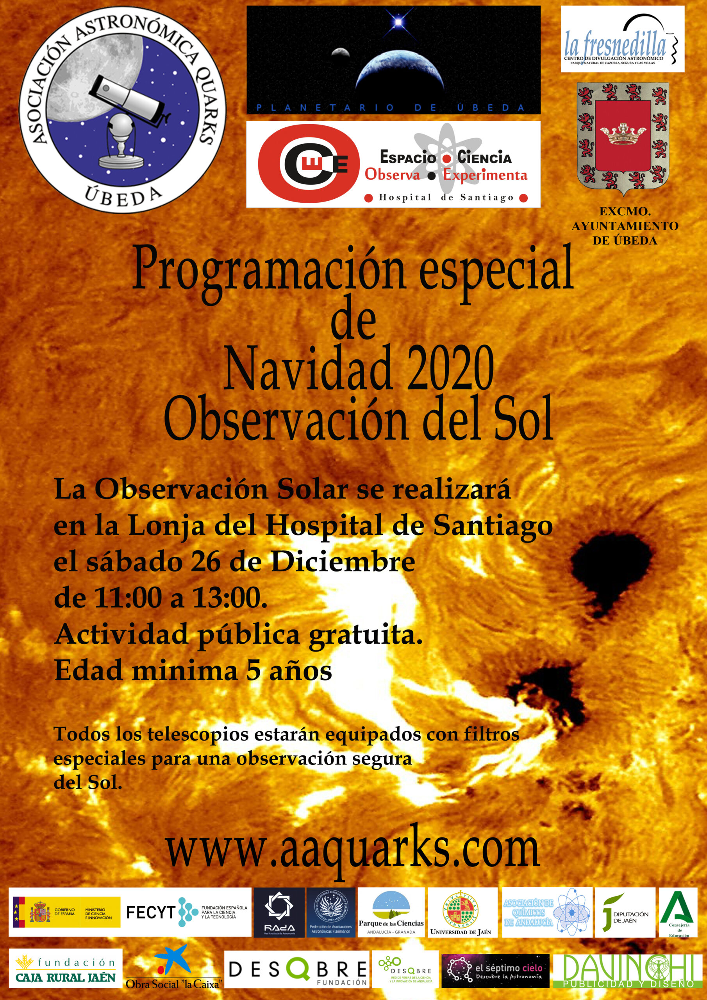

Debido a la pandemia de Covid-19 y a las restricciones sanitarias impuestas para las actividades realizadas en interiores, este año no podremos realizar la tradicional actividad de Navidad en el Planetario de Úbeda.

Por eso, en este año tan atípico, nos trasladaremos al exterior y no nos quedaremos sin actividad.

¡¡¡ Observaremos la superficie de la estrella más cercana a nuestro planeta, el Sol!!!

La observación solar será una actividad pública gratuita y se realizará en la lonja del Hospital de Santiago, el sábado 26 de diciembre de 11:00 h a 13:00 h.
Para este evento contaremos con telescopios equipados con filtros especiales para una observación segura del Sol.

La edad mínima es de 5 años.

