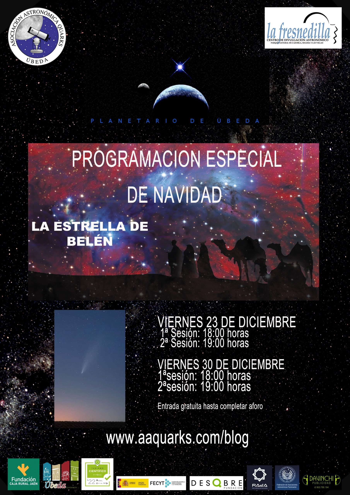

## Planetario de Úbeda · Hospital de Santiago

# 23 de Diciembre – 30 de Diciembre

### Entrada gratuita hasta completar aforo.

Es indiscutible que uno de los elementos que no pasa desapercibido en cualquier representación de un nacimiento es la Estrella. A medida que se va acercando la Navidad nuestras calles se iluminan y no es rara aquella en la que aparezca una estrella. Belenes, villancicos, anuncios, películas,… en todos estas situaciones no falta la bíblica estrella de Belén. Con la ayuda de los ordenadores, los avances en traducciones de lenguas orientales y nuevos hallazgos arqueológicos, hoy día tenemos posibilidades de investigar, desde el punto de vista astronómico, que pudo ser realmente la estrella. Las conclusiones que se van obteniendo aún andan por el terreno de las hipótesis pero permiten obtener algunos datos interesantes y descartar algunos sucesos astronómicos que se relacionaban, (y aún se relacionan erróneamente) con la Estrella de Belén.
