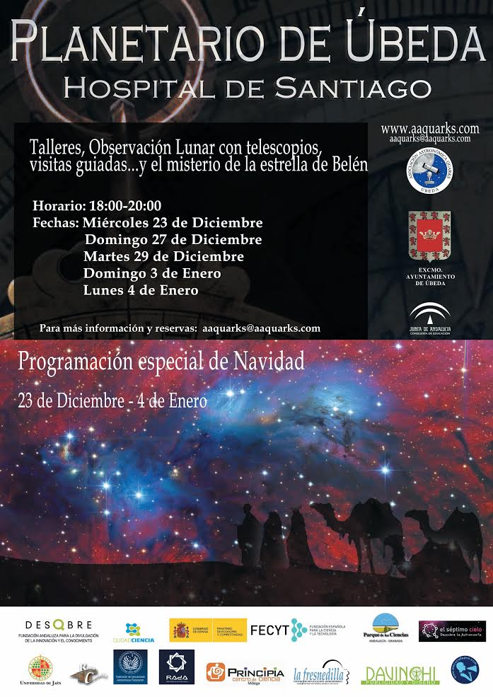

## Planetario de Úbeda · Hospital de Santiago

# Programación especial de Navidad

### 5 Diciembre- 4 de Enero

- **5 de Diciembre**. 17-21 horas. Jornadas de puertas abiertas. Visita guiada a la Exposición “De la Tierra al Universo, la belleza de la evolución del Cosmos”. Acceso libre sujeto a aforo.
- **23 de Diciembre**. 18-21 horas. Programa “La estrella de Belén” y observación Lunar\*. Visita guiada a la Exposición “De la Tierra al Universo, la belleza de la evolución del Cosmos”. Precio: 3€ por participante
  \*Actividad condicionada por meteorología
- **27 de Diciembre**. 18-20 horas. Programa “La estrella de Belén” y Taller “Artestrella” a cargo de CartonArt Úbeda. Exposición “De la Tierra al Universo, la belleza de la evolución del Cosmos”. Grupos reducidos 3 a 7 años y 8 a 11 años. Precio: 5€ por participante
- **29 de Diciembre**. 18-20 horas. Programa “La estrella de Belén” y visita guiada a la Exposición “De la Tierra al Universo, la belleza de la evolución del Cosmos”. Precio: 2€ por participante
- **3 de Enero**. 18-20 horas. Programa “La estrella de Belén” y Taller “Artestrella” a cargo de CartonArt Úbeda. Exposición “De la Tierra al Universo, la belleza de la evolución del Cosmos”. Precio: 5€ por participante
- **4 de Enero**. 18-20 horas. Programa “La estrella de Belén” y visita guiada a la Exposición “De la Tierra al Universo, la belleza de la evolución del Cosmos”. Precio: 2€ por participante

Nota:

- Actividades dirigidas al público familiar, adaptadas a todas las edades.
- Reserva previa en [planeariodeubeda@aaquarks.com](mailto:planeariodeubeda@aaquarks.com)
- La organización no garantiza la participación en la actividad sin reserva previa. Adquisición de entradas sin reserva media hora antes del comienzo de la actividad.

E-mail: [planetariodeubeda@aaquarks.com](mailto:planetariodeubeda@aaquarks.com) o [aaquarks@aaquarks.com](mailto:aaquarks@aaquarks.com)
Web: [www.planetariodeubeda.aaquarks.com](http://www.planetariodeubeda.aaquarks.com) o [www.aaquarks.com](http://www.aaquarks.com)
