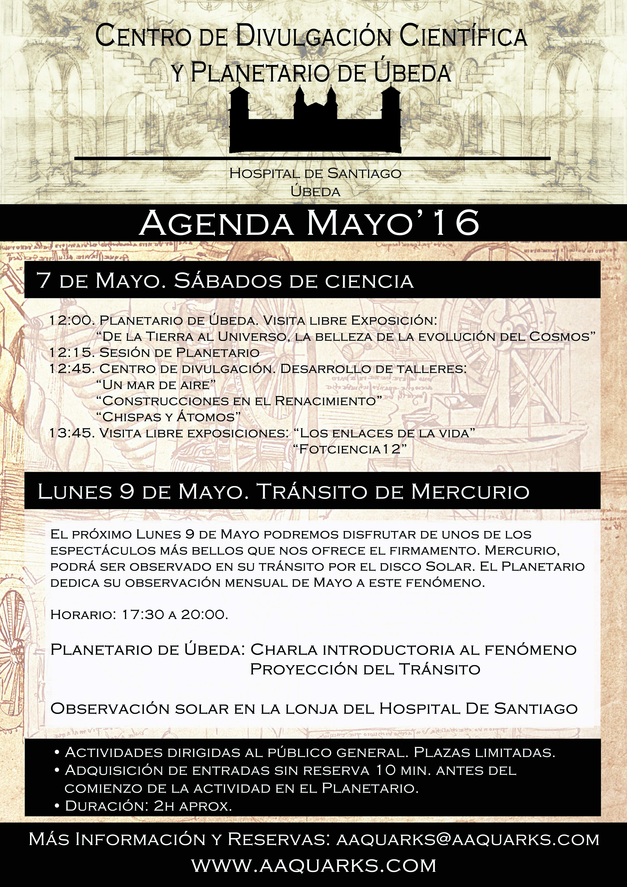

A lo largo del próximo fin de semana, volvemos a ofrecer la posibilidad de acercarnos a la ciencia de una forma amena y divertida. Destacamos tres eventos en nuestra programación:

**Sábado, 7 de Mayo. 10:00 a 12:00 horas**. Visita a las instalaciones del Planetario y Centro de Divulgación científica, de la Asociación Cordobesa de docentes y divulgadores de ciencia. Nuestros compañeros, quieren conocer de primara mano el proyecto de Museo de ciencia de nuestra ciudad con la voluntad de desarrollar un Museo de ciencia en su localidad.

**Sábado, 7 de Mayo. 12:00 a 14:00 horas.** Sábado de ciencia. Actividad desarrollada en las instalaciones del nuevo Museo de ciencia y del Planetario dirigida al público general. **Consultar programa.**

### Tránsito de Mercurio

**Lunes, 9 de Mayo. 17:30 a 20:00 horas.** Este próximo Lunes, disfrutaremos en directo de uno de los espectáculos más atractivos que nos ofrece el firmamento cercano. Mercurio recorrerá el disco solar y podrá ser observado con telescopios específicos en el Hospital de Santiago. El Planetario ofrecerá un programa específico de forma simultánea explicando el fenómeno.

### Qué información adicional puedo utilizar:

- [Artículo general del evento,](https://elseptimocielo.fundaciondescubre.es/2016/04/17/9-de-mayo-transito-de-mercurio/) por Tomás Ruiz Lara, publicado en [El Séptimo Cielo](https://elseptimocielo.fundaciondescubre.es)
- [Editorial dedicada al Tránsito](https://elseptimocielo.fundaciondescubre.es/2016/05/07/boletin-el-septimo-cielo-mayo/) desde una perspectiva histórica, por Emilio Alfaro, publicado en [El Séptimo Cielo](https://elseptimocielo.fundaciondescubre.es).
- [Sociedad Española de Astronomía](http://www.sea-astronomia.es/drupal/content/especial-tr%C3%A1nsito-de-mercurio-9-de-mayo-de-2016) (SEA), ofrece recursos y enlaces para poder programar la observación y seguimiento del tránsito:
- [Aplicación móvil para seguirlo en Android](https://play.google.com/store/apps/details?id=com.viajeinterplanetario.android_test1&hl=es)
- [Aplicación móvil para seguirlo en Apple](//appsto.re/es/9Pjacb.i)
- [Enlace para la televisión en directo durante más de 10 horas](http://www.cosmos.esa.int/web/cesar/streaming)
- [Enlace para seguir las imágenes del tránsito y vídeos generados en directo](http://www.cosmos.esa.int/web/cesar/live-sun-images)
- [Otra información se puede ver en la página principal del tránsito](http://www.cosmos.esa.int/web/cesar/mercury-transit-2016)

Parece que el tiempo en la península no va acompañar, de modo que muy  posiblemente tendremos que seguir el tránsito via internet. Os recordamos que en la [página web de la SEA](http://www.sea-astronomia.es/drupal/content/especial-tr%C3%A1nsito-de-mercurio-9-de-mayo-de-2016) hemos ido recopilando información sobre las distintas actividades organizadas tanto por centros profesionales como agrupaciones de aficionados.

