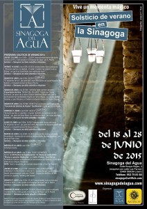

**Solsticio en la Sinagoga del Agua**

- Presentación: «Introducción al solsticio desde el punto de vista científico”, por parte de Pedro Ariza.
- Lugar: Sinagoga del Agua de Úbeda.
- Fecha y hora: martes 23 de junio, a las 9:00 horas.
- Desayuno con dulce sefardita e infusiones
- Precio: 25,00 €(imprescindible reserva anticipada)
- Más información:<http://artificis.com/programa-solsticio-de-verano-2015-en-la-sinagoga-del-agua/>

**Planetario de Úbeda. Cuenta cuentos bajo las estrellas.**

- Lugar: Planetario de Úbeda. Av. Cristo Rey. Centro de congresos Hospital de Santiago. Úbeda (Jaén)
- Fecha y hora: viernes 26 de junio, de 18:00 a 20:00 horas
- Organiza: Asociación Malion. XVI Festival de cuentos, «En Úbeda se cuenta»
- Colaboran: Planetario de Úbeda y Asociación Astronómica Quarks
- Más información: <http://enubedasecuenta.blogspot.com.es/>
