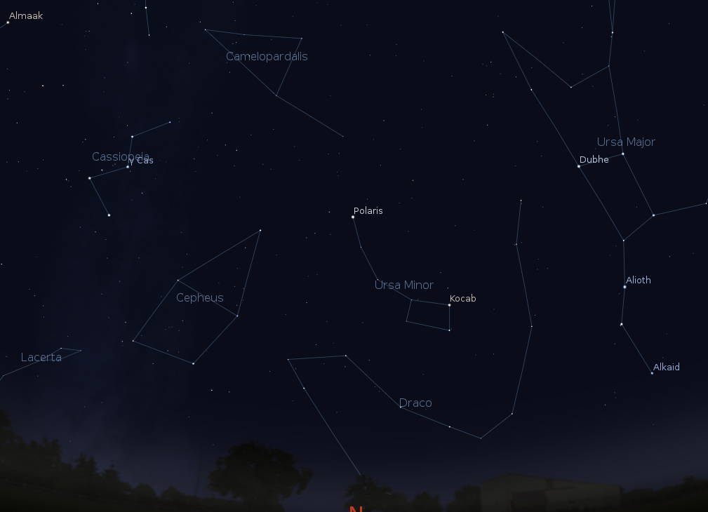
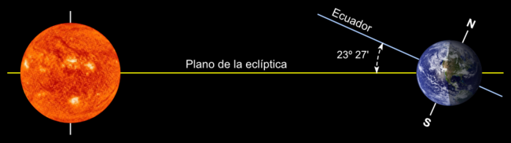
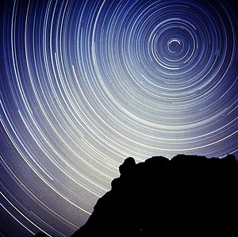
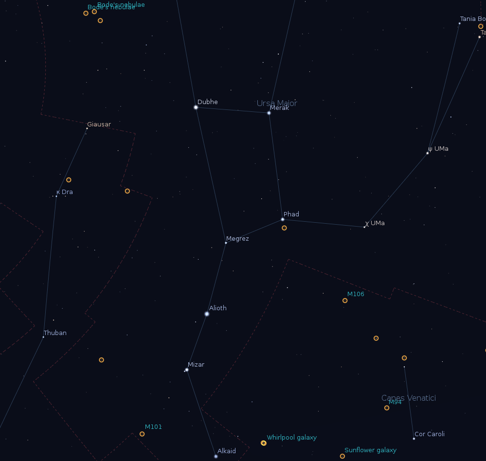
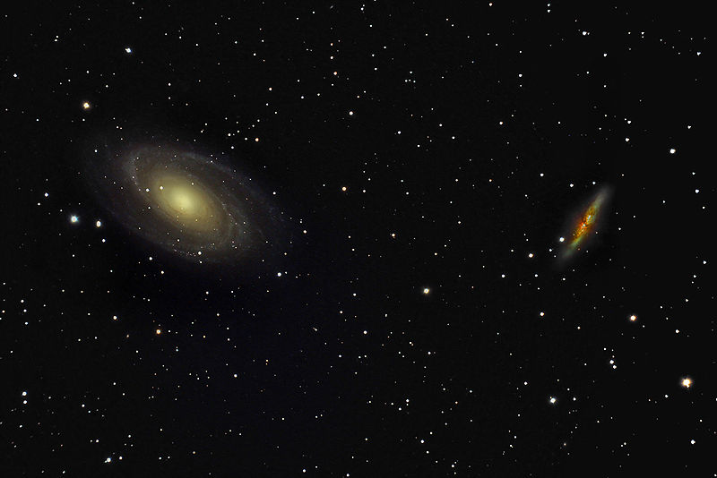
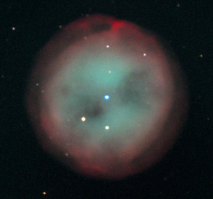
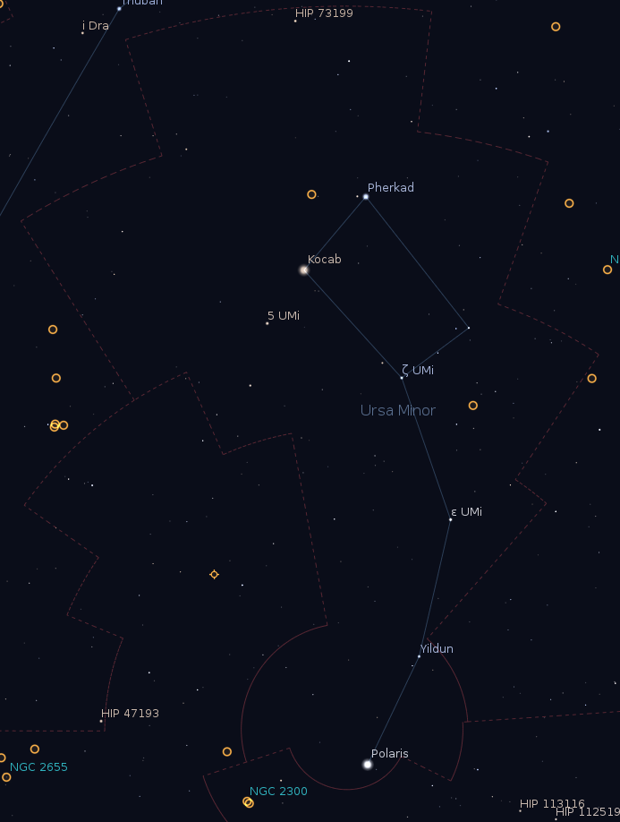
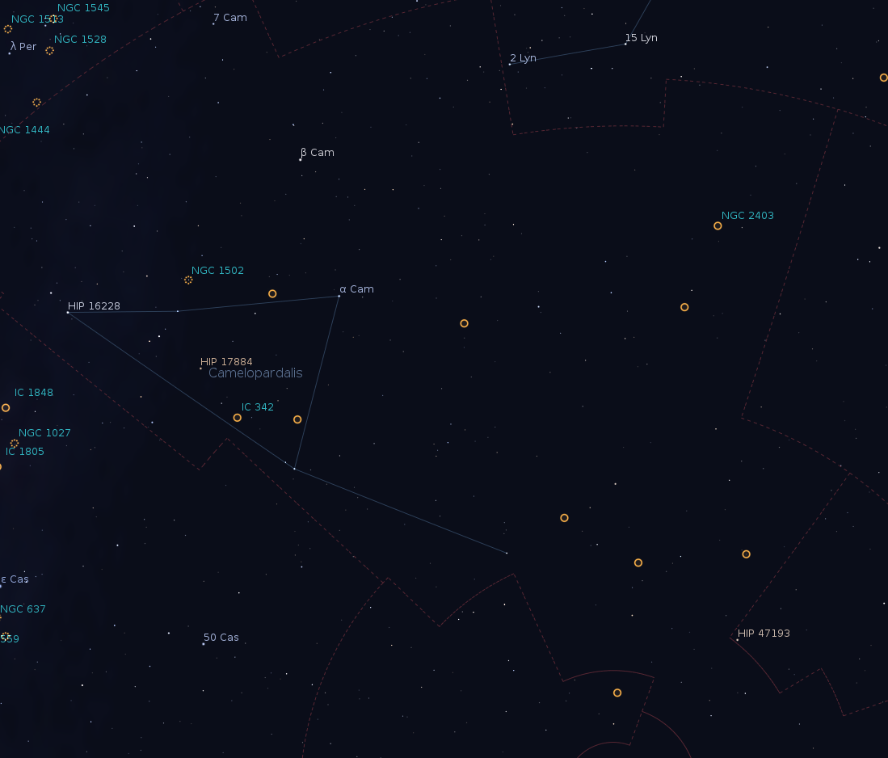

Por Tomás Ruiz Lara

En Febrero aún podremos contar con largas noches para continuar deleitándonos y disfrutando con el espectáculo que mes a mes nos brinda una noche estrellada. Aún estamos relativamente cerca del solsticio de Invierno (recordemos que durante esta época el sol parece cambiar de altura sobre el horizonte muy lentamente en el cielo) y tendremos algo más de 10 horas de noche. Esto nos puede dar pie a observar cielos muy distintos si decidimos observar tras la puesta de sol, a mitad de la noche o a finales de la misma, antes de que los primeros claros hacia el este nos anuncien el comienzo de una nueva jornada. Además nos vamos acercando a una de las fechas marcadas en rojo en los calendarios de los astrónomos aficionados, el maratón Messier, por lo que nos puede servir a modo de pre-temporada o calentamiento para tal hazaña. Para los despistados, y haciendo un simple resumen, el maratón Messier es el intento de observar los 110 objetos de cielo profundo que se encuentran dentro del catálogo elaborado por el astrónomo francés Charles Messier en el siglo XVIII… ¡en una misma noche! Todo un reto para los verdaderos aficionados a la astronomía. Pero como digo, dejemos este acontecimiento para el mes que viene ya que generalmente las noches en las que los 110 objetos son accesibles desde nuestras latitudes se encuentran en este mes (aunque cambiando la fecha dependiendo de la posición de la luna) y centrémonos en la etapa de nuestro viaje preparada para el mes de Febrero.

Nuestros viejos amigos (y perfectamente conocidos tras nuestra campaña de Diciembre) **Orión**, **Can Mayor** y **Tauro** culminan (pasan por la línea imaginaria que une el Sur con el cenit, llamada meridiano celeste) al principio de la noche. Conforme ésta va avanzando **Can Menor**, **Géminis** y **Auriga** van ganando altura culminando poco después. Para aquellos rezagados que no hayan podido disfrutar de la majestuosidad de la Vía Láctea dando forma a estas constelaciones y a sus “pobladores”, el firmamento aún les brinda la oportunidad de disfrutar de ellas al principio de la noche… no sé a qué estáis esperando, preparad vuestros mapas y ropas de abrigo, colimad vuestros telescopios y salid a observar uno de los espectáculos más embriagadores que la cúpula celeste nos brinda a los observadores boreales.

Poco a poco la riqueza de estrellas que observamos al mirar en dirección al disco de nuestra Vía Láctea va dando paso a un cielo más tosco (rotación terrestre), pobre en estrellas y objetos, pero donde empiezan a dominar los objetos más distantes que podemos observar con nuestros pequeños telescopios, las galaxias. Sistemas de estrellas, gas, polvo y materia oscura como nuestra propia galaxia, con aproximadamente 100.000 millones de soles como el nuestro pero que se encuentran tan lejos que no podemos ver más que pequeñas manchitas en el firmamento, eso dando gracias, y hasta en algunos casos con un poquito de imaginación 😉 Pero dejemos dichas constelaciones para los meses de primavera y vamos a centrarnos en las que durante este mes nos ocupan, la primera parte de las constenlaciones de la **Región Circumpolar Norte**.

*Las constelaciones características de la Región Circumpolar Norte: Osa Menor, Osa Mayor, la Jirafa, el Dragón, Cefeo y Cassiopea. Durante este mes nos centraremos en aquellas que se encuentran a una mayor altura sobre el horizonte (Osa Mayor, Osa Menor y la Jirafa). Figura creada con el programa Stellarium, http://www.stellarium.org/es*

**Nota del autor**: Recordemos que la Tierra, como buena peonza en un campo gravitatorio (causado por el sol), realiza **tres movimientos** simultáneos, movimientos realmente veloces de los que no nos daríamos cuenta si no fuese por el cambio de estaciones, la sucesión de las noches y los días, y el lentísimo cabeceo que nos obliga a cambiar ligeramente el sistema de coordenadas. El primer movimiento, el que causa el cambio de las estaciones es la **traslación** alrededor del sol (a una velocidad de 108.000 km/h), dando lugar al año; así, la Tierra realiza una vuelta alrededor del sol en unos 365 días y algo más de 6 horas, esto causa que en Enero el cielo que vemos es ligeramente distinto al que observamos en Febrero y completamente distinto al observado en Agosto. El siguiente, es simplemente la **rotación** de la Tierra alrededor de su eje, dando lugar a la duración de un día; de esta forma, la Tierra tarda en dar una vuelta alrededor de su eje un día (unas 23 horas y 56 minutos, esto supone una velocidad de 1675 km/h para una persona en el ecuador terrestre, o unos 1340 km/h para un observador en Andalucía, latitud de 37N), esto explica por qué al principio de la noche vemos unas constelaciones que van desplazándose hacia el Oeste, dando lugar a otras nuevas que aparecen por el Este (al igual que nuestro sol al amanecer y anochecer). Y por último, un movimiento de cabeceo, al igual que cuando tiramos una peonza que dura unos 26000 años, llamado “**precesión**”, y que causa lo que denominamos la “precesión de los equinoccios”, este movimiento causa que no siempre el eje de rotación de la Tierra apunte a la Estrella Polar (que en nuestras latitudes marca el Norte). La combinación de estos tres movimientos determina, a una hora determinada, un día determinado de un año dado, qué constelaciones son visibles desde distintos lugares de la Tierra.

Este mes empezamos con lo que conocemos como la Región Circumpolar Norte. La Región o Casquete Circumpolar Norte está formado por una serie de constelaciones que son siempre visibles desde nuestras latitudes. Antes de comenzar con las constelaciones que este mes nos ocupan creo que es conveniente que expliquemos convenientemente un poco de “astronomía de posición”. No os asustéis, aunque la astronomía de posición estudia coordenadas celestes, cambios de coordenadas, localización de objetos a través de las mismas, el tiempo, ecuación del tiempo, etc… y por lo tanto puede ser en sí misma toda una asignatura a cursar a nivel universitario, en esta entrada vamos a tocar sólo lo justito para entender cómo se mueven las estrellas en el firmamento, y comprender el porqué de una región que siempre es visible y que se encuentra entorno al polo norte celeste.

**Debes saber (I)**: Imaginemos que nos encontramos exactamente en el **polo norte**, aunque la Tierra continúa rotando, nosotros estamos en perfecto reposo, ¡Aunque rotamos no nos desplazamos! Para comprenderlo imaginemos a Pau Gasol en un calentamiento con la selección española de baloncesto. En un alarde de habilidad, se coloca el balón sobre su dedo índice y empieza a rotar el balón, en perfecto equilibrio sin que caiga (todos hemos visto esta imagen, aunque debo de admitir que no soy capaz de conseguirlo, lo confieso). Mientras que el cuero del balón al rotar se desplaza (unas veces vemos la marca del balón, en otras ocasiones vemos el símbolo de la Federación de Baloncesto), hay una pequeña superficie del mismo, apoyado sobre su dedo (y también en dirección opuesta a éste) que no se desplaza. Lo mismo pasa en la Tierra, mientras que ésta gira entorno a su eje, cualquier punto de su superficie se desplaza pero si estamos justo en el polo no nos desplazamos, sólo hacemos un giro sobre nosotros mismos, como los patinadores cuando empiezan a girar sobre ellos mismos. Por lo tanto, si nos encontramos en el polo norte, bien abrigados y mirando al cielo… ¿Veremos algún cambio? La respuesta es sencilla, SI, veremos una rotación, las estrellas darán una vuelta (no son las estrellas las que rotan sino nosotros). Sin embargo veremos siempre las mismas estrellas, la Región Circumpolar Norte para un observador en el mismo polo norte será TODO su cielo observable. Podréis decirme, ¿qué pasa con la traslación alrededor del sol de la que nos acabas de hablar? Teniendo en cuenta que el eje de rotación de la Tierra y la eclíptica (plano de traslación de la Tierra, donde encontramos los planetas) guardan un ángulo de unos 23.5º y que las estrellas se encuentran muuuuuyyyyyy, muuuyyy lejos lo único que pasará será que miraremos al sol durante 6 meses, pero durante otros 6 meses nos encontraremos en una oscuridad profunda (de ahí que en los países nórdicos haya épocas en las que el sol no se pone, o en las que el sol no sale, ver imagen siguiente). Si seguimos con el simil del balón en manos de Pau, y somos unos personajillos pequeños sentados en dicho punto de no desplazamiento, al mirar hacia arriba sólo veremos el techo o en general, la parte “alta” de la habitacion.

*Esquema explicativo de la situación entre el plano de traslación terrestre (plano de la eclíptica) y el plano de rotación terrestre (ecuador). Fuente: Wikipedia.*

**Debes saber (II)**: Bajemos ahora al **ecuador**. Ahora no sólo nos desplazamos, sino que nos desplazamos la máxima distancia posible (a lo largo de la circunferencia de mayor radio). En este caso sólo habrá dos puntos (en el hipotético caso de un planeta completamente esférico) que siempre son observables (mientras que antes todo era siempre observable), se trata del polo norte celeste y el polo sur celeste. Siguiendo con el simil del balón del mayor de los hermanos Gasol, si nos sentamos en dicho punto (intermedio entre el dedo y el lugar opuesto al dedo), veremos el pabellón dar vueltas alrededor nuestro, unas veces veremos una grada, otras veces un fondo, otras veces la otra grada y finalmente el otro fondo, y así sucesivamente cogiendo un mareo considerable. Exactamente lo mismo pasa en el firmamento, reemplacemos balón de baloncesto por la Tierra, Pau Gasol por gravedad (y condiciones iniciales de formación del sistema solar), y el techo o el pabellón por la bóveda celeste.

**Debes saber (II)**: Creo que ya sabéis responder perfectamente a la siguiente pregunta: ¿Qué veremos si nos encontramos en un punto intermedio entre el ecuador y el polo (por ejemplo en Andalucía a una latitud de 37N)? ¡Correcto! Estaremos en una zona intermedia entre los dos casos extremos anteriormente presentados. No todo el cielo será circumpolar (como en el caso de los polos), ni tampoco todo el cielo será “cambiante” (como en el ecuador). Seremos capaces de observar una parte que aunque rota siempre está visible (Región Circumpolar Norte) y una zona variable que dependerá de la época del año, de hecho, ésta es la razón que esta sección tenga 12 capítulos, uno por cada mes 😉

*Durante la captura de esta imagen se ha dejado el obturador abierto durante un largo periodo de tiempo, pudiendo captar la traza dejada por las estrellas a lo largo de una noche debido a la rotación terrestre. Esta imagen nos enseña perfectamente el concepto de Región Circumpolar (Norte en este caso). Vemos algunas estrellas que nunca se ponen bajo el horizonte, mientras que otras desaparecen para reaparecer más tarde. Fuente: Wikipedia.*

Así es que, una vez que entendemos que existe una zona del firmamento que siempre es visible, pero que rota, vamos a centrarnos en aquellas constelaciones que, siendo siempre visibles, se encuentran en esta época del año a una mayor altura sobre el horizonte (facilitando su observación y minimizando el efecto de la atmósfera). Dichas constelaciones son la Osa Mayor, la Osa Menor y Camelopardalis (la jirafa).

# Osa Mayor

Entre las constelaciones seleccionadas para este mes de Febrero se encuentra sin ninguna duda la constelación más conocida de todo el hemisferio norte, la **Osa Mayor**. La Osa Mayor, o comúnmente conocida como el “**carro**” o el “**cazo**”, es una constelación perteneciente a la Región Circumpolar Norte, es decir, siempre es visible desde nuestras latitudes. Además, sus siete estrellas principales (Alioth, Alkaid, Dubhe, Megrez, Merak, Mizar y Phecda) tienen magnitudes entre 2 y 3, lo que las hace visibles prácticamente desde cualquier lugar (incluso desde algunas ciudades). La importancia de esta constelación va más allá que la mera observación (visual o con instrumentos). Podemos utilizar esta constelación para orientarnos geográficamente. Si trazamos una línea imaginaria desde Merak hasta Dubhe y la prolongamos aproximadamente 5 veces la distancia entre ambas estrellas, localizaremos la Estrella Polar, de la que hablaremos más adelante y que marca la prolongación del eje de rotación terrestre, es decir, el Polo Norte Celeste. Por lo tanto, esta constelación, dominada por estrellas brillantes y cuyo asterismo es fácilmente reconocible desde cualquier lugar, nos permite encontrar fácilmente el Norte en una noche estrellada.

*Detalle de la Osa Mayor. Fuente: Stellarium, http://www.stellarium.org/es*

En la imagen que nos muestra el asterismo completo de la Osa Mayor podemos ver que además de estas 7 famosas estrellas, otras forman parte del asterismo de la Osa Mayor, representando las patas, la cola, el cuerpo y el cuello. Pero para nuestros propósitos orientativos, con conocer el asterismo formado por estas siete es suficiente, aunque os animamos a completar el asterismo en una de estas frías noches de Febrero.

Debido a su gran extensión en el firmamento con unos 1280 grados cuadrados (la tercera en área) en esta constelación podemos encontrar una buena cantidad de objetos de cielo profundo como siete objetos Messier (M40, M81, M82, M97, M101, M108 y M109). Además contiene 13 estrellas en las que se han detectado planetas a su alrededor. Como notaréis, la Osa Mayor se encuentra alejada de la Vía Láctea (nuestra Galaxia), es decir, cuando observamos la Osa Mayor no estamos observando en dirección al disco de nuestra Galaxia. Debido a que el disco de la Vía Láctea, al igual que el del resto de galaxias espirales tiene grandes cantidades de gas y polvo, este polvo nos impide ver más allá de la vecindad solar si observamos en el disco, debido a efectos de absorción de la luz. Sin embargo, al observar en otra dirección no tan afectada por el polvo galáctico, seremos capaces de observar, no sólo estrellas y cúmulos alejados de nosotros, sino otras galaxias como la nuestra. En particular en la Osa Mayor podremos disfrutar de un buen número de estos objetos extragalácticos, pero dejemos para los meses de Abril y especialmente Mayo para hablar de **galaxias**. Comentemos algunos de los objetos más llamativos que podemos encontrar en esta constelación:

- **M101**: También conocida como la **galaxia del molinete**, es una de las grandes galaxias espirales (grand-design) observables de cara desde la Tierra. Se encuentra a unos 20.9 millones de años-luz de distancia. En Agosto de 2011 tuvimos la suerte de poder observar una supernova de tipo Ia en esta galaxia. Una supernova de tipo Ia se produce cuando un sistema binario formado por una gigante roja y una enana blanca se encuentran en rotación la una alrededor de la otra y muy próximas. Debido a la proximidad, la gigante roja puede “ceder” parte de su envoltura a la enana blanca de forma que ésta aumenta su masa. Básicamente, una enana blanca es una estrella formada fundamentalmente por carbono y un mar de electrones “degenerados”. Estos cuerpos tienen un límite de masa (límite de Chandrasekhar) de unas 1.4 masas solares, si este límite se excede la estrella se convierte en inestable y explota (la gravedad vence a la repulsión del gas degenerado, presión de Pauli, y empiezan a producirse reacciones nucleares que emiten grandes cantidades de energía, dependiendo de dónde se produzcan dichas reacciones observaremos una Nova o una Supernova tipo IA). De esta forma, si este transporte de masa de la gigante roja a la enana blanca supera dicho límite, la enana blanca explotará liberando grandes cantidades de energía, se habrá producido una supernova de tipo Ia. Esta galaxia tiene unos 170.000 años-luz en diámetro, es decir, es un poco más pequeña que nuestra Vía Láctea.
- **M51**: La **galaxia del remolino**, o M51, es uno de los objetos más conocidos del cielo nocturno con una magnitud aparente de 8.4. Se trata de otra gran galaxia espiral (grand design) que se encuentra a unos 31 millones de años-luz. Esta galaxia (M51) se encuentra en interacción con NGC5195, una galaxia enana que está siendo acretada por M51. Aunque esta galaxia no se encuentra estrictamente dentro de los límites de la Osa Mayor, se encuentra muy cerca del límite, así como es localizable a partir de las estrellas de la Osa Mayor, de ahí que hayamos decidido incluirla en esta sección. Se localiza fácilmente a partir de Alkaid. En cielos oscuros y grandes telescopios podemos distinguirla como dos nebulosidades circulares formando algo así como un ocho. Si no disfrutamos de cielos muy oscuros, incluso telescopios relativamente pequeños (200 mm) pueden mostrarnos la galaxia principal e indicios de la enana.

*Imagen visible de M81 y M82. Cabe destacar los brazos espirales en M81 así como las nubes de polvo oscureciendo en centro de M82. Fuente: Wikipedia.*

- **M81** y **M82**: Esta pareja de galaxias espirales es uno de los espectáculos más bonitos que podemos disfrutar en una noche con un telescopio de aficionado. Fácil de localizar a partir de la línea imaginaria que une Phecda y Dubhe, este par de galaxias caben perfectamente en el campo de visión de un ocular de poco aumento. M81 es una galaxia espiral que se encuentra a 11.8 millones de años-luz y es también conocida como la galaxia de **Bode**. M81 se encuentra en interacción (como así revelan los mapas de hidrógeno atómico) con su compañera M82 y la pequeña NGC3077. M82 se nos ofrece de perfil, lo que engrandece aún más la observación de esta pareja de una galaxia de cara y otra de perfil. M82 se encuentra a unos 11.5 millones de años-luz y muestra una intensa actividad de formación estelar, simplemente su zona central ya forma 10 veces más estrellas que la Vía Láctea entera, de ahí que el telescopio espacial Hubble haya revelado recientemente unos 200 cúmulos abiertos en su región central. Este sistema doble fué descubierto por Johann Elert Bode en 1774 y descritas como dos objetos nebulares, recordemos que el concepto de galaxia no fué aceptado hasta los años veinte del siglo pasado. M81 y M82 forman parte de un grupo de galaxias formado por 34 sistemas conocido como el grupo de M81 (por ser esta la más grande y luminosa del grupo).

*Imagen en falso color de M97. Cabe destacar la presencia de la enana blanca causante de esta nebulosa en el centro de la misma así como sus colores verdosos (debido a la emisión en OIII, oxígeno ionizado) y rojizos en la periferia (H-alpha, hidrógeno ionizado). La ionización es causada por la radiación tan energética emitida por la enana blanca. Credits: Gary White and Verlenne Monroe/Adam Block/NOAO/AURA/NSF*

- M97: También conocida como la **nebulosa de la lechuza**, M97 es una nebulosa planetaria (de las que ya hemos hablado en el mes anterior) que se encuentra a unos 2600 años-luz de distancia y se cree que fué formada hace unos 8.000 años.

# Osa Menor

Una vez que somos capaces de reconocer la Osa Mayor y encontrar la estrella Polar siguiendo las instrucciones detalladas anteriormente, no debe de ser difícil localizar la Osa Menor. Como su propio nombre indica, las 7 estrellas que dibujan esta constelación en el firmamento imitan casi a la perfección a sus contrapartidas en la Osa Mayor, creando un asterismo muy similar, aunque más pequeñito. Sin embargo, las estrellas que forman la Osa Menor rondan la magnitud 4, a excepción de las tres más brillantes: **Polaris** (alpha UMi, magnitud 1.95), **Kocab** (beta UMi, 2.05) y **Pherkad** (gamma UMi, 3.0), a estas dos estrella, beta y gamma de la Osa Menor, se les conoce también como “**las guardas**”. Esto hace que la observación del asterismo de la Osa Menor se reserve para cielos oscuros o personas con una agudeza visual por encima de la media. Desde ciudad nos podemos dar por satisfechos si podemos localizar estas tres. Son muchas las personas ajenas al mundo de la astronomía que piensan que la estrella Polar es una estrella tremendamente brillante, he llegado a escuchar que la Polar es la estrella más brillante del hemisferio Norte, desbancando así a Sirio en el Can Mayor. Nada más lejos de la realidad, la estrella Polar es una estrella muy normalita en cuanto al brillo, pero privilegiada por su posición tan próxima al Polo Norte Celeste. Eso sí, se encuentra en una zona del cielo muy pobre de estrellas brillantes, de hecho es la estrella más brillante en un círculo imaginario de 30 grados de radio con ella localizada en su centro.

La **estrella Polar** se encuentra a 434 años-luz de distancia y realmente se trata de una estrella múltiple formado por 5 estrellas. La componente más brillante, es decir, la estrella Polar “oficial” se trata de una estrella gigante muy brillante con una masa de 6 veces la masa de nuestro Sol. La segunda componente, Polaris B, fué descubierta en 1780 por el famoso William Herschel. Se cree que la estrella Polar es una variable de tipo Cefeida, dicha variabilidad fué confirmada por el astrónomo Ejnar Hertzsprung en 1911 (sí, eso es, la “H” del diagrama H-R).

*Detalle de la Osa Menor. Fuente: Stellarium, http://www.stellarium.org/es*

Debido a la forma de esta constelación (alargada) y a que realiza un giro en 24 horas, cuyo pivote se encuentra exactamente en un extremo (la estrella polar), antiguamente y aún hoy son muchas las personas que utilizan la posición de esta constelación para determinar la época del año en la que nos encontramos o la hora. A este reloj se le llama “**reloj de las guardas**”. Sabemos que las “guardas” se encuentran próximas al Cenit (está a las 12, siguiendo el símil de un reloj de agujas) a medianoche del 2 de Agosto (todos los años), y que realiza un giro de 360 grados en 24 horas (15 grados cada hora). Además, en un año, si observamos la Osa Menor sólo a las 12 de la noche, también habrá realizado un giro, es decir, cada mes supone 30 grados. Con un poco de ingenio y con estos tres conceptos básicos podemos, no sólo orientarnos, sino saber la época del año (viendo las constelaciones) y la hora (reloj de las guardas) con la única ayuda del firmamento que nos rodea con precisión astronómica 😉
La Osa Menor no presenta ningún objeto de cielo profundo de interés para astrónomos aficionados observando con pequeños instrumentos. El único objeto que cabe destacar es la galaxia enana elipsoidal UGC09749 con una magnitud aparente de 11.9 lo que la hace casi imposible para nuestros telescopios. Se trata de una galaxia satélite de nuestra Vía Láctea que se encuentra a unos 200.000 años-luz de distancia.

# Camelopardalis (la Jirafa)

Aunque esta constelación también ocupa un área bastante reconocida del cielo nocturno (757 grados cuadrados, ocupando la posición 18 en el ranking de mayor a menor área), todas sus estrellas son realmente poco brillantes, siendo la beta de esta constelación la más brillante, con una magnitud aparente de 4. Se trata de una estrella binaria localizada a 1.000 años-luz.

*Detalle de Camelopardalis, la Jirafa. Fuente: Stellarium, http://www.stellarium.org/es*

Tal y como hemos dicho antes esta zona del cielo podemos encontrar una buena cantidad galaxias. Entre los objetos destacados en esta constelación encontramos **NGC2403**, se trata de una galaxia espiral a 8 millones de años-luz de distancia mostrándonos una magnitud aparente de 8.9. Cabe destacar que esta galaxia fué descubierta también por William Herschel en el siglo XVIII y pertenece al grupo de galaxias de M81 y M82 aunque se encuentra en la periferia de dicho grupo que a su vez forma parte del super-cúmulo de Virgo. Otros objetos en esta constelación (aunque sin mucho interés y en algunos casos muy difíciles de observar) son el cúmulo abierto NGC1502, o las galaxias NGC2366, NGC1569, e IC342.

Y con esto terminamos nuestra primera visita a las constelaciones de la Región Circumpolar Norte, el mes que viene no nos centraremos en unas constelaciones especiales sino que dedicaremos la entrada al Maratón Messier, un recorrido por todo el firmamento para deleitarnos con la observación de cúmulos de estrellas, nebulosas y galaxias en una misma noche, recorriendo desde la vecindad solar hasta algunos de los objetos más lejanos accesibles con pequeños telescopios.
