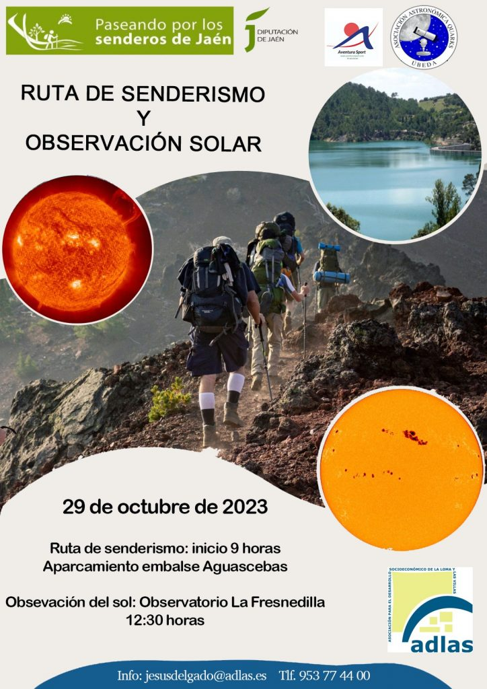

Domingo 29 de octubre de 2023.

**PASEANDO POR LOS SENDEROS OTOÑO**

El domingo 29 de octubre realizaremos una ruta de [#senderismo](https://www.facebook.com/hashtag/senderismo?__eep__=6&__cft__[0]=AZUlhuxZ6Gs1ECNHL8U5SdlgtMI3Jsv98IQMG2hqxgjecrl_tuG8ZTLw9mn51fTniZZA5F_vMIhR_RLniSJMRwLYTrs2EvZwu-D56xRtZUgkk-7nrgT2nVZ6uCQ5CetaECjdVXQv5ZF8vII1cweZs0eCHQXs49lVM3JIgRdZuvMplup83k82DFg5KuLomYzWb-E&__tn__=*NK-R) y posteriormente una observación del sol.

Hora de inicio de la ruta: 9 horas (esa madrugada hay cambio de hora) desde el aparcamiento del Embalse Aguascebas

Hora de la observación solar: 12:30 en el Observatorio de La Fresnedilla.

Si quieres disfrutar de esta actividad doble solo tienes que pedir **información** en el **correo jesusdelgado@adlas.es** o en el **teléfono 953774400.**

Recordad que este programa está organizador la Diputación Provincial de Jaén e colaboración con GDR ADLAS.

Con Emd Villacarrillo Emd Villanueva DEL Arzobispo Ayuntamiento de Iznatoraf Ayuntamiento de Torreperogil Ayuntamiento de Sabiote Ayuntamiento de Úbeda PMJD Baeza Excmo. Ayuntamiento de Rus Canena Ayuntamiento Ayuntamiento de Ibros – Jaén Ayuntamiento de Begíjar Ayuntamiento de Lupión y Guadalimar Ayuntamiento De Torreblascopedro Campillo Del Río Cultura Ayuntamiento de Villatorres
