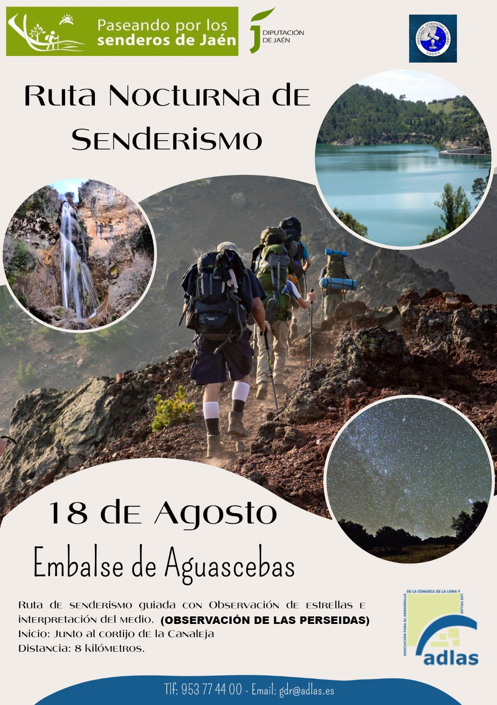

Viernes 18 de agosto de 2023.

Se realizará una ruta circular asequible de unos 8 km por el entorno del pantano de Aguascebas para terminar con una observación astronómica en el Observatorio de La Fresnedilla.

Inscripciones en el teléfono 953 77 44 00 o en el correo electrónico gdr@adlas.es

