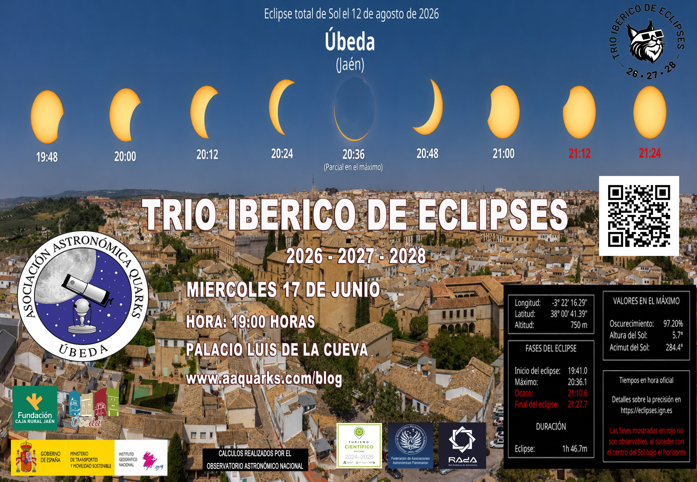
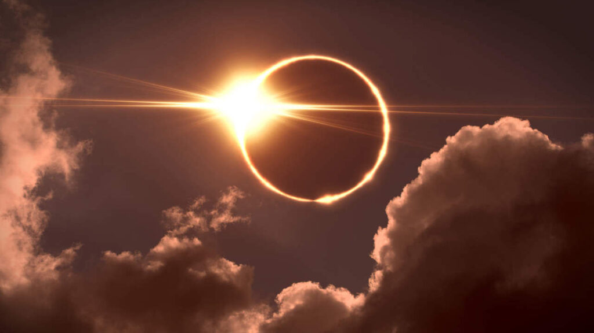
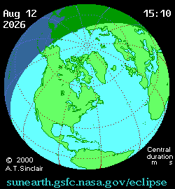
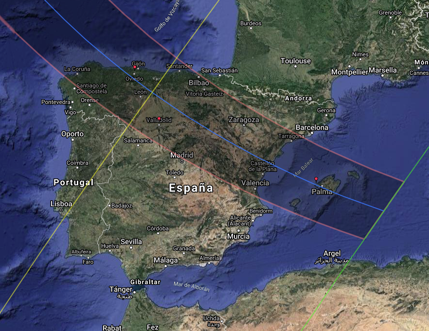
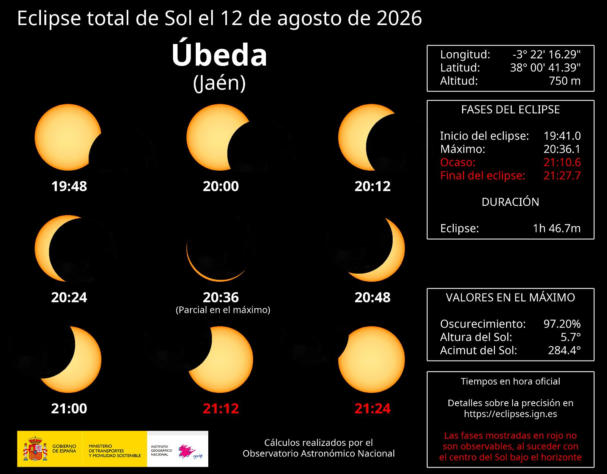
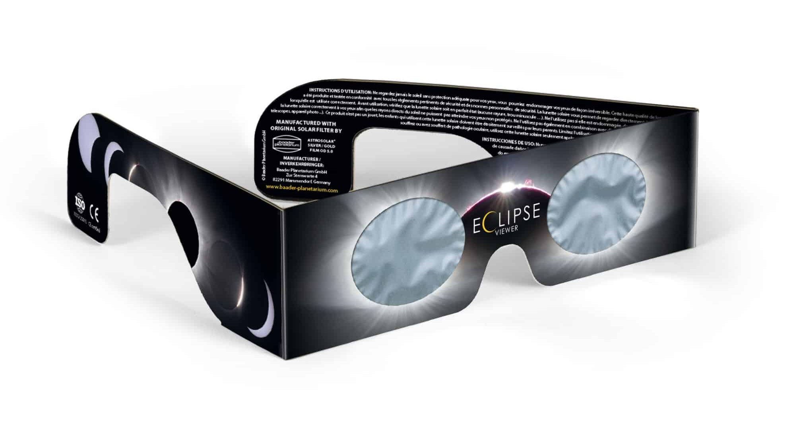
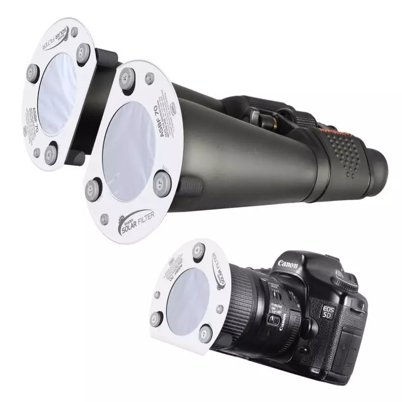

CHARLA DIVULGATIVA

MIÉRCOLES 17, 19:00 H

PALACIO LUIS DE LA CUEVA

⭐️☀️🌑 VOLVEMOS CON NUESTRAS ACTIVIDADES 🌑☀️⭐️

El próximo miércoles 17 de junio de 2026, a las 19:00 h en el Palacio Luis de la Cueva, ofrecemos una charla divulgativa sobre el TRÍO IBÉRICO DE ECLIPSES.

Con esta charla, iniciamos nuestra preparación hacia el que será claramente el evento del verano: El eclipse solar del 12 de agosto.

¡¡OS ESPERAMOS 🌑☀️🌑☀️!!

---

**Eclipse Total de Sol**

El próximo **12 de agosto de 2026**, España será escenario de uno de los acontecimientos astronómicos más importantes de este siglo: un **eclipse total de Sol** que cruzará gran parte del norte de la Península y Baleares justo al atardecer. Será un fenómeno histórico, ya que el Sol se oscurecerá completamente muy cerca del horizonte, transformando durante unos instantes el final del día en una inesperada noche.

Según la web oficial del Trío de Eclipses, <https://trioeclipses.es/>, la franja de totalidad atravesará comunidades como Galicia, Asturias, Cantabria, Castilla y León, Madrid, Navarra, Aragón, Cataluña, Comunidad Valenciana y Baleares, convirtiendo a España en uno de los mejores lugares del mundo para disfrutar de este extraordinario espectáculo natural.

---

## Elegir bien el lugar de observación

El eclipse de 2026 presenta una característica singular: sucederá con el Sol muy bajo sobre el horizonte occidental. Esto significa que no basta con encontrarse dentro de la franja de totalidad; también será necesario disponer de un horizonte despejado hacia el oeste, libre de montañas, edificios o arbolado que puedan ocultar el Sol en el momento decisivo.

El Instituto Geográfico Nacional ha desarrollado un visualizador, <https://visualizadores.ign.es/eclipses/2026>, con el que planificar con antelación el lugar de observación, conocer los horarios locales y llegar con suficiente tiempo permitirá disfrutar de la experiencia con tranquilidad y seguridad.

## ¿Cómo se verá el eclipse desde Úbeda (Jaén)?

Desde Úbeda, el eclipse del 12 de agosto de 2026 **no será total**, pero sí ofrecerá una ocultación muy elevada del disco solar, convirtiéndose en uno de los eclipses parciales más espectaculares visibles desde Andalucía. La Luna cubrirá la mayor parte del Sol durante el máximo del fenómeno, provocando una notable disminución de la luz ambiental y cambios perceptibles en el paisaje y la temperatura.

La principal dificultad para los observadores ubetenses será la **baja altura del Sol sobre el horizonte occidental**. El eclipse tendrá lugar durante el atardecer, por lo que será fundamental elegir un lugar con una vista completamente despejada hacia el oeste y noroeste. Cualquier obstáculo, como edificios, colinas, arboledas o infraestructuras cercanas, podría impedir observar las fases finales del fenómeno.

Las ubicaciones orientadas hacia poniente y las zonas abiertas del entorno rural ofrecerán mejores condiciones que los espacios urbanos con obstáculos visuales.

---

## Una experiencia para recordar toda la vida

Los eclipses totales de Sol son fenómenos poco frecuentes que combinan ciencia, emoción y asombro. El eclipse del 12 de agosto de 2026 marcará el inicio del llamado **Trío de Eclipses visibles desde España (2026-2028)**, una secuencia excepcional que difícilmente volverá a repetirse en varias generaciones.

Disfrutar de este espectáculo será una experiencia inolvidable, pero el mejor recuerdo será hacerlo de forma responsable. La seguridad ocular debe ser siempre la prioridad para que la emoción de contemplar cómo el día se convierte en noche no deje ninguna huella en nuestra visión.

### Seguridad: Imprescindible durante todo el eclipse

A diferencia de las localidades situadas dentro de la franja de totalidad, ***en Úbeda nunca será seguro mirar directamente al Sol sin protección***, ya que en ningún momento quedará completamente cubierto por la Luna. Esto significa que las gafas de observación solar homologadas deberán utilizarse durante toda la duración del eclipse.

Recuerda:

- Utiliza únicamente gafas certificadas bajo la norma **ISO 12312-2**.

- No observes el Sol con gafas de sol convencionales, radiografías, cristales ahumados ni filtros caseros.
- Si utilizas prismáticos, telescopios o cámaras fotográficas, estos deberán disponer de filtros solares específicos colocados delante del objetivo.

- Supervisa especialmente a los niños durante toda la observación.

La expectación que genera un eclipse solar puede llevar a cometer errores que tienen consecuencias graves. Es importante recordar que **mirar directamente al Sol sin la protección adecuada puede provocar daños irreversibles en la retina**, incluso cuando el Sol aparece parcialmente cubierto por la Luna.

Por ello, durante todas las fases parciales del eclipse, es imprescindible utilizar **gafas homologadas para observación solar** que cumplan la norma ISO 12312-2. **Las gafas de sol convencionales, radiografías, cristales ahumados, CDs o filtros caseros no ofrecen ninguna protección segura**.

**El Sol puede esperar unos segundos; nuestros ojos, no.** 🌞🌑✨

### Una oportunidad para prepararse para el Trío de Eclipses

Aunque Úbeda quedará fuera de la franja de totalidad de 2026, el eclipse será una excelente ocasión para que aficionados, familias y centros educativos se familiaricen con las técnicas de observación segura. Además, forma parte del extraordinario **Trío de Eclipses de España (2026-2028)**, una secuencia histórica que convertirá nuestro país en uno de los grandes escenarios mundiales para la observación de eclipses solares durante los próximos años.

**Desde Úbeda podremos contemplar cómo el Sol se transforma en una fina media luna dorada antes de ocultarse tras el horizonte. Un espectáculo inolvidable que merece ser disfrutado con planificación, paciencia y, sobre todo, con la máxima seguridad para nuestros ojos.** ✨🌞🌑
