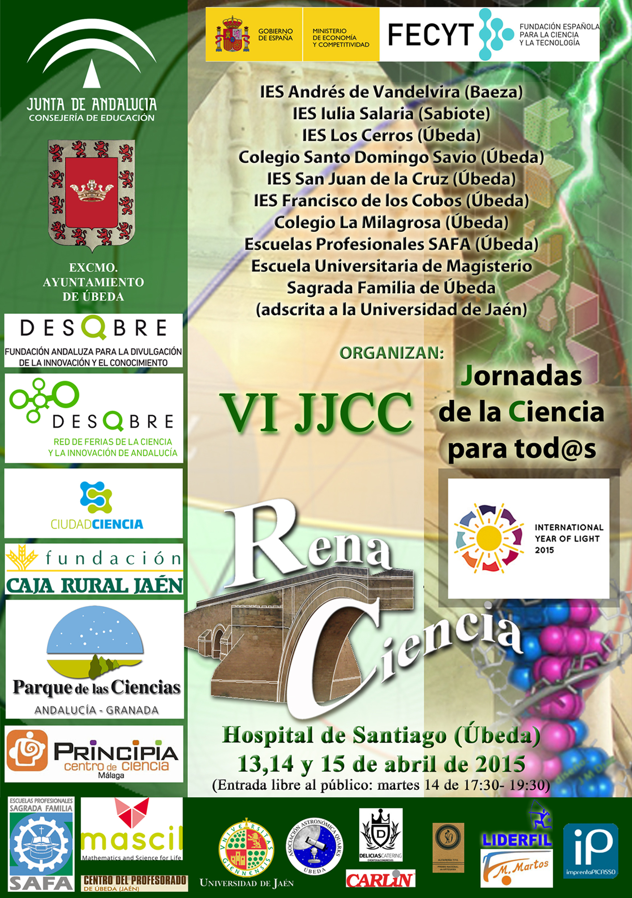

**Asociación cultural Renaciencia****VI Jornadas de Ciencia para tod@s****Úbeda, del 13 al 15 de abril de 2015****Centro Cultural Hospital de Santiago**

Desde hace varios años, la asociación cultural Renaciencia, integrada por docentes de varios centros de la localidad de Úbeda y comarca, organiza y coordina las Jornadas de Ciencia para tod@s. Este gran evento de divulgación científica pretende ofrecer un espacio dedicado a compartir las experiencias que hemos ido desarrollando desde nuestras aulas, expuestas por el alumnado y como consecuencia de actividades de formación específica del profesorado implicado.

Tenemos previsto, que de cara al público en general, se realicen durante los días 13,14 y 15 de Abril de 2015 en el Hospital de Santiago de Úbeda. Las actividades estarán abiertas a todos los centros y niveles educativos que lo soliciten con anterioridad.

La organización de los stands correrá a cargo de alumnos de Educación Infantil, Educación Primaria, Educación Secundaria, Bachillerato y alumnos de la Escuela Universitaria de Magisterio; asesorados y dirigidos por sus profesores correspondientes tras una planificación y preparación previa.

Esta iniciativa convierte al Hospital de Santiago en un gran escenario por el que pasan más de 5000 visitantes, participando unos 800 monitores en su desarrollo cada jornada.

Os invitamos a asistir a estas VI Jornadas de la Ciencia para tod@s:

- Como participantes. Aportando una o varias experiencias que expondrá vuestro alumnado como monitores a los centros visitantes y al público en general que pase por las Jornadas.
- Como visitantes. Acudiendo con vuestro alumnado a conocer los distintos stands que prepararán el resto de centros.
- Visitas público general. La muestra contempla la visita de público familiar durante la jornada de tarde del Martes 14. De igual forma, también se podrá asistir libremente a la inauguración oficial y las actividades previstas en este acto (Lunes 13, 19 horas). Esas actividades no requieren reserva previa.

Para más información sobre ediciones anteriores pueden consultar: <http://www.jornadasdelaciencia.aaquarks.com>

Asociación Cultural Renaciencia

Descarga: Díptico de las VI Jornadas de la Ciencia para tod@s (A5)
