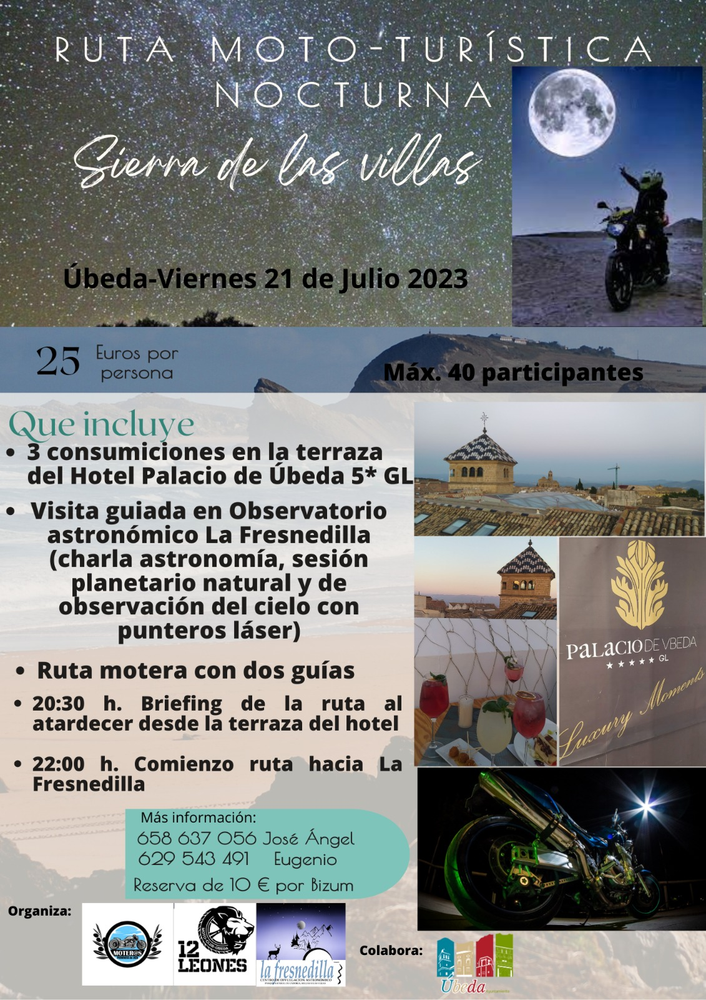

El viernes día 21 de julio se realizará una ruta mototurística nocturna organizada por el **Club motero 12 Leones**, donde se combinan:

1.- la promoción de nuevos espacios turísticos de Úbeda como es la terraza en el tejado del Hotel Palacio de Úbeda 5\*GL, donde podremos disfrutar de un atardecer espectacular con vistas al Valle del Guadalquivir.

2.-La difusión de la labor de asociaciones y colectivos locales, como es la Asociación Astronómica Quarks de Úbeda, que gestiona el planetario de Úbeda y el Observatorio de la Fresnedilla, con la observación de los principales objetos celestes que nos brinda el oscuro cielo de la Fresnedilla.

3.-Promoción de la provincia de Jaén como destino mototurístico, donde podemos disfrutar de infinidad de carreteras de montaña dentro de nuestros 4 parques Naturales.

Sin duda , una ruta nocturna única donde disfrutaremos de la noche fresquita del Parque Natural de la Sierra de las Villas.

