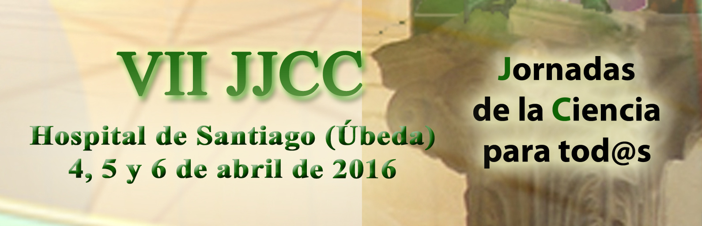
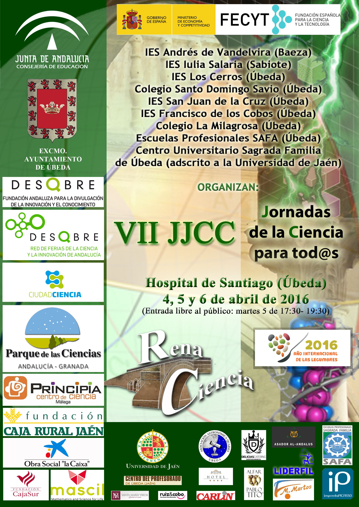

Desde hace varios años, la asociación cultural Renaciencia, integrada por docentes de varios centros de la localidad de Úbeda y comarca, organiza y coordina las Jornadas de Ciencia para tod@s. Este gran evento de divulgación científica pretende ofrecer un espacio dedicado a compartir las experiencias que hemos ido desarrollando desde nuestras aulas, expuestas por el alumnado y como consecuencia de actividades de formación específica del profesorado implicado.

## **JUSTIFICACIÓN**

Uno de los objetivos fundamentales e ineludibles del quehacer científico es su difusión, tanto social como profesional. Es impensable desarrollar una mejora de las prácticas docentes en este campo sin ofrecer a la comunidad educativa (profesorado y alumnado como mínimo) una oportunidad en este sentido.

Por otro lado, es misión de los docentes intentar paliar la paradójica separación que nuestra sociedad padece respecto de los principios científicos que sustentan su propio desarrollo tecnológico, así como el antinatural distanciamiento que existe entre dicha sociedad y todo lo que tenga que ver con el mundo de la ciencia.

Y por último, desde la ciencia podemos aportar a nuestro ámbito valores imprescindibles en la sociedad democrática en la que vivimos, inherentes al trabajo científico: el respeto hacia el otro y hacia lo que piensa y hace, el trabajo colaborativo, la iniciativa individual, la construcción del conocimiento de manera social, la discusión entre iguales, el debate, etc., son sólo algunos ejemplos de lo que la metodología científica ha aportado a nuestro modelo de vida.

Con estas Séptimas Jornadas de la Ciencia para tod@s a nivel Comarcal, y extensible a nivel provincial, queremos dar respuesta a estos tres aspectos, facilitando un foro motivador de intercambio de experiencias, divulgando la ciencia como tal, sus principios y métodos y destacando los valores que estas disciplinas del saber humano nos están legando.

##

## **METODOLOGÍA**

 La organización corre a cargo de la *Asociación Cultural RenaCiencia*. La idea principal es crear experiencias que puedan llevar a cabo nuestros alumnos, acordes con su nivel educativo, de forma que ellos las diseñen, las trabajen, las estudien y, por último, las trasladen a las Jornadas haciendo de monitores y explicándolas al resto de participantes y visitantes.

Para ello la motivación y la guía de los maestros y profesores resulta fundamental y es ahí donde han recaído los mayores esfuerzos por parte de este equipo. Ese esfuerzo es recompensado por el hecho de verlos tan ilusionados con los proyectos y perfectamente preparados y en condiciones de afrontar este reto. Nuestros alumnos están disfrutando mucho con estas actividades: ellas han permitido que lean, investiguen, dialoguen y experimenten acerca del desarrollo de la ciencia.

La filosofía seguida ha sido acercar la ciencia a todos los niveles educativos y de ahí que los cursos implicados abarquen todos los niveles educativos (infantil, primaria, secundaria, bachillerato, ciclos formativos y universidad).

## **CONTENIDOS**

- Adquisición de Competencias Básicas.
- Comunicación Social de la ciencia y convivencia entre centros y niveles.
- Didáctica del Conocimiento del Medio Natural y Social.
- Didáctica de las Ciencias, Matemáticas, Educación Física y Música.
- Metodología Científica (puesta en práctica del Método Científico).

Disponemos de muchas áreas dedicadas a Experimentación Científica. Sus principios básicos serán explicados y se propondrán baterías de preguntas clave de comprensión de los fenómenos. De igual manera (a posteriori y según guías didácticas correspondientes a cada itinerario) se profundizará, una vez en el aula y con el profesor, sobre los fenómenos observados.

Otros espacios estarán dedicados a la manipulación de sistemas, desarrollo de juegos con contenido científico y vídeos con contenido científico.

## **PROGRAMA**

**PROGRAMA****:**

- **Presentación del proyecto Museo de ciencia de Úbeda.** Visita guiada a las instalaciones. Lunes 4 de Abril, 18:00 horas.
- **Acto de inauguración oficial:**lunes 4 de abril, 19:00 h, en el auditorio del Hospital de Santiago. Intervención de **D. David Galadí-Enríquez**.
- Acto de presentación de las Jornadas a los monitores: martes 5 de abril, 10:00h en el auditorio del Hospital de Santiago. Interviene **D. David Galadí-Enríquez.**
- El acceso a las experiencias se realizará por orden establecido según grupos e itinerarios asignados tras la inscripción en estas Jornadas.
- Martes 5 de abril, 12:00 – 14:00: recorrido de los itinerarios por parte de los **grupos 1 y 2** (50 agrupaciones de quince alumnos/as)**.**
- Martes 5 de abril, **17:30 – 19:30: horario abierto al público.**
- Miércoles 6 de abril, 09:30 – 11:30 y 12:00 – 14:00: recorrido de itinerarios de los **grupos 3-4 y 5-6** (50 agrupaciones de quince alumnos/as)**.**
- Miércoles 9 de Abril, 12:00 – 14:00: recorrido de itinerarios de los **grupos 5 y 6** (50 agrupaciones de quince alumnos/as)**.**

## INSCRIPCIONES

- **Hasta el 19 de Febrero: Inscripción de grupos de monitores.** Necesitamos conocer que grupos y profesorado está interesado en colaborar como **participante**, exponiendo alguno de los proyectos que han realizado a lo largo del curso. Os pedimos por tanto que nos hagáis llegar esta información (nombre de la experiencia, nivel al que se expone…). En caso de que sean varias, la información correspondiente a cada una de ellas. Esta inscripción es informal y no requiere cumplimentar ningún tipo de inscripción por el momento, siendo suficiente la comunicación de la información solicitada a la organización a través del correo habilitado por la misma. Remitir esta información a [**jjccparatodos@gmail.com**](mailto:jjccparatodos@gmail.com)

- **Hasta el 6 de Marzo: Inscripción de grupos visitantes.** Una vez recibida su solicitud se les asignará hora e itinerario de la visita de su grupo. [Descargar el boletín de inscripción](http://aaquarks.com/blog/wp-content/uploads/2016/02/VII_JJCC_Inscripcion_para_visita_2016.docx) y remitirlo a [**jjccparatodos@gmail.com**](mailto:jjccparatodos@gmail.com)

## **PLAZOS DE SOLICITUD**

- Centros con aporte de experiencias: antes del **19 de Febrero** (inclusive).
- Centros visitantes: hasta el **6 de Marzo** (inclusive).
- Deberán especificarse niveles (edades) de los alumnos que desean participar.
- Para cada uno de los itinerarios de visita se formarán grupos de 15 alumnos/as, los cuales deberán venir acompañados y guiados, cada uno de ellos, por un profesor.

## DESCARGAS

- Díptico Informativo
- [Boletín de solicitud de visita a las Jornadas](http://aaquarks.com/blog/wp-content/uploads/2016/02/VII_JJCC_Inscripcion_para_visita_2016.docx).
- [Cartel VII edición](http://aaquarks.com/blog/wp-content/uploads/2016/02/CARTEL-VII-Jornadas-Ciencia.jpg)

## **ORGANIZA**

 La Asociación Cultural ***RenaCiencia***

Asociación integrada por profesorado de los Centros:

IES *Andrés de Vandelvira* (Baeza),

Colegio *Santo Domingo Savio* (Úbeda), IES *Los Cerros* (Úbeda),

IES *Francisco de los Cobos* (Úbeda), IES *San Juan de la Cruz* (Úbeda),

Colegio *La Milagrosa* (Úbeda),  IES *Iulia Salaria* (Sabiote),

Escuelas Profesionales *SAFA* (Úbeda),

Centro Universitario *Sagrada Familia* de Úbeda (adscrito a la Universidad de Jaén)

## **COLABORAN**

Excmo. Ayuntamiento de Úbeda, Consejería de Educación, FECYT

Fundación Descubre, Fundación Caja Rural de Jaén

Red de Ferias de la ciencia y la innovación de Andalucía

Obra social La Caixa, Fundación Cajasur

Proyecto Ciudad Ciencia, CSIC, Universidad de Jaén

Parque de las Ciencias de Granada, Centro Principia de Málaga

Proyecto Mascil, CEP de Úbeda, Planetario de Úbeda

Liderfil, Carlin, Imprenta Picasso, Catering Delicias, Clínicas Ruiz y Cobo

M. Martos, Asociación Astronómica Quarks, Alfarería Tito

Hotel Santa Maria, Hotel Álvar Fáñez, Asador Al Andalus

Escuelas Prof. SAFA: Centro Universitario *Sagrada Familia*

Ciclo de Grado Superior de “Guía, Información y Asistencias Turísticas” y

Ciclo de Grado Medio de “Servicios en Restauración”
