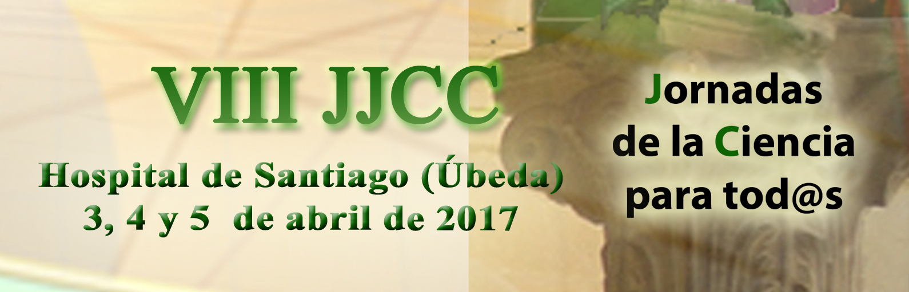
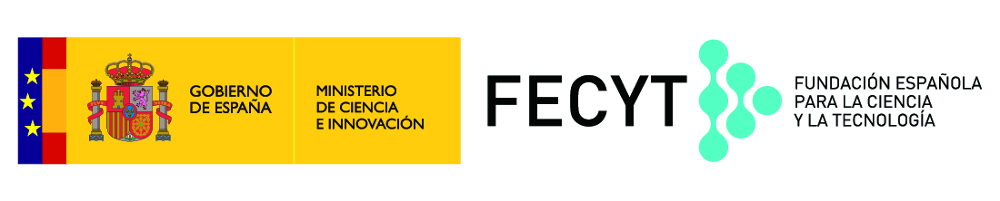
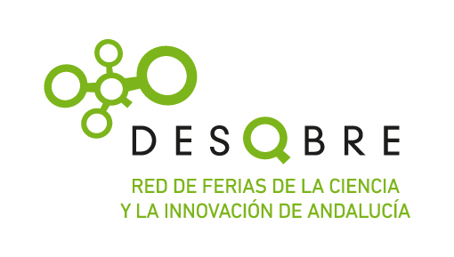
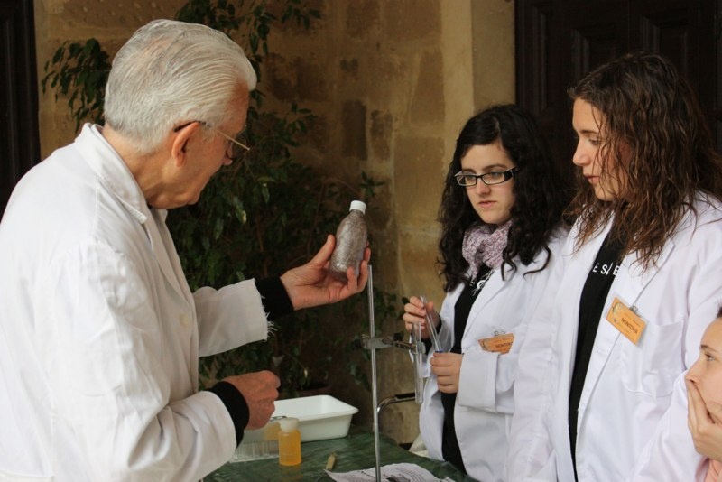

Desde hace varios años, la asociación cultural Renaciencia, integrada por docentes de varios centros de la localidad de Úbeda y comarca, organiza y coordina las Jornadas de Ciencia para tod@s. Este gran evento de divulgación científica pretende ofrecer un espacio dedicado a compartir las experiencias que hemos ido desarrollando desde nuestras aulas, expuestas por el alumnado y como consecuencia de actividades de formación específica del profesorado implicado.

Siguenos en     [FACEBOOK](https://www.facebook.com/RenacienciaUbeda/?fref=ts)         [@jjccparatodos](https://twitter.com/jjccparatodos)

[Ver el vídeo incrustado en la entrada original](https://www.youtube.com/embed/IOSPnBZ6gkQ?feature=oembed&wmode=opaque)

##

## **Red de Ferias de la Ciencia y la Innovación de Andalucía**

La VIII Feria Ciencia para Tod@s de Úbeda forma parte de la **Red de Ferias de la Ciencia y la Innovación de Andalucía, que promueve la [Fundación Descubre](https://fundaciondescubre.es/)**. Constituida en 2011 por las principales muestras científicas de la Comunidad autónoma bajo la iniciativa de la Fundación Descubre con la esponsorización de la Consejería de Economía y Conocimiento, tiene como fin aunar fuerzas para despertar vocaciones científicas, impulsar la divulgación del conocimiento, fomentar la participación ciudadana, potenciar la imagen de la ciencia, consolidar e impulsar las ferias, y crear un foro de encuentro entre los divulgadores de la ciencia de Andalucía.

## **JUSTIFICACIÓN**

Uno de los objetivos fundamentales e ineludibles del quehacer científico es su difusión, tanto social como profesional. Es impensable desarrollar una mejora de las prácticas docentes en este campo sin ofrecer a la comunidad educativa (profesorado y alumnado como mínimo) una oportunidad en este sentido.

Por otro lado, es misión de los docentes intentar paliar la paradójica separación que nuestra sociedad padece respecto de los principios científicos que sustentan su propio desarrollo tecnológico, así como el antinatural distanciamiento que existe entre dicha sociedad y todo lo que tenga que ver con el mundo de la ciencia.

Y por último, desde la ciencia podemos aportar a nuestro ámbito valores imprescindibles en la sociedad democrática en la que vivimos, inherentes al trabajo científico: el respeto hacia el otro y hacia lo que piensa y hace, el trabajo colaborativo, la iniciativa individual, la construcción del conocimiento de manera social, la discusión entre iguales, el debate, etc., son sólo algunos ejemplos de lo que la metodología científica ha aportado a nuestro modelo de vida.

Con estas Octavas Jornadas de la Ciencia para tod@s a nivel provincial, y extensible a nivel regional, queremos dar respuesta a estos tres aspectos, facilitando un foro motivador de intercambio de experiencias, divulgando la ciencia como tal, sus principios y métodos y destacando los valores que estas disciplinas del saber humano nos están legando.

##

## **METODOLOGÍA**

 La organización corre a cargo de la *Asociación Cultural RenaCiencia*. La idea principal es crear experiencias que puedan llevar a cabo nuestros alumnos, acordes con su nivel educativo, de forma que ellos las diseñen, las trabajen, las estudien y, por último, las trasladen a las Jornadas haciendo de monitores y explicándolas al resto de participantes y visitantes.

Para ello la motivación y la guía de los maestros y profesores resulta fundamental y es ahí donde han recaído los mayores esfuerzos por parte de este equipo. Ese esfuerzo es recompensado por el hecho de verlos tan ilusionados con los proyectos y perfectamente preparados y en condiciones de afrontar este reto. Nuestros alumnos están disfrutando mucho con estas actividades: ellas han permitido que lean, investiguen, dialoguen y experimenten acerca del desarrollo de la ciencia.

La filosofía seguida ha sido acercar la ciencia a todos los niveles educativos y de ahí que los cursos implicados abarquen todos los niveles educativos (infantil, primaria, secundaria, bachillerato, ciclos formativos y universidad).

##

## **CONTENIDOS**

- Adquisición de Competencias Básicas.
- Comunicación Social de la ciencia y convivencia entre centros y niveles.
- Didáctica del Conocimiento del Medio Natural y Social.
- Didáctica de las Ciencias, Matemáticas, Educación Física y Música.
- Metodología Científica (puesta en práctica del Método Científico).

Disponemos de muchas áreas dedicadas a Experimentación Científica. Sus principios básicos serán explicados y se propondrán baterías de preguntas clave de comprensión de los fenómenos. De igual manera (a posteriori y según guías didácticas correspondientes a cada itinerario) se profundizará, una vez en el aula y con el profesor, sobre los fenómenos observados.

Otros espacios estarán dedicados a la manipulación de sistemas, desarrollo de juegos con contenido científico y vídeos con contenido científico.

## **PROGRAMA**

- **Presentación de las VIII Jornadas de ciencia para tod@s. Museo Espacio Ciencia de Úbeda.** Visita guiada a las instalaciones.  4 de Marzo. 11.45 horas. Sala Julio Corzo. «Cuentos conCiencia» a cargo de Nono Granero. Reserva previa invitación. Aforo limitado.
- **Acto de inauguración oficial:**lunes 3 de abril, 18:00 h, visita guiada a **«Espacio Ciencia»**. 19:00 h en el auditorio del Hospital de Santiago. A cargo de **D. Sebastián Cardenete García, Centro Principia de Málaga.**
- Acto de presentación de las Jornadas a los monitores: martes 4 de abril, 10:00h en el auditorio del Hospital de Santiago. A cargo de **D. Sebastián Cardenete García, Centro Principia de Málaga.**
- El acceso a las experiencias se realizará por orden establecido según grupos e itinerarios asignados tras la inscripción en estas Jornadas.
- **Martes 4 de Abril, 12:00 – 14:00**: recorrido de los itinerarios por parte de los grupos integrantes del **turno 1****.**
- **Martes 4 de Abril, 17:30 – 19:30: horario abierto al público.**
- **Miércoles 5 de Abril, 09:00 – 10:30 y 10:45- 12.15 y 12:30 – 14:00:** recorrido de itinerarios por parte de los grupos integrantes del **turno 2, 3 y 4.**

## INSCRIPCIONES

- **Del 15 de Enero al 3 de Febrero: Inscripción de grupos de monitores.**Necesitamos conocer que grupos y profesorado está interesado en colaborar como **participante**, exponiendo alguno de los proyectos que han realizado a lo largo del curso. Os pedimos, por tanto, que nos hagáis llegar esta información (nombre de la experiencia, nivel al que se expone…) [cumplimentando el **formulario**](https://goo.gl/forms/AkAWHAQvUieCaYcu2) correspondiente (disponible desde el 15 de Enero al 3 de Febrero). Cada stand solicitado requiere una inscripción independiente. En el mismo podrá desarrollarse una única experiencia o un conjunto de ellas agrupadas en un Taller (indicar en el formulario de inscripción). Esta inscripción es formal y dada la limitación de espacios, sugerimos que se lleve a cabo lo antes posible. La organización confirmará las solicitudes cursadas una vez terminado el periodo de inscripción.

## [Acceso al Formulario Inscripción de experiencias VIII Jornadas de ciencia para tod@s. Úbeda, 2017](https://goo.gl/forms/G5PtdKixIRayBNib2). Proceso cerrado

- **Desde el 4 de Febrero al 5 de Marzo: Inscripción de grupos visitantes**. De igual forma, la solicitud de visita se realizará a través de **formulario** (disponible desde el 4 de Febrero). Una vez terminado el periodo de inscripción, la organización le confirmará el turno de visita de su grupo.

## [Acceso al Formulario Inscripción de grupos visitantes VIII Jornadas de ciencia para tod@s. Úbeda, 2017](https://goo.gl/forms/tc2p9JCQM9cuykEb2). Proceso cerrado

**Nota:** Deberá realizar una inscripción por cada curso y nivel académico, indicando en el formulario el número de grupos de 15 alumnos inscritos. Por ejemplo: para inscribir 45 alumnos de 3º de EP y 60 alumnos de 4º de EP, necesitará cumplimentar dos formularios independientes. En el primer caso, para 3 grupos de 15 alumnos y en el segundo caso para 4 grupos de 15 alumnos.

## **PLAZOS DE SOLICITUD**

- **Centros con aporte de experiencias:** antes del **3 de Febrero** (inclusive). [Acceso al **formulario**](https://goo.gl/forms/AkAWHAQvUieCaYcu2) **(disponible desde el 15 de Enero al 3 de Febrero)**.
- **Centros visitantes:** hasta el **5 de Marzo** (inclusive). [Acceso al **formulario**](https://goo.gl/forms/tc2p9JCQM9cuykEb2) (disponible desde el 4 de Febrero).
- Deberán especificarse niveles (edades) de los alumnos que desean participar.
- Para cada uno de los itinerarios de visita se formarán grupos de 15 alumnos/as, los cuales deberán venir acompañados y guiados, cada uno de ellos, por un profesor.

## DESCARGAS

### Difusión

- Díptico Informativo
- [Cartel VIII edición](http://aaquarks.com/blog/wp-content/uploads/2017/01/CARTEL-VIII-Jornadas-Ciencia-Definitivo.jpg)

### Información dirigida a los monitores

- Listado Expereriencias y Talleres VIIIJJC
- planos 2017

### Información dirigida a los grupos visitantes

- **Turnos de visita y accesos.** Comprueba el horario y turno de visita asignado, así como el acceso que tendrás que utilizar al Hospital de Santiago:
  - DISTRIBUCIÓN DE VISITAS Y ACCESOS VIII JJC 2017 Turno 1 Martes 4 Abril
  - DISTRIBUCIÓN DE VISITAS Y ACCESOS VIII JJC 2017 Turno 3 Miércoles 5 Abril
  - DISTRIBUCIÓN DE VISITAS Y ACCESOS VIII JJC 2017 Turno 4 Miércoles 5 Abril
  - DISTRIBUCIÓN DE VISITAS Y ACCESOS VIII JJC 2017 Turno 5 Miércoles 5 Abril
- **Visitas complementarias al Planetario, Museo «Espacio Ciencia»** (Sala de módulos o sala de talleres):
  - Turnos Planetario
  - Turnos Museo sala modulos
  - Turnos Museo sala talleres
- **Cuestionarios.** Esta herramienta didáctica tiene como objetivo provocar en los participantes una visión reflexiva de las experiencias, por lo que recomendamos su utilización:
  - Seleccionando las cuestiones de las experiencias que se van a visitar.
  - Proporcionando una copia a cada alumno/a para que sirva de memoria de la jornada , o bien llevando una copia para todo el grupo y contestando en común después de cada experiencia.
  - Disponibles los dos itinerarios:
    - CUESTIONARIO VIIIJJC para INFANTIL y PRIMARIA
    - CUESTIONARIO VIIIJJC para ESO y Bto

## **ORGANIZA**

 La Asociación Cultural ***RenaCiencia,***

integrada en la **Red de Ferias de la ciencia y la innovación de Andalucía**,

dependiente de la **Fundación Descubre**

por profesorado de los Centros:

IES *Andrés de Vandelvira*(Baeza),

Colegio *Santo Domingo Savio*(Úbeda), IES *Los Cerros*(Úbeda),

IES *Francisco de los Cobos*(Úbeda), IES *San Juan de la Cruz*(Úbeda),

Colegio *La Milagrosa*(Úbeda),  IES *Iulia Salaria*(Sabiote),

Escuelas Profesionales *SAFA*(Úbeda),

Centro Universitario *Sagrada Familia*de Úbeda (adscrito a la Universidad de Jaén)

## **COLABORAN**

Red de Ferias de la ciencia y la innovación de Andalucía,

Fundación Descubre,

Fundación Española para la Ciencia y la Tecnología, FECYT,

Excmo. Ayuntamiento de Úbeda,

Consejería de Educación y Consejería de Economía y Conocimiento

Centro de Divulgación científica «Espacio Ciencia» de Úbeda

Obra social La Caixa,

Fundación Caja Rural de Jaén, Unidad de Cultura Científica de la UJA,

Proyecto Ciudad Ciencia, CSIC, Universidad de Jaén,

Parque de las Ciencias de Granada, Centro Principia de Málaga,

Proyecto Mascil, CEP de Úbeda,

Planetario de Úbeda, Averroes Formación Grupo Forma, Liderfil,

Carlin, Catering Delicias, Clínicas Ruiz y Cobo,

M. Martos, Asociación Astronómica Quarks, Alfarería Tito, Imprenta Davinchi,

 Asador de Santiago, Hotel Álvar Fáñez, Asador Al Andalus, Eco callejero, Siempre a mano,

Escuelas Prof. SAFA: Centro Universitario *Sagrada Familia,*

Ciclo de Grado Superior de “Guía, Información y Asistencias Turísticas” y

Ciclo de Grado Medio de “Servicios en Restauración”
